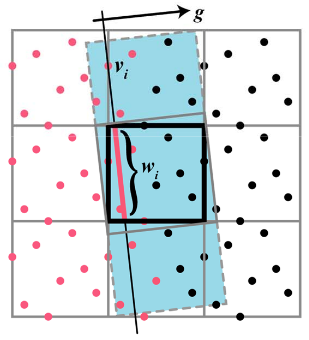
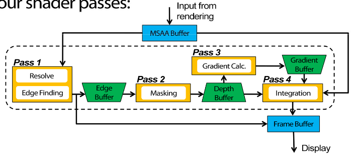

# 現在のハードウェアのアプローチ: マルチサンプルアンチエイリアシング(MSAA)[Current Hardware Approach: Multisample Anti-Aliasing (MSAA)]

- 色階調[color gradations]はハードウェアのサンプル数により制限される。

この例(8xAA)では、だいたい8階調(カバレッジなしを含めない)。

# MSAAの概要[MSAA Overview]

- サンプルポイントでテストすることでプリミティブのピクセルカバレッジを推定する。
- (通常はピクセルの中心が覆われた[covered]サンプルの重心で)プリミティブあたりのピクセルあたりの色をひとつ計算して、すべての覆われたサンプルにそれを割り当てる。

約1/2が占められているにも関わらず、このピクセルはプリミティブにより3/4が占められると見なされる。

4 samples at most 4 levels of gradation (5 including non covered)

# 昔ながらのMSAA[Traditional MSAA]

- 各サンプルの値を個別に計算することでレンダリングを高速化する。
- 一様でないサンプリンググリッドはピクセルカバレッジ推定を改善するために使われる。

<!-- p.7 -->

- 第一の目標はプリミティブとZエッジのアンチエイリアシングである。

ハードウェアAAはジオメトリエッジをを扱うのみで、テクスチャは扱わない。

<!-- p.8 -->

- テクスチャの再サンプリングは別の所で行われる(ミップマッピング)。
    - 高周波なテクスチャディテール(例えば、テキスト)はMSAAカラーバッファにおいて失われ、それ以上に容易にポストプロセスできない。

# 動機[Motivation]

- GPUのシェーダ処理能力[processing power]やより良いエッジアンチエイリアシング(AA)の柔軟性を使うことができないか？
- 目標
    - 同じサンブル数とより良いソフトウェアフィルタリングアルゴリズムを用いてプリミティブエッジの外観を("標準"のMSAA処理と比較して)改善する。

<!-- p.10 -->

- エッジ検出カスタムフィルタAA --- 8xMSAAのカバレッジサンプルを用いることで最大24の色階調を達成する。

# 重要な洞察: 統合アプローチと等値線[Key Insight: Integration Approach and Isolines]

- 画像関数の等高線(等輝度線[isophote])が分かっている場合
    - ピクセルの外のサンプル値を使用できる。
    - ピクセル中の関連する等高線の線分の長さでそれらを重み付けして、それらすべてを足し合わせる。

エッジがあれぱ等高線があるだろう。そうなれば、ピクセルの外のサンプルを用いることができる。

# 3チャンネルでの等高線の評価[Isoline Evaluation in Three Channels]

- 等高線を見つける必要がある。
    - ただし、小さな曲率の場合でのみ(これが実際のプリミティブエッジに近いケースであるので)。
    - 直線としてそれらをモデル化できる。
- 勾配の推定値を計算するために3チャンネルに平面を合わせる。
    - 線形な近似を使う。
    - **最小二乗問題[least squares problem]を解く。**
    - 詳しくは[@Iourcha2009]を参照してください。

事実上、RGBサンプルの線形フィッティング --- 最小二乗の問題

# フィルタ計算(統合)[Filter Computation (Integration)]

- $g$と直交する二辺[two sides]を持った、ピクセルを囲む四角形を構築する。
- 3x3のピクセル境界と交わるまで、$g$と直行する方向に矩形を拡張する。

<!-- p.14 -->

- すべてのサンプル$v_i$に対して、$v_i$を通り$g$と直交する線のピクセルに内接する線分の長さはその重み$w_i$である。
- 矩形中のすべてのサンプルの重み付きの合計を計算する。

# 全員集合: サンプル実装[Bringing It All Together: Sample Implementation]

- DirectX 10.1を用いて実装した。
- 4つのシェーダパス

# パス1[Pass 1]

- MSAAバッファを用いてエッジピクセルを識別する。
    - 部分的なカバレッジ == エッジ
    - 高い色コントラスト == 興味深いエッジ
- 各ピクセルで標準の解決を行うことでフレームバッファを種をまく[seed]。

あなたは完全に覆われていないサンプルのエッジが存在することを知っている。

# パス2[Pass 2]

- エッジパターンを用いて候補ピクセルを除外[mask out]する。
- テーブルに対してシェーダで計算される。
    - 我々は3x3のピクセルパターンを使う。

マスキングからピクセルを排除することに注意

# マスキング[Masking]

- 例えば、3x3ピクセルすべてが"エッジ"のものならば、長い支配的なエッジが存在せず、この場合は高周波を平滑化したくない。

パフォーマンスとルックに役立つ。コーナーを過剰にフィルタリングしたくない。

<!-- p.19 -->

- 過度にコーナーを平滑化するのを避けることができる。
- 処理時間を減らす。

# パス3[Pass 3]

- "勾配"を計算する。

ここで最小二乗を行う。

# パス4[Pass 4]

- 3x3のピクセル近傍からの入力サンプルで提示された統合手法を用いて、パス3からのピクセルに対して最終的なフレームバッファの色を計算する。
- 統合と重みはシェーダで計算される。
- 他のすべてのピクセルはすでにパス1でフィルタリングされている。

# おわりに[Conclusion]

- リアルタイムで動作する。
- ハードウェア又はソフトウェアの変更を必要としない。
- ピクセルの外側を調べる。
- より複合的な処理にGPUを使う。

8x = 24x
4x = 12x
2xはあまり興味を惹かない。

# ある問題[One Problem]

- 依然としてハードウェアサンプルに依存する。
- ディファードレンダリングで問題になる。
    - ジオメトリデータの喪失
    - 形態学的[morphological]アンチエイリアシング

# 今後は？[Future?]

- 近いうちに世界は新しいハードウェアに移行するだろう。
- DX11とGL4.xの興味深い機能
    - より柔軟なAA
    - サンプルレートでシェーダを走らせる。
    - コンピュートシェーダ --- 興味深いデータ構造とより良いパフォーマンス

# 参考文献[References]
