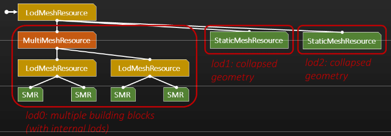

# はじめに[INTRODUCTION]

# 背景[BACKGROUND]

# 既存のシステム --- モデル[Existing system - Models]

- 我々のモデルデータはMeshResourceによって表現される。
    - 実際には他のMeshResourceの任意のツリー[arbitrary tree]
    - LOD切り替えとマルチメッシュの内部ノード
    - プリミティブデータを持つ静的、および、スキンメッシュのリーフノード

ゲームで見られるような3Dモデルは任意に複雑にできるMeshResourceのツリーである。異なるブランチの間を選択するLODメッシュ、ルートを基準にブランチを配置するためのマルチメッシュを持つ。そして、リーフには、ジオメトリを含む静的メッシュを持つ。他のリーフノードタイプもあるが、このトークと関係はない。

これは、様々なコンテンツワークフローを構築するのに効果的である、とても柔軟なシステムだが、最適化するときに一般的な挙動を見極め、抽出することをより難しくしている。

# 既存のシステム --- インスタンス[Existing system - Instances]

- メッシュはDrawableObjectとしてワールドに配置される。
    - 各々は自身のMeshInstanceTreeを持つ。
    - 効率的な平坦な形式でリソースツリーをエンコードする。
- MeshInstanceTreeリーフノードはDrawableSetupを含む。
    - プリミティブジオメトリ(頂点＆インデックス配列)
    - シェーダとレンダリングオプション
    - ローカルからワールドへの変換
- DrawableObjectのKdツリーは空間的な階層を提供する。

DrawableObjectとしてワールドにメッシュリソースのインスタンスを配置する。これらはランタイムで使われるMeshResourceツリーのより効率的なエンコーディングを持つ。

ある特有の問題はメッシュリソースがツリーのルートであるかを認識していないことであり、これはDrawableObjectによって配置されるときのみ明確になる。

このツリーのリーフノードは、レンダラを送り込むものであるDrawableSetupを含む。各々はレンダリングするのに必要なシェーダを持つジオメトリのチャンクである。これらはコンテンツの残りからレンダラを隔離する。

# 既存のシステム --- クエリ[Existing system - Queries]

- 可視[visible]のDrawableObjectを見つける。
    - Kdツリーを歩く。
    - 各DrawableObjectを錐台カリングする。
- 可視のDrawableSetupを見つける。
    - それぞれの可視DrawableObjectのMeshInstanceTreeを歩く。
    - 関連するLODに降りる[descend]。
    - 各DrawableSetupを錐台カリングする。
- 可視DrawableSetupのリストをレンダラに出力する。

KZ3では、PS3のSPUでソフトウェアオクルージョンカリングを用いて各オブジェクトとセットアップをカリングしていた。

KZ4では、静的コンテンツには遮蔽を含めたすべての可視性を扱うミドルウェアを用いた。

# 既存のシステム --- クエリ[Existing system - Queries]

- すべてのジオメトリに対して同じシステム
    - 静的も動的も同じ方法で取り扱う。
- フレームごとに2つ以上のクエリを実行する。
    - プレイヤーカメラ(透視投影[perspective])
    - 太陽光シャドウマップ(正投影[orthographic])
    - 他のシャドウマップ(透視投影、小さめの錐台)

クエリは一般のレンダリングジョブグラフの一部のCPUジョブである。CPU上の柔軟なジョブアーキテクチャがある --- ほとんどのコード(とすべてのレンダリングコード)はジョブで実行する。

# 既存のシステム --- 問題[Existing system - Problems]

- いくつかのスケーリング問題が存在することを理解した。
    - Kdツリーを再構築するのはコストが高い。
    - MeshInstanceTreeのクエリはコストが高い。
        - 並列ジョブにも関わらず
        - 大きかったり小さかったりするツリーが混ざりあったアンバランスなジョブ
        - それでもKdツリーのクエリは比較的高速
    - APIは少なく大きなオブジェクトを狙っていた。
        - ブロックの構築には**大量の小さなオブジェクト**がある。
        - インターフェースのオーバーヘッド(主にロック処理による)

このシステムはHorizonのワールドサイズにはあまり良いとは言えず、しばしばストリームされるコンテンツとして再構築してみたかったのでKdツリーの複雑さを減らす必要があり、また、MeshInstanceTreeクエリは高価なのでより少なくしたかった。

シーンAPIは本当は少なく大きなオブジェクトを狙っていて、Horizonのワールドを生成するブロック構築には大量の極小オブジェクトがある、という問題もあった。

# 新システム[NEW SYSTEM]

# 基本的な目標[Basic goals]

- オフライン事前計算なし
    - **マジで、なし**
- 既存のコンテンツをサポートする。
- KZ4よりはるかに多くのコンテンツを扱う。
- KZ4よりクエリ時間を短縮する。
    - **クエリはすべてのレンダリングでクリティカルパスである。**

KZ4では可視性ミドルウェアを持っていたが、これは、可視性データを事前計算する必要があり、単に我々がやっていた方法に合わなかったため、ワークフローの問題を引き起こした。変更を適切にテストするために必要な時間が増加した --- それなしにゲームを始めることもできたが、アーティストは、あるべき姿としてモノを確認できるようになる前に、焼き込み処理がバックグラウンドで終了するのを待たなければならなかった。我々は依然としてそれとともにゲームを出荷していたが、Horizonにそれを合わせられるとは考えなかった。

事前計算のアイデアを諦めることはとても難しいと分かっていたが、それは自由をもたらす --- もし焼き込み処理を待たなくて良いとしたら、同様に素早くコードの変更をテストできる。

明らかに、新しいコンテンツを、より高速に扱う必要があった。

# 新システム --- StaticScene[New system - StaticScene]

- 静的データのみを扱う。
    - 動的データより静的データのほうがはるかに多い。
    - 既存のシステムは動的データでうまく動作する。
    - 物事を過度に複雑にしない。
    - 並列に両ジョブを動作する。
- **非同期** コンピュートハードウェアを使う。
    - レンダリングではなくCPUと同期する。
    - 我々が熟知し愛好した、PS3のSPU同期のようなもの。

既存の多目的システムの負荷を軽減するために単目的システムを構築した。StaticSceneは、それが大量にあるということから、静的なジオメトリのみを扱う。

残りの動的なジオメトリを扱うために既存のシステムを使って、並列にジョブを実行することができる。

コンテンツ量をより良く扱える、CPUと同期するのが比較的簡単になると考えたため、PS4の非同期コンピュート能力を使うことを目標とした。

# 入力の制約[Input constraints]

- ほとんどの静的リソースツリーはこのようになっている。
    - 高LOD: アーティストが配置した、構築ブロックのリスト
    - 低LOD: 構築ブロックからツールが生成した *潰れた[collapsed]* ジオメトリ

計算を行うために比較的平坦なデータを送り込みたかったので、複雑なMeshResourceツリーに制約を課さねばならなかった。

静的なリソースの多くは、1つ以上の構築ブロックのLODとエクスポートツールによって生成された潰れたジオメトリのLODとの間を選択するトップレベルのLodMeshResourceを持っている、ように見えたことが判明している。構築ブロックそれ自体はLODノードを持つが、潰れたジオメトリでは、これは単純化されている。

# 入力の制約[Input constraints]

- このツリーをより均一な何かへ平坦化したい。
    - コンピュートに食わせるために
- 2つのLODレベルとして完全に表現できる。
    - これらを親と子と呼ぶ。
    - バウンディングボックスとLOD距離の$[\min, \max)$
    - リーフは親と子の両方のLODが選択された場合のみ可視である。
    - ツリーが2つのLODレベルを持っていない場合、"常に有効[always on]"なレベルを詰める。
        - **特例[special cases]はない**
- はずれ値[outlier]コンテンツは動的に移される。
    - 古いシステム内でうまく動作する。
    - アーティストは時間をかけてそれを取り除くためにワークフローを調整した。

重要な観察結果として、2つのLODレベルはこれらのツリーを表現するのに十分であることだった。これらを親と子を呼び、これらはLodMeshResourceの境界とブランチのひとつに対するLOD区間[bracket^[この文脈では、括弧[bracket] = 区間[interval]]]を持つ。

リーフは親と子のLOD両方が選択された場合に限り可視である。

特殊なケースを避けるため、"空"のLODレベルを追加する。すなわち、すべてが2つ持つことになる。

これに合わないコンテンツは動的システムに移され、アーティストは時間をかけてそれを取り除いた。

# 高レベル構造: StaticTile[High level structure: StaticTile]

- ワールドをタイルに分割する。
    - 空間的にではなく、ストリーミンググループによって定義される。
    - いくつかのグループは真の空間的なタイルである。
    - [settlements]、[encounters]のような他のグループ
- 一度生成されれば、タイルは不変である。
    - 動的な更新は物事を複雑化するだろう。
    - 変更するには破棄して再生成する。

このすべてのデータを選別するため、空間的な構造を必要とした。トップレベルでは、ワールドをStaticTileに分割する。これは時に真の空間的なタイルであり、時に[settlements]や[encounters]のような他のものである。これらはストリーミングシステムによって定義され、StaticSceneを選ばせない。

タイルは不変として生成され、物事を単純化するために、更新できないようになっている。

# 高レベルデータ: タイルコンテンツ[High level data: Tile contents]

- GPUバッファ
    - QueryObject (DrawableObjectを表現)
    - QuerySetup (DrawableSetupを表現)
    - QueryInstance (QueryObjectひとつとQuerySetupひとつを接続する)
        - **コンピュートスレッドに1対1対応する。**
        - 行列＆バウンディングボックス
            - インスタンスから間接的に読み出される。
- CPUクラスタ
    - 境界とLODを持つインスタンスの空間的に一貫性のある範囲

タイルは、第1パスのカリングのためにCPU上で使われるクラスタのリストを持つ、ほぼ平坦なGPUデータのバッファである。

# 低レベルデータ: QueryInstance[Low level data: QueryInstance]

|用途|ビット|
|-|-|
|フィルタマスク|3|
|フラグ|2|
|Setupインデックス|12|
|Objectインデックス|17|
|親と子の境界インデックス|2@15|
|行列インデックス|14|
|親のLOD範囲|2@12|
|子のLOD範囲|2@12|
|将来を見据えた領域[future proofing]|2|
|合計|128|
: QueryInstance

- ほぼ数値データ
    - 従って、積極的なパッキング
- フィルタはインスタンスの高速な排除ができる。
    - 例えば、シャドウキャスターだけを選択するために。
    - または、可視メッシュ
    - これ以上のデータを読み込む必要はない
- 間接読み込みのために使われるインデックス
    - 行列(48バイト、floatの4x3行列)
    - 境界(12バイト、halfのAABB)

Horizonを出荷するまで、バッチレンダリングをサポートするための変更を作っていた。これについては後に話したい。新旧両方を網羅する時間があるとは思えなかったので、ここに記述するデータフォーマットは新しい方のものである。手短に言えば、以前は、各DrawableSetupがそれ自身のローカルからオブジェクトへの空間の変換を持っていたので、より小さなQueryInstanceとより大きなQuerySetupを使っていた。バッチ処理のために、DrawableSetupから変換を取り除き、代わりにローカルからオブジェクトへの変換を定義するMeshResourceTree中のDrawableSetupの位置を用いる。

スペースを節約するため、QueryInstance以外のすべての要素はハッシュ化され、インデックスで検索されるインスタンスと一緒に、1タイルあたり厳密に一度だけ格納される。繰り返すが、これは出荷後の変更である。

データは、主にインデックスであり、可視メッシュや様々なシャドウキャスターの種類を示すフィルタビットであり、インスタンスが入っているリーフのための親と子のLOD範囲である。

現状では[as it stands now]、成長の余地は残っていない！

# 低レベルデータ: QuerySetup/QueryObject[Low level data: QuerySetup/QueryObject]

|用途|バイト|
|-|-|
|object-to-snapped|48|
|スナップされた位置|12|
|LODスケール、フラグ|4|
|合計|64|
: QueryObject

|用途|バイト|
|-|-|
|ローカル境界|24|
|CPUポインタ|8|
|合計|32|
: QuerySetup

- 両方が1タイルあたり厳密に一度だけ格納される。
    - パッキングはそれほど重要じゃない。
- レンダラはカメラに関連する *浮動空間[floating space]* を用いる。
    - スナップされた[snapped]整数のオブジェクトの位置を格納する。
    - それに関するobject-to-snappedの行列
    - object-to-floatingを構築して出力する。
        - 原点から遠い所の精度を維持する。
- Setupはジオメトリの正確な頂点境界を持つ。
    - LOD境界は常に過大推定[overestimate]である。
    - LODをまたいで集められ、オブジェクト空間で格納される。

各々のユニークなQuerySetupとQueryObjectは1タイル当たり一度だけ格納される。なので、これらの構造をパッキングすることは重要ではない。

ゲームワールドは原点から離れるほど浮動小数点の精度が欠落することで引き起こされる問題を回避するため高精度な座標系を用い、そのレンダラはカメラに従う浮動空間で動作する。1m整数グリッドに基づく高精度のオブジェクト変換中を通り、クエリシェーダはスナップされたカメラ原点を減算して、レンダラへ浮動空間の変換を出力する。

QuerySetupは錐台カリングで用いる正確なローカル境界情報を持つ。LOD境界を用いることもできるが、これらは常に過大推定である。

# タイル構築: 読み込み[Building tiles: Loading]

- ストリーミングスレッドでは、
    - 変更が大きい場合、複数のStaticTileへ分けて追加する。
    - 変更が小さい場合、"孤児[orphan]"タイルへオブジェクトを追加する。
    - 一連の追加/除去を一致させるので、タイル全体を除去する(孤児を除く)。
    - 負荷バランシング＆スケーリングのために矛盾のない[consistent]タイルサイズを得ることを目指す。
    - 空間的な分割を生成し、バッファを埋める。
- メインスレッドでは、
    - 単に準備のできたタイルをアクティブにする。
    - **困難な仕事[heavy lifting]なし --- ストリーミングヒッチを回避する。**

我々のストリーミングシステムは、ローティングが数フレームをかけて起こる可能性があるので、バックグラウンドスレッドでオブジェクトをロードおよびアンロードする。StaticSceneは、部分アンロードを扱わなくて良いように追加と除去が一致していることを保証した、追加されるオブジェクトと除去されるオブジェクトのセットを受け取る。

一般には、追加されるオブジェクトのグループは単一のStaticTileを生成するが、タイルは大量のQueryInstance(24K以上)を持つかもしれないなら、それを分割する。同様に、非常に少ない(1K以下)場合、これらを特別な"孤児"タイルに追加する。

すべての困難な仕事(空間分割、メモリ割り当て、など)はストリーミングスレッドで発生し、メインスレッドは単にタイルが利用可能になるときにそれをアクティブにすればいいだけである。

# タイル構築: 空間分割[Building tiles: Spatial partition]

- 分割の第1レベルとしてタイルを使う。
    - 一般的にはすでに空間的に一貫性がある。
- 各タイル内に更なる空間分割[spatial+ partition]を生成する。
    - フィルタ、LOD範囲、*モートン数[Morton number]* でインスタンスをソートする。
    - フィルタはCPUでクラスタ全体のリジェクションを可能にする。
    - LOD範囲は、例えば[detailed dense area]に対して、同じことを行う。
    - モートン数は合理的な空間的一貫性を与える。
- ソートキーはクラスタを定義する。
    - 最小サイズと一緒に
    - **クラスタはコンピュートジョブと1対1対応する。**

データを分解するために空間分割が必要であり、このための二人一組のレベル[a couple of levels]を持つ。StaticTileは、一般的にはすでに一貫性があるので、第1レベルを提供する。そして、クラスタを定義するためにタイル内に部分的に空間分割を生成する。

フィルタビット、最大LOD範囲、モートン数を用いて各QueryInstanceごとにソートキーを生成する。フィルタはクエリに関係のないクラスタを素早く破棄することができ、LOD範囲はコンテンツの[dense area]に対して似たようなことを行う。これの下に、モートン数はある程度[a degree of]の空間的一貫性を与える。

ソート後、負荷バランシングの役に立つよう再び4K個のインスタンスの最小サイズでクラスタを定義するためのソートキーを変更する。各クラスタは潜在的にコンピュートジョブである。

# 余談: モートン数[^morton_numbers][Aside: Morton numbers]

[^morton_numbers]: 日本語での参考文献:[Z階数曲線 --- Wikipedia](https://ja.wikipedia.org/wiki/Z%E9%9A%8E%E6%95%B0%E6%9B%B2%E7%B7%9A)

- 単純だが役に立つ概念
    - 位置を整数に量子化する。
    - ビットバイビットで要素をインターリーブする。
    - N次元の点から1DのZ階数曲線を生成する。
    - 3Dでは、八分木を構築するのと等価である。
- モートン数は近い？
    - 位置は(ほぼ)近い。
    - 逆もまた然り[vice-versa]
- ビットトリックでかなり素早く計算できる。
    - [Spread bits of each component by two]
- 素早く汚い空間的構造に対して役立つ。
    - Hilbert曲線はより良い局所性を持つが、計算コストがより高い。

Guy Macdonald Mortonにより導入されたモートン数はN次元の座標と1次元の数値とをマッピングする方法である。

位置をいくつかの整数グリッドに量子化することに始まり、単一の数値を生み出すためにビットバイビットで要素をインターリーブする。3Dにおいて、これは八分木を構成するのと似ており、モートン数の増加は図のひとつのようなZ階数曲線に従う。

これらはビットトリックによりとても計算しやすく、モートン数同士が近ければ、位置同士も一般的に近い。そのため、素早く汚い空間的構造に対して役立つ。Hilbert曲線のようなより良いがより高価な曲線が利用可能である。

# クエリのためのCPUジョブ[CPU job for query]

- 静的クエリあたりひとつのCPUジョブを実行する。
    - 可視性クエリに対する全ジョブグラフの一部
    - 動的クエリに対する既存のCPUジョブと一緒に並列に
- CPUでタイルとクラスタの可視性をテストする。
- 可視クラスタごとにひとつのコンピュートジョブをキックする。
- CPUジョブはGPUジョブを待つ。

データを構築したら、クエリを実行したいので、古いシステムのようにレンダジョブグラフ内でこれを行うためにCPUジョブを生成する。これは動的クエリジョブをと一緒に並列に実行できるので、レイテンシーは増加しない。

できるだけ多くのクラスタをスキップするためにタイルとクラスタの階層を用いて、可視クラスタごとにひとつのコンピュートジョブをディスパッチする。そして、CPUジョブはコンピュートの終了を待つ。これは素晴らしく、単純であり、CPUジョブスケジューラに混在するジョブタイプを同期させることを回避する。

通常、このように結果を待つとき、空回り[idling]を避けるためにスケジューラからより多くの処理を選び取っていたが、待機は一般的に短く、最小のレイテンシーの後であるので、この場合は選択しない。

# クラスタのGPUコンピュートジョブ[GPU compute job for cluster]

- いくつかのコンパイル時特殊化を伴うuberシェーダ
    - シャドウクエリと可視クエリは異なるオプションを持つ。
    - 削減したコードサイズを含む二人一組の"ファストパス[fast path]"シェーダをコンパイルする。
    - **ファストパスから落ちていないことを確実にする…**

ディスパッチするGPUジョブは少量[a handful of]のコンパイル時バリエーションへ特殊化される単一のuberシェーダを使う。これらすべては汎用シェーダと比べて命令数やレジスタ数を削減してあり、GPUコンピュート単位が一度により多くのwavefrontを実行するのに役立つ。

クエリオプションがデフォルト設定から切り替えられているとき、汎用シェーダのみを使う。これはデバッグ専用のものである。

このシェーダはとても長く、最長の場合で約1500命令ある。

# GPUコンピュートスレッド: 入力とテスト[GPU compute thread: Input and tests]

- QueryInstanceを読み込み、フィルタをテストする。
    - **選択されていなければ、早期に脱出する。**
- コンテンツ(行列、境界、など)を読み込む。
- 親のワールド境界を計算して、LODをテストする。
    - **選択されていなければ、可視性テストをスキップする。**
- 子のワールド境界を計算して、LODをテストする。
- 正確なローカル境界を読み込んで、可視性をテストする。
    - 錐台
    - サイズのしきい値
    - オクルージョンカリング

コンピュートジョブ内では、各スレッドはQueryInstanceを読み込み、すべての処理をスキップできるかどうかを確認するためにフィルタビットをテストする。

そうでなければ先に進み、LODと可視性のテストを行うために境界と行列を間接的に読み込む。少なくとも親のLODテストが合格すれば、LODフェード状態を更新するのに両方の結果を必要とするので、子のLODテストと正確な可視性テストの両方を行う。

この時点でメッシュストリーミング可用性をチェックする --- 頂点およびインデックスのデータが[stream out]されていれば、オブジェクトを描画できない。

# GPUコンピュートスレッド: 出力[GPU compute thread: Output]

TODO

# 参考文献[References]
