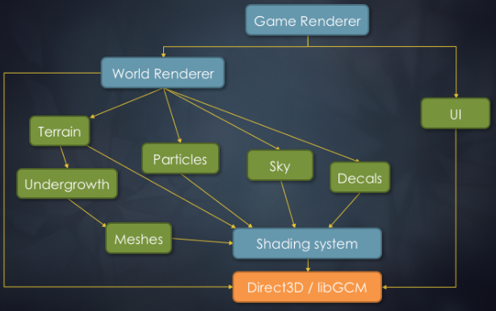
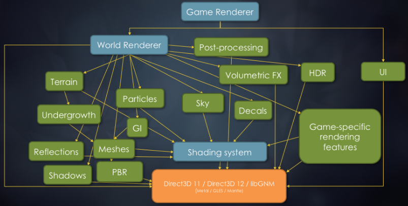
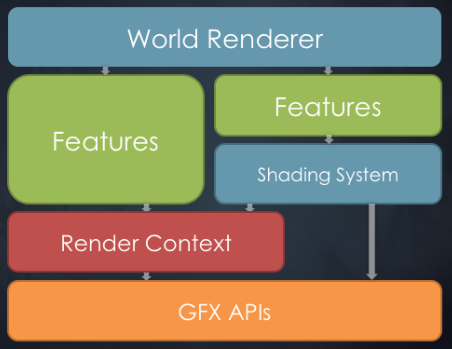
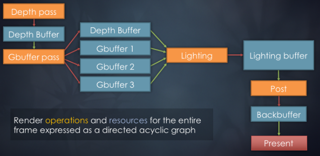
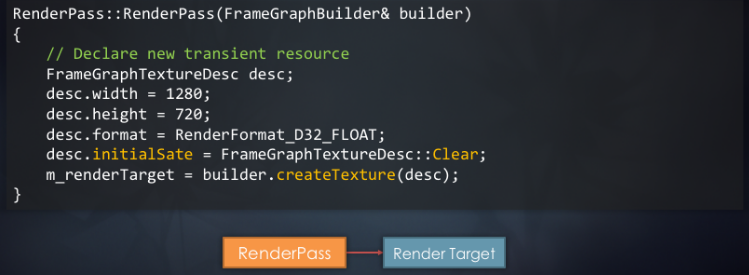
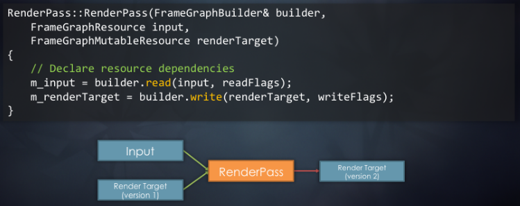
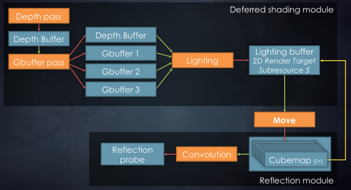

# 2007年と2017年におけるFrostbiteの比較(Frostbite 2007 vs 20017)

- 2007年
    - DICEの次世代エンジン。
    - 以下を下地に作られた。
        - Xbox 360
        - PlayStation 3
        - マルチコアPC
        - シェーダモデル3.0のDirectX9とDirect3D 10
    - 今後のDICEのゲームで使うために。
- 2017年
    - The EAのエンジン。
    - 以下のために発展(evolve)・拡大(scale up)した。
        - Xbox One
        - PlayStation 4
        - マルチコアPC
        - DirectX 12
    - 約15のEAのゲームで使われる。
        - もうバトルフィールドのエンジンではない。
        - 使われるジャンルはRPG、レース、スポーツ、アクションなど多岐にわたる。

# 2007年のレンダリングシステムのあらすじ(Rendering system overview '07)

# 2017年のレンダリングシステムのあらすじ(Rendering system overview '17)

- このグラフはエンジンを完璧にあらわしているわけではない。システムの広がりを図式化しただけ。
- 複雑に絡み合ったシステムが無数に存在する以外は基本的に同じ。
- このトークではWorld Rendererとレンダリング機能についての話をする。

# レンダリングシステムのあらすじ(簡略化バージョン)(Rendering system overview(simplified))

# WorldRenderer

- すべてのレンダリングを指揮する。
    - **コード駆動**アーキテクチャ。
    - メインのワールドジオメトリ(Shadeing System経由)。
    - ライティング、ポストプロセス(Render Context経由)。
    - すべてのビューとレンダパスについて知っている。
- 設定とリソースのシステム間マーシャリング(表現の変換)を行う。
- リソース(レンダターゲットやバッファ)の割り当てを行う。

# バトルフィールド4のレンダリングパス(Battlefield 4 rendering passes (Features))

- 上記は数年前にバトルフィールド4用にFrostbiteに蓄えたレンダリングパスである。
- 現在のパイプラインはPBR化されており、パスはさらに増えて複雑になっている。

# WorldRendererの課題(WorldRenderer challenges)

- 明示的な即時モードレンダリング。
- 明示的なリソース管理。
    - オーダーメイドによる職人技的な手作りのESRAM管理。(Bespoke, artisanal hand-crafted)
    - 様々なゲームチームによる複数の実装。
- レンダリングシステムとの強固な結合。
- 制限された拡張性。
- カスタマイズのためにフォーク/分岐が必須。
- 4k SLOCから15k SLOCへの組織的な成長。
    - 2k SLOC超の関数。
    - 維持、拡張、統合が高価。

# モジュール式WorldRendererの目標(Modular WorldRenderer goals)

- フレーム全体の高レベルな知識を得る。
- **拡張性**を改善する。
    - 分離された構成可能なコードモジュール。
    - 自動的なリソース管理。
- よりより可視化と診断。

- 蓄積した技術的負債の対処と拡張性と保守性の改善を行うため2016年に主要な部分を再構築した。
- 明示的なパスとリソースのミクロな管理なし。
- エンジンコード内のモノリシックな関数のハックなし。
- メモリ割り当てと別名付け(aliasing)の子守(baby-sitting)なし。

# 新アーキテクチャの要素(New architectural components)

- **FrameGraph**
    - **レンダパス**と**リソース**の高レベル表現。
    - フレームの完全な知識。
- **Transient Resource System**
    - リソース割り当て。
    - メモリ別名付け。

# FrameGraphの目標(Frame Graph goals)

- フレーム全体の**高レベル知識**を構築する。
    - リソース管理の単純化。
    - レンダリングパイプライン構成の単純化。
    - 非同期コンピュートやリソースバリアの単純化。
- 自己充足的で**効率的なレンダリングモジュール**を可能にする。
- 複雑なレンダリングパイプラインを可視化・デバッグする。

# FrameGraphの例(Frame Graph example)

- ディファードシェーディングパイプラインを実装したFrameGraphの例。
- グラフにはレンダパス(橙)とリソース(青)がノードとして表される。
- アクセス宣言や依存関係は辺で表される。

# Battlefield 4のフレームのグラフ(Graph of a Battlefield 4 frame)

- 一般に数百のノードからなる。
- デバッグ用グラフはGraphVizで可視化され、検索可能なPDFとして出力される。
- グラフは驚くほど巨大で複雑になり得る。
- このグラフはいくつかの場合で役に立ち得るが、我々が最終的に用いた主要な可視化ツールでは断じてない。

- カスタムの可視化スクリプト(HTML+Javascriptとランタイムから書き出したJSONデータ)を書いた。
- JSONデータはすべてのレンダパスとリソースの情報が含まれている。
- 各レンダパスがどのリソースが作成し、読み込み、書き出しているかを知ることができる。
- 各リソースのメモリレイアウトと各種メタデータ(デバッグ名、サイズ、フォーマットなど)を知ることができる。
- 可視化はインタラクティブであり、PIXのように、フレームで行ったことの概要をより便利に提供してくれる。

# FrameGraphの設計(Frame Graph design)

- 即時モードレンダリングからの脱却。
- レンダリングコードをパスに分ける。
- マルチフェーズ保持(retained)モードレンダリングAPI
    1. セットアップフェーズ。
        - 比較的安価であることを前提とする。
    2. コンパイルフェーズ。
    3. 実行フェーズ。
- 毎フレームにゼロから組む。
    - シーンの変化に対応するため。
- コード駆動アーキテクチャ。

# FrameGraphのセットアップフェーズ(Frame Graph setup phase)

- レンダパスとコンピュートパスを定義する。
- 各パスで入力リソースと出力リソースを定義する。
- コードの流れは即時モードレンダリングと似ている。
    - ただし、GPUコマンドは生成しない。

- すべてのリソースはグラフ構築中は**仮想的**である。
- レンダパスの入出力は仮想リソースハンドルを用いて宣言される。

# FrameGraphのリソース(Frame Graph resources)

- レンダパスは使うリソースを全て宣言しなければならない。
    - 読み込み。
    - 書き込み。
    - 生成。
- 外部の永続的(permanent)リソースはFrameGraphに**インポート**される。
    - TTA用ヒストリーバッファ。
    - バックバッファ。
    - などなど。

- FrameGraphから見えない効果(例えば、GPUからのデータの読み出し)を持つ場合、その副次的効果を明示的にマークする。
- 持続的(persistent)レンダターゲットが必要になる場合(TTA、SSR、など)、FrameGraphにインポートすることができる。
- インポートしたリソースへの書き込みは、コンパイルフェーズ中にカリングされないようにするため、レンダパスの副次的効果として数える。

# FrameGraphリソースの例(Frame Graph resource example)

- レンダターゲットリソースを生成するレンダパスのダミーコード。
- 初期リソースステート(クリアや破棄/未定義)を指定する以外は、通常のテクスチャ生成と似ている。

# FrameGraphセットアップの例(Frame Graph setup example)

- テクスチャから読み出して他のテクスチャに書き出すレンダパス。
- テクスチャへの書き出しはリネームされたハンドルを生み出すことで、リソースが未定義の順番で変更されたときにエラーを捉えることができる。
- リソースのリネーミングはレンダパスを特定の実行順に強制する。

# 高度なFrameGraph処理(Advanced FrameGraph operations)

- 遅延生成するリソース。
    - 先にリソースを宣言して、実際に使うときになって初めて割り当てる。
        - 例:デプスプリパスがあれば、移行は深度バッファに書き込まない。
    - 使い方に応じた、自動的なリソースバインドフラグ。
- 派生するリソースパラメータ。
    - 入力サイズやフォーマットに基づくレンダパス出力を生成する。
        - 例:ダウンサンプリングで縦横1/2になる場合。
    - 使い方に応じたバインドフラグを引き出す。
        - 例:レンダテクスチャ。
- `MoveSubresource`
    - あるリソースをもうひとつに送る。
    - サブリソースビュー/エイリアスを自動的に作成する。
    - "タイムトラベル"を可能にする。
        - 後のレンダパスで生成されるリソースのエイリアスを生成する。

# MoveSubresourceの例(MoveSubresource example)

- 一般的なレンダリングパイプラインは2D画像リソースである出力テクスチャを生成することで実装できる。
- キューブマップを入力として受け取る反射プロブフィルタリングパイプラインを組み合わせることができる。
- Move処理は"Lighting buffer"のリソースをキューブマップの一面に割り当てに使うことができる。
- これにより、ディファードシェーディングモジュールはキューブマップの面に直接書き出すことができる。
- 同じディファードシェーディングモジュールを他のところでMove処理なしで使うこともできる。

# FrameGraphコンパイルフェーズ(Frame Graph compilation phase)

- リソースとパスのうち**使わないものをカリングする**
    - 宣言フェーズを若干雑にすることができる。
    - 構成の複雑さを減らすのが目的。
    - 条件付きパス、デバッグレンダリング、などを単純化する。
- **リソースの寿命**を計算する。
- 使い方に応じて具体的な(concrete)GPUリソースを割り当てる。
    - シンプルな貪欲法(greedy algorithm)による割り当て。
    - 初めて使う前に正しく取得し、最後に使った後に解放する。
    - 非同期コンピュートのために寿命を拡大する。
    - 使い方に応じてリソースバインドフラグを引き出す。

## FrameGraphデータ構造

- RenderPassごとの使うリソースハンドルの一次元配列。
- FrameGraph内のRenderPassの一次元配列。
- ResourceRegistry内のリソースの一次元配列。
    - リソースハンドルはこの配列の中の単なるインデックスである。
- コンパイルフェーズはすべてのRenderPassを渡り歩く。
    - リソースの参照カウントを計算する。
    - リソースの最初と最後の使用者を計算する。
    - 非同期待機地点とリソースバリアを計算する。
- RenderPassの実行順はセットアップ順で定義される。
    - コンパイル中は並び替えしない。

## カリングアルゴリズム

- 未参照リソースから、単純なグラフの塗りつぶし(flood-fill)。

~~~cpp
初期ステートを計算し、参照カウントを渡す
    renderPass.refCount++ for すべてのリソース書き込み
    resource.refCount++ for すべてのリソース読み込み
refCount == 0となるリソースを識別し、スタックにプッシュする
    while スタックが空でない
        リソースをポップして、producerの参照カウントを減らす
        if producer.refCount == 0
            producerが読み込むリソースの参照カウントを減らす
            減らした参照カウントが0なら、そのリソースをスタックに加える

~~~

# サブグラフカリングの例(Sub-graph culling example)

- 最初に必要とするかどうかをチェックせずに、レンダパスやリソースを追加できると時折便利である。
- 例えば、デバッグ可視化や深度バッファの線形化のような特殊化パスを常に追加できる。
- これはレンダリングパイプライン構成の複雑さを多少切り詰める。

- エンジンは数多くの機能を有している。
- レンダリングパスを実行するかどうか決めることは退屈な仕事(chore)になる可能性がある。
- これにはパス同士の連結も含まれる。
- ライティングパスはデバッグパスについてなにも知る必要はない。
- デバッグが有効になると、ライティングの出力が上書きされ、結果、カリングされる。
- これはさらなる分離/モジュール化コードを導く。

# FrameGraphの実行フェーズ(Frame Graph execution phase)

- カリングされなかった各レンダパスごとにコールバック関数を実行する。
- 即時モードレンダリングコード。
    - 親しみのあるRenderContext APIを使う。
    - ステート、リソース、シェーダを設定する。
    - 描画、ディスパッチ。
- セットアップフェーズで生成したハンドルから**実際の(real)**GPUリソースを得る。

- このフェーズはFrameGraph以前に行われたレンダリング方法とほぼ同一である。
- FrameGraphのリソースを実体化する以外はRenderContext APIを使うだけである。

# 非同期コンピュート(Async compute)

- 依存グラフから自動的に引き出すことができるかもしれない。
- 手動制御が望ましい。
    - パフォーマンス節約に関する素晴らしい潜在能力を持つ。しかし…
    - 必要なメモリが増える。
    - 間違えて用いるとパフォーマンスを害する可能性がある。
- レンダパス単位でオプトインする。
- メインのタイムラインで始める。
- 他のキューで出力リソースを最初に使うときを同期ポイントとする。
- リソースの寿命は自動的に同期ポイントに拡充される。

- 効率的な非同期コンピュートには手厚い指導(hand-holding)が必要になる。
- グラフ中のすべての依存関係を持っていても、実行中にはGPUでどんなボトルネックが存在するかは分からない。
- 帯域ヘビーなコンピュートパスと帯域ヘビーなグラフィクスパスは一緒に動かしたくない。
- 非同期処理はリソース寿命を拡張させる(同時に生存しているリソースが増加する)ため、メモリ水位を上昇させる。
- 最終的には手動のオプトインするメカニズムをとった。
- 非同期パスは直列に実行するメインタイムライン上で始める(パスの順序変更はしない)。
- 同期ポイントは非同期パスの出力を消費する最初のレンダパスの前に自動的にメインパイプライン上に追加される。

# (Pass declaration with C++)

TODO

# References
