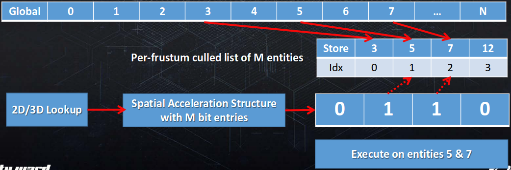

# Plus Methods: Introduction

# Plus Methods: Algorithm Steps

- レンダリングエンティティのリスト。
- カリングされるエンティティリストを持つ空間的高速化構造(spatial acceleration structure)。
- サンプリングポイントごとに実行されるアルゴリズム。
    - 高速化構造を走査する。
    - 存在するエンティティ上を反復する。
- Tiled/Clustered Forward+/Deferred+としても知られる。

# Spatial acceleration structure: Frustum

- タイル。
    - 深度プリパス。
    - タイル境界と最大最小深度でエンティティをカリングする。
    - 2Dの密なグリッド。
        - つまり、8x8ピクセルのタイル。
    - 深度の不連続性に苦しめられる。
<!--  -->
- クラスタ。
    - 深度プリパスの必要なし --- 3Dクラスタでエンティティをカリングする。
    - 任意の3D(錐台内)ルックアップができる。
    - メモリをより多く使えば、深度の不連続性をより和らげることができる。
        - Zスライスの分布。
    - メモリ消費のため、2Dで疎である可能性が高い。

# Data Structure Divergence performance issues

- タイル。
    - フォワードでは、１つのトライアングルが複数のタイルにまたがることがあり得る。
    - ディファードでは、wavefrontがタイルサイズにマッチすることがあり得る。
- クラスタ。
    - フォワードでは、１つのトライアングルが複数のクラスタにまたがることがあり得る。
    - ディファードでは、wavefrontが複数のZスライスにまたがることがあり得る。
- ボクセルツリー。
    - wavefrontが複数のボクセルにまたがることがあり得る。
- トライアングル/テクセル。
    - wavefrontが複数のトライアングル/テクセルにまたがることがあり得る。

# Divergence performance issues

- 高いVMEMとVALUのコスト。
    - divergence点を通り過ぎた(すなわち、タイル内の)すべての計算はベクトルごとに起こる。
    - すべてのメモリ読み込みは、コヒーレントであっても、ベクトルごとに起こるので、TCCユニットに無差別に送りつける(spam)。
    - メモリ算術命令はベクトルごとに起こるため、VALUコストに加えられる。
- 高いVGPRコスト。
    - すべての処理はベクトルベースのため、(エンティティのデスクリプタのような)すべての定数データはVGPRに読み込まれなければならない。

# Data Structures & Scalarization

# Scalarization

- 一度に1つのdivergentアイテムでのみwavefrontを実行する。
- wavefrontによりサンプルされたすべてのアイテム上で繰り返す。
    - 選択されたアイテムにのみ動かすためにすべてのwavefrontレーンをマスクする。
    - 次に移る。
- ディファードと同じようにフォワードでも使える。

# Data Container: Hierarchical

- リーフクラスタへのポインタ。
    - リーフクラスタは各エントリ中の見えているエンティティへのすべてのポインタを格納する。
    - エンティティ番号に束縛されない。
    - 間接参照により走査が高価になる。
    - 可変なメモリストレージコスト。

~~~c
// Typical Hierarchical Container iterator
address = containerAddressFromSamplePosition(samplePosition); // Find address of container for 2D / 3D position
// First entry is the header. Read and advance pointer
header = g_EntityClusterData[address++];
entityCount = GetEntityCountFromHeader( header );
// Iterate over entities inside the container
for ( entityItr = 0; entityItr < entityCount; entityItr++)
    ProcessEntity(g_EntityClusterData[address++]);
~~~

~~~c
// Hierarchical Container iterator scalarized over containers
address = containerAddressFromSamplePosition(samplePosition); // Find address of container for 2D / 3D position
uniformAddress = address;
currentLaneID = WaveGetLaneIndex();
execMask = ~ulong(0); // init mask to 111...111 – open for all lanes
ulong currentLaneMask = ulong(ulong(1) << ulong(currentLaneID));
while ((execMask & currentLaneMask) != 0) {  // set EXEC to remaining lanes
    uniformAddress = WaveReadFirstLane(address);
    laneMask = WaveBallot(uniformAddress == address); // mask of lanes to be processed in current iteration
    execMask &= ~laneMask; // remove currently alive lanes from mask
    if (uniformAddress == address) { // execute for lanes with matching coherent address
        header = g_EntityClusterData[uniformAddress++]; // First entry is the header. Read and advance pointer
        entityCount = GetEntityCountFromHeader(header);
        // Iterate over entities inside the container
        for (entityItr = 0; entityItr < entityCount; entityItr++)
            ProcessEntity(g_EntityClusterData[uniformAddress++]);
    }
}
~~~

# Scalarization: Hierarchical Container

- シェーダは完全にスカラ化されている。
    - VMEM/SMEMとVALU/SALUの均衡がいい感じに保たれている。
    - VGPRの使用率が低い(フォワードの定数読み込みに似ている)。
- パフォーマンスは大きく変化する。
    - wavefrontは、同じエンティティが異なるコンテナにある場合、複数回エンティティを処理する可能性がある。
    - データの一貫性/冗長性に依存して、結果として遅くなることがある。
- 理想的には、エンティティレベルでスカラ化する。
    - これは順序付いたコンテナが必要になる --- Flat Bit Array。

# Data Container: Flat

- Flat Bit Array
    - ビットのコレクション --- N番目のビットはグローバルリストでのN番目のエンティティの可視性を表す。
    - 単純な走査 --- ビットを通して反復する。
    - メモリ/エンティティ束縛 --- 錐台ごとのコンテキストでほぼ使われる。

~~~c
// Typical Flat Bit Array iterator
wordMin = 0;
wordMax = max(MAX_WORDS - 1, 0);
address = containerAddressFromSamplePosition(samplePosition);
// Read range of words of visibility bits
for (uint wordIndex = wordMin; wordIndex <= wordMax; wordIndex++) {
    // Load bit mask data per lane
    mask = entityMasksTile[address + wordIndex];
    while ( mask != 0 ) { // processed per lane
        bitIndex = firstbitlow( mask );
        entityIndex = 32 * wordIndex + bitIndex;
        mask ^= (1 << bitIndex);
        ProcessEntity(entityIndex);
    }
}
~~~

~~~c
// Flat Bit Array iterator scalarized on entity
wordMin = 0;
wordMax = max(MAX_WORDS -1, 0);
address = containerAddressFromSamplePosition(samplePosition);
// Read range of words of visibility bits
for (uint wordIndex = wordMin; wordIndex <= wordMax; wordIndex++) {
    // Load bit mask data per lane
    mask = entityMasksTile[address + wordIndex];
    // Compact word bitmask over all lanes in wavefront
    mergedMask = WaveReadFirstLane(WaveAllBitOr(mask));
    while (mergedMask != 0) { // processed scalar over merged bitmask
        bitIndex = firstbitlow(mergedMask);
        entityIndex = 32 * wordIndex + bitIndex;
        mergedMask ^= (1 << bitIndex);
        ProcessEntity(entityIndex);
    }
}
~~~

# Scalarization: Flat Container

- ビットマスクのスカラ化。
    - シェーダは完全にスカラ化されていて、各エンティティごとに一度だけ実行する。
    - VGPRの使用率が低い。
    - ベースラインよりさらに大幅に効率的。
    - 間違いなく(arguably)よりエレガントなコード。
- 作った(synthetic)テストシェーダでのスカラ化の結果。
    - スカラ化は密に照らされる環境でライトルックアップに適用した。

||VGPR数|占有率|コスト|
|-|-|-|-|
|ベースのF+|56|5|100%|
|スカラ化された階層的F+|32|8|98%|
|スカラ化されたフラットF+|32|8|72%|

# Scalarization

- 階層的なデータコンテナはコンテナレベルでスカラ化することができる。
    - タイル/クラスタ/ボクセルのアドレス。
- フラットなデータコンテナは格納したエンティティレベルでスカラ化することができる。
    - ライト/プロブ/デカールのインデックス。

# Z-Binning

||深度の非連続性|空間解像度|Zによるメモリスケーリング|
|-|-|-|-|
|タイル|-|+|+|
|クラスタ|+|-|-|

- オープンワールドの深度範囲。
    - 深度の複雑さが大きい所では高効率なクラスタリングのパフォーマンスやメモリは実践的ではない。

# F+ Renderer: Z-binning algorithm

- CPU:
    - ライトをZでソートする。
    - 可能性のある深度の合計範囲の上に均一に分布するbin(容器)を設定する。
    - 各bin境界内の最大最小のライトIDを持つ16ビットLUTを2つ生成する。
- GPU(PSかCS):
    - Vector load ZBIN
    - Wave uniform LIGHT MIN / MAX ID
    - Wave uniform LOAD of light bit WORDS from MIN / MAX range
    - ライトの最大最小IDからベクトルビットマスクを生成する。
    - ベクトルZ-Binマスクでユニフォームのライトをマスクする。

~~~c
// Z-Binのマスクされたワードを持つエンティティでスカラ化されたフラットビット配列のイテレータ
wordMin = 0;
wordMax = max(MAX_WORDS - 1, 0);
address = containerAddressFromScreenPosition(screenCoords.xy);

zbinAddr = ContainerZBinScreenPosition(screenCoords.z);
zbinData = maskZBin.TypedLoad(zbinAddr, TYPEMASK_NUM_DATA(FORMAT_NUMERICAL_UINT, FORMAT_DATA_16_16));
minIdx = zbinData.x;
maxIdx = zbinData.y;
mergedMin = WaveReadFirstLane(WaveAllMin(minIdx)); // この点からのスカラ値
mergedMax = WaveReadFirstLane(WaveAllMax(maxIdx)); // この点からのスカラ値
wordMin = max(mergedLightMin / 32, wordMin);
wordMax = min(mergedLightMax / 32, wordMax);

// 可視性ビットのワードの範囲を読む
for (uint wordIndex = wordMin; wordIndex <= wordMax; wordIndex++) {
    // レーンごとにビットマスクデータを読み込む
    mask = entityMasksTile[address + wordIndex];
    // ZBinマスク単位によるマスク
    localMin = clamp((int)minIdx - (int)(wordIndex * 32), 0, 31);
    uint maskWidth = clamp((int)maxIdx - (int)minIdx + 1, 0, 32);
    // BitFieldMask命令は手動で32のサイズラップをサポートする必要がある
    uint zbinMask = maskWidth == 32 ? (uint)(0xFFFFFFFF) : BitFieldMask(maskWidth, localMin);
    mask &= zbinMask;
    // wavefrontのすべてのレーン上のワードビットマスクをコンパクト化する
    mergedMask = WaveReadFirstLane(WaveAllBitOr(mask));
    while (mergedMask != 0) {  // マージされたビットマスク上で処理されるスカラ値
        bitIndex = firstbitlow(mergedMask);
        entityIndex = 32 * wordIndex + bitIndex;
        mergedMask ^= (1 << bitIndex);
        ProcessEntity(entityIndex);
    }
}
~~~

# F+ Renderer: Memory Performance

|構造(256ビット配列)|XY解像度|Z解像度|複雑さ|ストレージ|エンティティあたりのカリング処理数|
|-|-|-|-|-|-|
|Tiled Buffer|240x135|1|O(X*Y)|1036KB|32400|
|Tiled+ZBin|240x135|8096|O(X*Y+Z)|1036KB+32KB|32400+8096(単純)|
|Clustered|60x32|18|O(X*Y\*Z)|1106KB|34560|

# F+ Renderer: Z-Bin Performance

|構造(256ビット配列)|不透明レンダリング時間|
|-|-|
|Tiled Buffer|9.00ms|
|Tiled+Zbin|7.65ms(15%削減)|
: Hangar Fire Scene (PS4 1080p)

# F+ Renderer: Optimization Performance

|構造(256ビット配列)|不透明レンダリング時間|不透明パスの平均占有率|
|-|-|-|
|Base Tile|5.7ms(100%)|~3|
|Based Tile+Zbin|5.2ms(91%)|~3|
|Scalarized Tile|5.1ms(88%)|~4.3|
|Scalarized Tile+Zbin|4.6ms(80%)|~4.3|
: Zombies opening scene (PS4 1080p)

# Rasterization based culling

TODO

# References
