# 収差と補正[Aberrations and Corrections]

# 光学的収差[Optical Aberrations]

- 実際のレンズは理想的に像を作らない。
    - 不完全なフォーカス
    - 画像の歪み
    - 分散[dispersion]
    - などなど…

# 主な収差[Major Aberrations]

- 単色[monochromatic]収差
    - 単波長光線でも発生する。
    - Seidel[ザイデル]の5収差としても知られる。
- 色[chromatic]収差
    - 分散によって発生する。
        - 異なる色への可視光の分離
        - 多波長光線における異なる屈折率
    - 多波長光線によって発生するが、
        - モノクロフィルムではブラーとして発生する。
        - 短波長光線によるカラーフィルムでは発生しない。
            - ナトリウムランプ[sodium-vapor lamps]のようなもの。

# 単色および有色収差[Monochromatic and Chromatic Aberrations]

- 単色収差(Seidelの5収差)
    - 球面収差(SA)[spherical aberration]
    - コマ収差[coma]
    - 像面湾曲[field curvature]
    - 非点収差[astigmatism]
    - 歪曲収差[distortion]
- 色収差(CA)
    - 横色収差(倍率色収差)[lateral chromatic aberration(CA of magnification)]
    - 縦色収差(軸上色収差)[logitudinal chromatic aberration(axial CA)]

# ボケに影響を与える重要な収差の詳細[Details of Important Aberrations Which Affect Bokeh]

# 球面収差[Spherical Aberration]

- 光軸に平行な光線の焦点距離のズレ
- 収差は球面レンズに起因する。
    - 球状の表面は、
        - レンズとして理想的ではない。
        - 高い製造可能性[manufacturability]のために一般的に使われる。

# 球面収差の原理[Principle of Spherical Aberration]

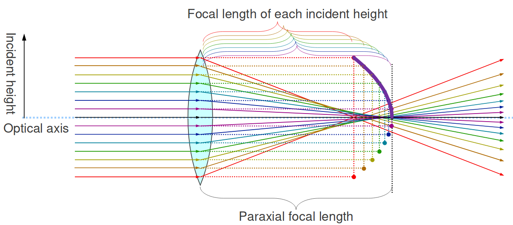

- 入射高[incident height]
- 光軸[optical axis]
- 各入射高の焦点距離[focal length of each incident height]
- 近軸の焦点距離[paraxial focal length]
<!--  -->
- 光線が光軸から離れるほど、光軸との交点がレンズに近くなる。

# 球面レンズのボケ[Spherical Lens Bokeh]

- スポットダイアグラム[spot diagrams]
- 前ボケ(シャープな輪郭)[front bokeh(sharp-edged)]
- 最小錯乱円(COLCとして知られる)[circle of least confusion(a.k.a. COLC)]
- 後ボケ(ソフトな輪郭)[back bokeh(soft-edged)]

# 球面収差に対する補正[Corrections for Spherical Aberration]

- ダブレットレンズ[doublet lens]
    - 凸[convex]レンズと凹[concave]レンズのペア。
    - 凹レンズの収差が凸レンズの収差を打ち消す。
    - 完璧に打ち消すことはできない。
- トリプレットレンズ[triplet lens]
    - ダブレットにもうひとつレンズを追加する。
    - 依然として完璧ではないが、更に良くなる。
- 非球面レンズ[aspherical lens]
    - 表面は理想に近い
    - 作るのが高価
    - 球面収差を完璧に取り除く

# ダブレットレンズ補正の例[Example of Doublet Lens Correction]

<!--  -->
- 球面レンズより更に複雑なボケ

# 球面収差のチャート(縦色収差のダイアグラム)[Spherical Aberration Charts(Longitudinal Aberration Diagrams)]

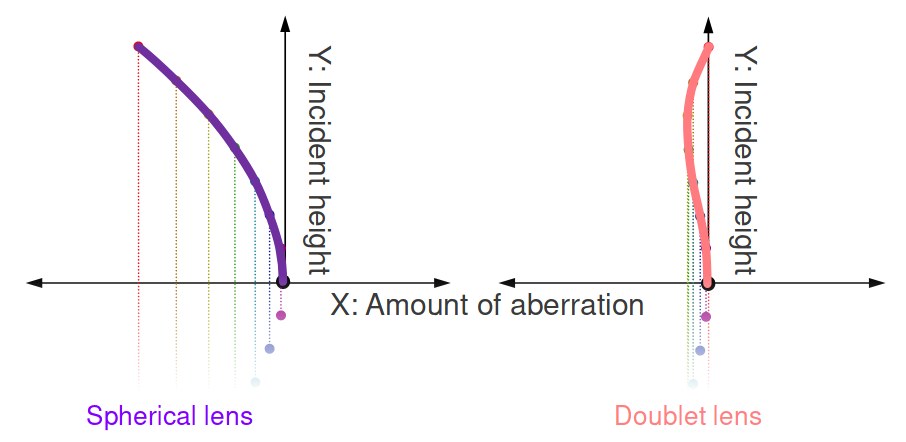

- Y軸:入射高(独立変数)
- X軸:球面収差量(従属変数)

<!-- p.16 -->

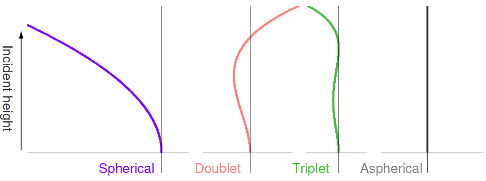

# ダイアグラムとボケ[Diagrams and Bokeh]

- 垂直に近いほど、補正が優れている。
    - 鮮明なフォーカス
    - 平坦なボケ

# 軸上色収差[Axial Chromatic Aberration]

- 光線波長の違いが収差を引き起こす。
- 波長によって屈折率が異なる。

# 軸上CAの原理[Principle of Axial CA]

# 軸上CAのボケ[Bokeh of Axial CA]

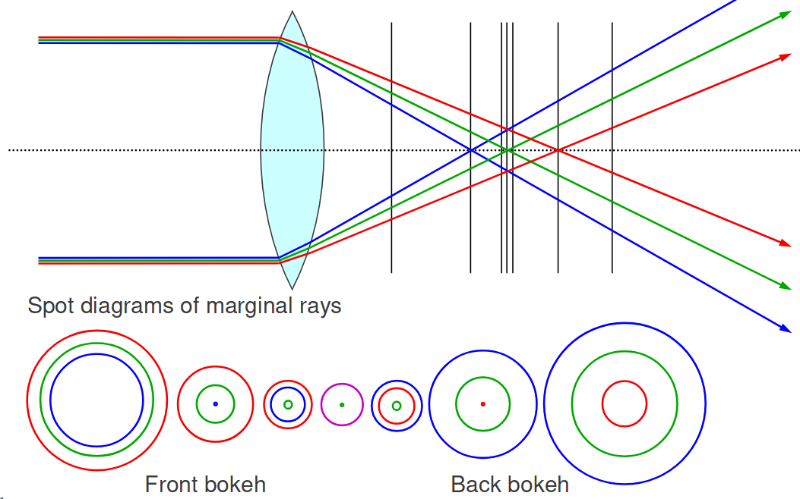

# [Effects of Axial CA]

- 前ボケは赤色のフチ[fringe]を示す。
- 後ボケは青色のフチ[fringe]を示す。
- 焦点距離の周辺では相対的に大きなフチを示す。

# 軸上色収差の補正[Correction of Axial Chromatic Aberration]

- アクロマティックレンズ[achromatic lens; 無色レンズ]
    - ダブレットかトリプレットなどによる補正
        - 異なる歪曲特性レンズの組み合わせ
        - 単一点でフォーカス可能な多波長光線
        - すべての波長で完璧に補正できるわけではない。

# アクロマティックレンズ[Achromatic Lens]

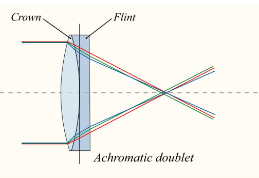

- アクロマティックレンズ(アクロマート[Achromat])
    - アクロマティックダブレットなど
    - 同じ点で2つの波長光線がフォーカスできる。
        - 例えば、赤と青

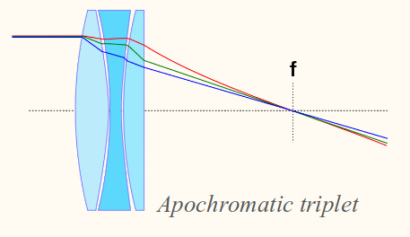

- アポクロマティックレンズ(APO)[apochromatic lens(APO)]
    - アポクロマティックトリプレットなど
    - 一般的には3つの波長光線がフォーカスできる。
        - 例えば、赤と緑と青

# アクロマティックダブレットの補正の例[Example of Achromatic Doublet Correction]

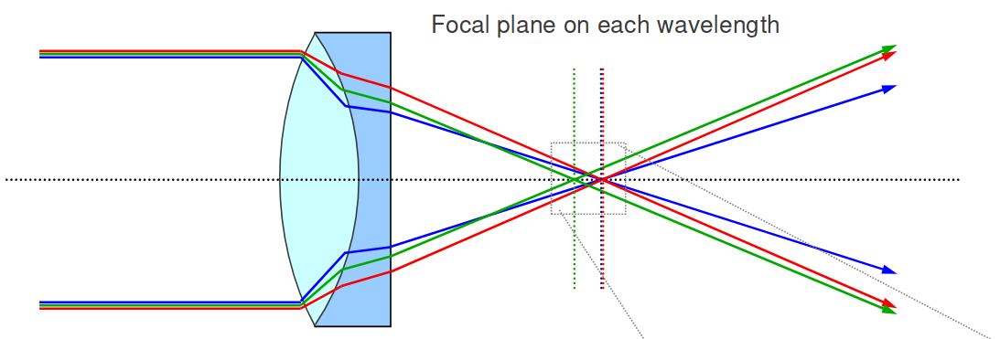

- すべての色の焦点位置を合わせることはできない。
    - 赤と青を合わせたら、その他(緑など)を合わせることはできない。

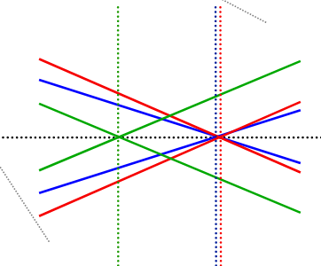

# アクロマティックダブレットのボケの例[Example of Achromatic Doublet Bokeh]

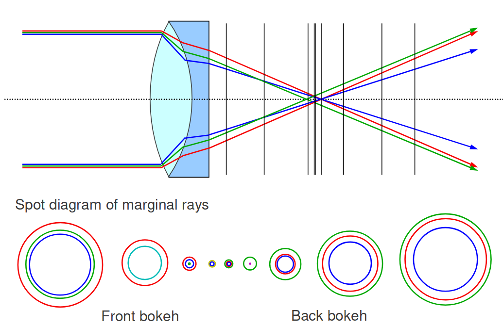

# 比較[Comparison]

- 軸上色収差
- 二次スペクトル[secondary spectrum]として知られる残存色収差[residual chromatic aberration]^[残存収差[residual aberration]とは補正を行った後に現れる収差のこと。]

# アクロマティックダブレットによる補正[Correction by Achromatic Doublet]

- ダブレットは球面収差も補正する。
- 各特徴のボケを組み合わせたもの
    - 球面収差の残存収差
        - 柔らかい/鋭い輪郭
        - 暗い中心/鋭いピーク
    - 軸上色収差の残存収差
        - 同心円状の色づいた円
- ⇒ **複雑なグラデーション**

# 多波長でのダイアグラムとボケ[Diagrams and Bokeh with Multiple Wavelengths]

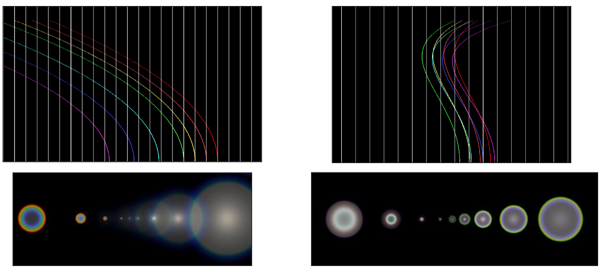

# 収差から補正されたボケ[Corrected Bokeh from Aberrations]

- アクロマティックダブレットによる補正
    - 広く使われている。
    - 典型的な補正の例
        - 前ボケにおける柔らかな紫色のフチ
        - 後ボケにおける鋭い緑色のフチ

# 残存収差が見えるか否か？[Is Residual Aberration Visible or Not?]

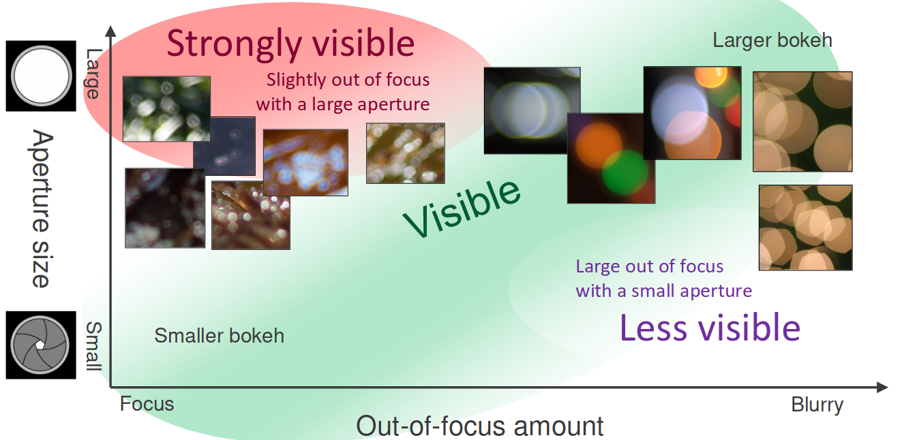

- 絞りサイズ[aperture size]
- ピンぼけ量[out-of-focus amount]
- はっきり見える[strongly visible]
    - 大きな絞りで若干のピンぼけ
- あまり見えない[less visible]
    - 小さい絞りで大きなピンぼけ

# 残存収差とボケの特徴[Residual Aberrations and Bokeh Characteristics]

# ボケの特徴[Bokeh Characteristics]

- ボケの特徴は以下によって変化する。
    - 収差
    - 残存収差
        - 補正が異なれば特徴も異なる。
- 残存収差は本質的に望ましくない。
    - たが、これらが現実の写真の特徴である。

# 複レンズシステムの現象[Phenomena of Multiple-Lens Systems]

# 複レンズシステム[Multiple-Lens Systems]

- 実際の光学システムは以下のために複数のレンズで構成される。
    - 収差の補正
    - ズーム
    - フォーカス呼吸の抑制
    - その他

# 複レンズVS単レンズ[Multiple-Lens vs. Single-Lens]

- より複雑な収差
- さまざまなボケ特徴
- 異なるフォーカス呼吸
- 可変な最大絞り
- 光学の口径食
- などなど

# フォーカス呼吸[Focus Breathing]

- フォーカス呼吸
    - 焦点を合わせるとき、FoVが変化する。
- フォーカス呼吸のタイプ
    - 単一のレンズ
        - レンズまたはセンサーをずらして焦点を合わせる。
            - 焦点距離は固定でフォーカス距離に依存しない。
        - 焦点に近いと、FoVが狭くなる。
            - 一定の焦点距離にも関わらず
                - (レンズからセンサーまでの)像距離[image distance]を大きくする。
                - F値が同じでも、実効F値が大きくなる(暗くなる)。
    - 複レンズシステム
        - 呼吸は焦点合わせのメカニズムで変化する。

# 焦点距離、センサーサイズ、FoV[Focal Length, Sensor Size and FOV]

- 視野角はしばしば以下のように説明される。
    - **センサーサイズと焦点距離の比に依存する。**
        - $fov = 2 \text{atan}(\frac{h}{2f})$
        - $f = h / (2 \tan(fov / 2))$
            - fov: 視野角
            - h: センサーサイズ
- 正確ではない
    - **無限遠にフォーカスしているときのみ正しい。**

# 正確なFoV計算[Accurate FOV Calculation]

- 視野角
    - **センサーサイズと像距離の比に依存する。**
        - $fov = 2 \text{atan}(h / 2d_i)$
        - $d_i = h / (2 \tan(fov / 2))$
    - レンズが存在するときのみ有効な計算
        - $fov = 2 \text{atan}(h(d_o - f) / 2 d_o f)$
        - $f = (d_o h / 2) / (d_o \tan(fov / 2) + h / 2)$
- 実効F値
    - $F_e = d_i / D$
    - レンズが存在するときのみ有効な計算
        - $F_e = (1 + M) F$
        - $F_e = (d_i / f) F$
            - 光学倍率:$M = d_i / d_o = f / (d_o - f) = d_i / f - 1$
- **焦点距離も正しく計算するために必要とされる。**
    - **焦点距離が定数ならば、FOVは有限フォーカス[finite focus]で狭くなる。**

# 焦点合わせのメカニズム[Focusing Mechanisms]

- 全群フォーカシング/フィルム後退フォーカシング[All-Group Focusing / Film-Back Focusing]
    - 単レンズシステムと同じメカニズム
    - 昔のレンズで使われていた。
    - **焦点に近くなると、視野角が狭くなる。**
        - 実効F値が小さくなる。
- 前群フォーカシング[Front-Group Focusing]
    - 昔のレンズで使われていた。
    - **通常は焦点に近くなると、視野角が狭くなる。**
        - 実効F値が小さくなる。
- インナー(インターナル)/リアフォーカシング[Inner(Internal) / Rear Focusing]
    - IF/RFとして知られる。
    - 最近のズームレンズで使われる。
    - **通常は焦点に近くなると、視野角が広くなる(高価なレンズほど広くなりづらくなる)。**
    - **フォーカスが呼吸しない(比較的高価なレンズ)。**
        - 実効F値は一定。

参考:http://photosku.com/archives/904/

# フォーカシングのメカニズムと呼吸の例[Focusing Mechanism and Breathing Examples]

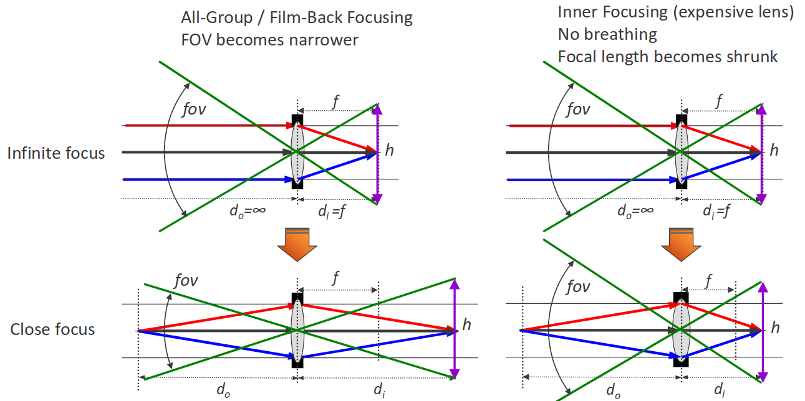

- 全群/フィルム後退フォーカシング
    - FOVは狭くなる。
- インナーフォーカシング(高価なレンズ)
    - 呼吸なし
    - 焦点距離が縮小する。[becomes shrunk]

<!-- p.45 -->

- 全群/フィルム後退フォーカシング
    - センサーを後方2fにずらす。(またはレンズ)
    - 焦点距離は一定。
    - 実効F値はより暗くなる。
- インナーフォーカシング
    - 像距離は固定。
    - 焦点距離は66.7%に縮小される。
    - FOVと実効F値は一定。

<!-- p.46 -->

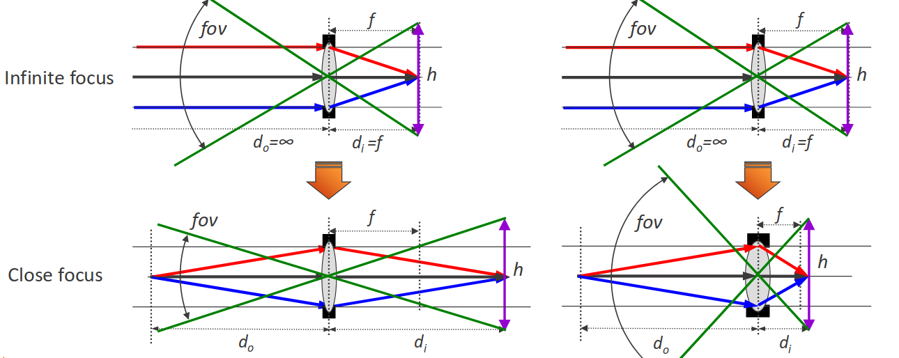

- 全群/フィルム後退フォーカシング
    - FOVは狭くなる。
- 典型的なインナーフォーカシング
    - FOVは広くなる。
    - 焦点距離は大幅に縮小する。

<!-- p.47 -->

- 全群/フィルム後退フォーカシング
    - センサーを後方2fにずらす。(またはレンズ)
    - 焦点距離は一定。
    - 実効F値はより暗くなる。
- インナーフォーカシング
    - 焦点距離はこの場合40%に縮小される。
    - 像距離は50%に縮小される。
    - FOVは広くなる。

# 可変絞りズームレンズ[Variable Aperture Zoom Lenses]

- 広い(12mm)
    - 最大絞りはf/2.8
- 狭い(60mm)
    - 最大絞りはf/4.0

# 有効口径$D$[Effective Aperture Diameter 'D']

- "入射瞳[entrance pupil]"の直径
    - 前方から見えるような絞りの虚像[virtual image]
    - 物理的な絞りの直径ではない。

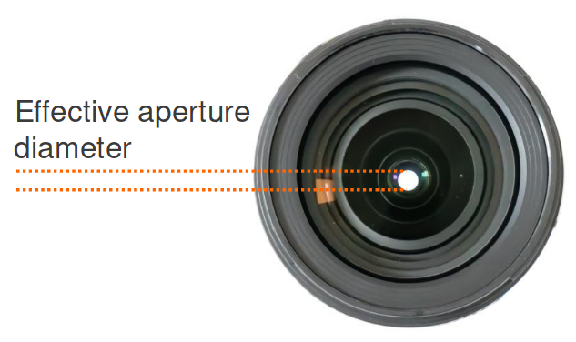

# ズームは虚像の直径を変化させる[Zooming Varies Virtual Image Diameter]

- 露出を維持するためには、FOVが狭くなるごとに直径を大きくする必要がある。
    - $D = f / F$

# ズームレンズのタイプ[Zoom Lens Types]

- 固定絞りのズームレンズ
    - 最小F値はズーム範囲全体を通して一定。
    - 有効口径は焦点距離に比例する($D = f / F$)。
- 可変絞りのズームレンズ
    - 最小F値は、FOVが狭くなるたび、大きくなる。
    - 有効口径は焦点距離に比例しない。

"最小F値"は"最大絞り"を意味することに注意。

# ズームレンズ製品の例[Examples of Zoom Lens Products]

- OLYMPUS D.ZUIKO (4/3")
    – 14-42mm F3.5-5.6
    – 12-60mm F2.8-4.0
    – 35-100mm F2.0  固定絞り
- CANON EF-S (APS-C)
    – 17-55mm F2.8  固定絞り
    – 18-135mm F3.5-5.6
    – 55-250mm F4.0-5.6
- DX NIKKOR (APS-C)
    – 17-55mm F2.8  固定絞り
    – 18-140mm F3.5-5.6
    – 55-200mm F4.0-5.6
- CANON EF (35mm)
    – 24-70mm F2.8  固定絞り
    – 70-200mm F2.8  固定絞り
    – 100-400mm F4.5-5.6
- FX NIKKOR (35mm)
– 24-70mm F2.8  固定絞り
– 70-200mm F2.8  固定絞り
– 80-400mm F4.5-5.6

# 実際のレンズの傾向[Tendency of Actual Lenses]

- より低倍率ズーム
- より高価な"より明るいレンズ"
    - ⇒ 最小F値は**小さく**変化する。
<!-- -->
- より高倍率ズーム
- より安価な"より暗いレンズ"
    - ⇒ 最小F値は**大きく**変化する。

# 結論[Conclusion]

- 実際のレンズは様々な収差を持つ。
    - 多くの解決法が収差を補正する。
    - 収差は完璧に補正することはできない。
        - 残存収差はボケにその特徴を与える。
- ボケは種類豊富[rich in variety]である。
    - 異なる補正は異なる表現を見せる。
    - 色のフチやグラデーションは前ボケと後ボケの間で変化する。
    - 被視認性: 小さなピンぼけ > 大きなピンぼけ

# 結論(続き)[Conclusion (cont'd)]

- 実際の光学システムは以下のために複数のレンズで構成される。
    - 収差の補正
    - ズーム
    - フォーカス呼吸の抑制
- おおくの現象は単レンズルールに従わない。
    - 異なるメカニズムによる異なるフォーカス呼吸
    - 異なるメカニズムによる異なるズームの絞り変化

# 参考文献[References]
