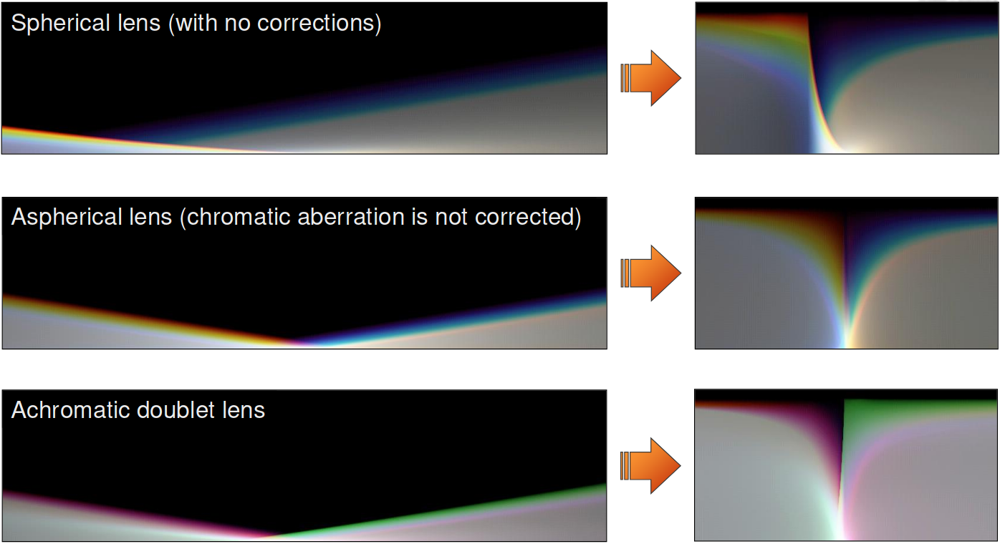
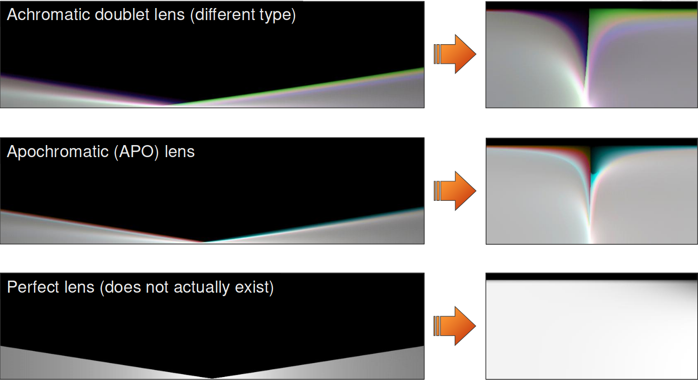
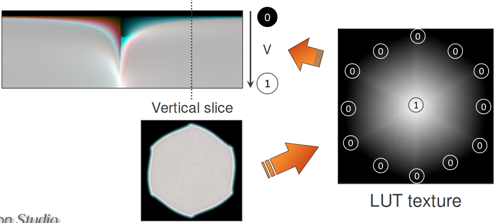
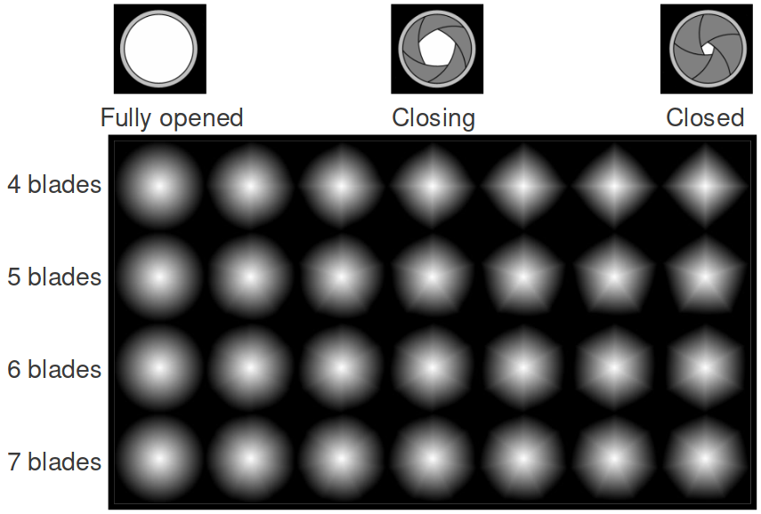
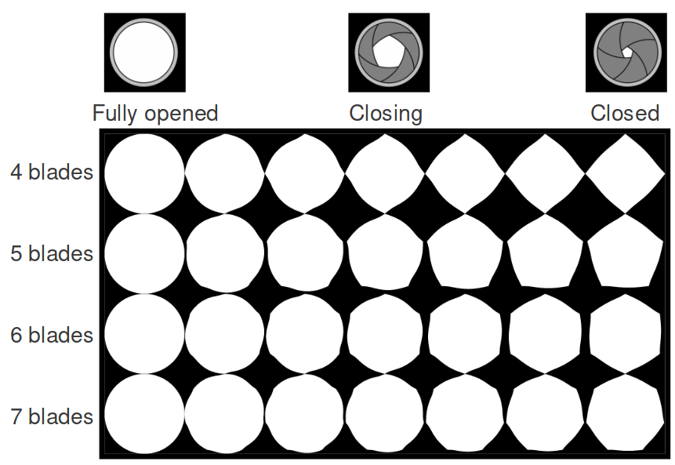

# はじめに[Introduction]

- 基本的なアイデアと理論[@Kawase2008]
    - 円形絞りのみ
- 実践的な実装と最適化[@Kawase2012]
    - 任意の絞り形状の種類

# ペンシルマップの生成[Creating the Pencil Map]

- 収差ダイアグラムから光路[light path]を事前計算する。
    - 球面色収差や軸上色収差を計算に入れる

# 円形ボケレンダリング[Circular Bokeh Rendering]

- V座標は光軸からの距離を表す。
    - 各スライスを円にマッピングすることで円形の'ボケ'を生成する。

# 離散化された結果…[Discretized Result...]

- 色収差は問題である。
- 3つの波長(R/G/B)では分散を表現するのに不十分である。

# 波長サンプリングの増加[Increasing Wavelength Samplings]

- より多くの波長でマップを計算する。
- RGB空間に変換する。

# 球面および色収差におけるボケ[Bokeh with Spherical and Chromatic Aberration]

- 不完全なフォーカス
- 赤の鋭いエッジを持つ前ボケ
- 青の柔らかいエッジを持つ後ボケ

# ダブレットのペンシルマップの生成[Creating the Pencil Map of Doublet]

- 縦収差ダイアグラムからマップを計算する。
- 実際のレンズパラメータを使う(それらが存在するならば)。
    - 各波長の光線経路のみが必須とされる。

# 写真との比較[Comparison with photographs]

- 一般的な補正
    - 前ボケは柔らかい紫のエッジを持ち、中心が暗くなる。
    - 後ボケは鋭い緑のエッジを持ち、中心が明るくなる。

# 異なるダブレットのタイプ[Different Type of Doublet]

- 残存色収差は残存球面収差より見えやすい。

# ペンシルマップの最適化[Optimization of Pencil Map]

- テクスチャでの無駄な部分
    - 疎で、多くのテクセルが空白である。
    - より重要な'焦点が合う'テクセル周辺の精度が十分でない。

<!-- p.21 -->

- 最大の高さ(ボケのサイズ)によってすべての距離(U軸)でかたまり[bundle]の高さを正規化する。
- 空白のテクセルが少なくなり、焦点が合うテクセル周辺の精度が大きく改善する。

# 任意の絞り形状への応用[Application to Arbitrary Aperture Shapes]

# 様々な絞り形状[Various Aperture Shapes]

- 絞り形状は重要な芸術的ファクタである。
    - 一般的に、5から9枚の絞り羽根[diaphragm blades]
    - 円形[rounded]からN角形に変化する。
- どうやってペンシルを多角形の絞り形状にマップするか？
    - 3Dテクスチャ？
        - 大きすぎるし、実践的ではない。

# ペンシルマップの間接参照[Indirect Reference of Pencil Map]

- ペンシルマップのV座標を格納するLUTテクスチャを事前計算する。

<!-- p.27 -->

- ランタイムでペンシルマップを間接的にサンプルする。

<!-- p.28 -->

- LUTは絞りの形状を決定する。
    - ペンシルマップに依存しない
    - 絞り羽根の曲がった形状を再生成できる。
        - 様々な絞り条件のためのLUT一式を準備する。
    - 星やハートといった他の形状も用いることができる。

# 様々なLUT[Various LUTs]

- 開き具合[opening levels]や絞り羽根の数ごとに
- 2つの隣接するLUT間を補間することで滑らかな変形が可能である。

# デバッグのためのシルエットのLUT[Silhouette LUTs for debug]

# 散乱か収集か？[Scattering or Gathering?]

# 両方実装できる[Both can be Implemented]

- 散乱によるほうが品質が良い
    - 処理負荷が高い
- ハイブリッドな手法が推奨される。
    - 散乱と収集の両方

# ハイブリッドな手法[Hybrid Method]

- ピクセルを散乱するか収集するかを決定するため、以下を使う。
    - CoCサイズ
    - 近傍ピクセル間の輝度差

# 最適化[Optimization]

- 散乱には半分の解像度のバッファを使う。
    - **散乱処理が16倍速くなる可能性がある。**
- 階層的な解像度のバッファでいくつかのパスに処理を分割する。
    - 大きなボケには低い解像度を使う。
    - **1/4x1/4の解像度での処理が256倍速くなる可能性がある。**
- 各解像度で比較的大きなボケには2x2ピクセルごとに1ピクセルを散乱する。
    - **特に処理負荷の高いピクセルが4倍速くなる可能性がある。**

# 曲がった絞りと光学の口径食[Curved Diaphragm and Optical Vignetting]

- 開く/閉じる
    - 変形
        - 円形絞り
        - 多角形絞り
    - 回転
    - 光学口径食
        - 猫目効果

# 様々な収差と補正[Various Aberrations and Corrections]

- 球面収差[SA]と軸上色収差[axial CA]の補正はボケに主に影響を与える。

# 結論[Conclusion]

- ペンシルマップとLUTでフォトリアリスティックなボケを再生成する。
    - ペンシルマップはボケの特徴を定義する。
    - LUTはボケの形状を定義する。
- 最適化
    - 様々な選択肢が利用可能
    - パフォーマンスを改善するために組み合わせて用いることができる。

# 参考文献[References]
