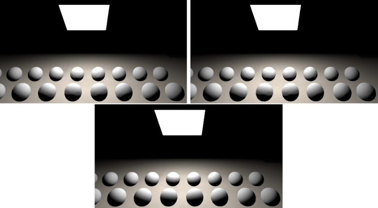

# まえがき(Introduction) {id="sec:1"}

# リファレンス(Reference) {id="sec:2"}

# マテリアル(Material) {id="sec:3"}

## マテリアルモデル(Material models) {id="sec:3.1"}

### 外観(Appearance)

### マテリアルモデル(Material models)

### エネルギー保存則(Energy conservation)

### 形状の特徴(Shape characteristics)

### Frostbiteの標準モデル(*Frostbite* standard model)

## マテリアルシステム(Material system) {id="sec:3.2"}

### マテリアル(Material) {id="sec:3.2.1"}

### レンダループ(Render loop)

## PBRとデカール(PBR and decals) {id="sec:3.3"}

# ライティング(Lighting) {id="sec:4"}

## 一般(General) {id="sec:4.1"}

## 解析的ライトパラメータ(Analytical light parameters) {id="sec:4.2"}

## ライト単位(Light unit) {id="sec:4.3"}

## パンクチュアルライト(Punctual lights) {id="sec:4.4"}

## 測光ライト(Photometric lights) {id="sec:4.5"}

## 太陽(Sun) {id="sec:4.6"}

## エリアライト(Area lights) {id="sec:4.7"}

### エリアライトの単位(Area light unit) {id="sec:4.7.1"}

### ディフューズエリアライト(Diffuse area lights) {id="sec:4.7.2"}

#### 一般(General) {id="sec:4.7.2.1"}

#### 球型エリアライト(Sphere area lights) {id="sec:4.7.2.2"}

#### ディスク型エリアライト(Disk area lights)

#### 球型とディスク型のエリアライトのマージ(Sphere and disk area light merging)

#### 矩形型エリアライト(Rectangular area lights)

#### チューブ型エリアライト(Tube area lights)

### 5倍ルール(Five times rule) {id="sec:4.7.3"}

### Disneyのディフューズによるディフューズエリアライト(Diffuse area light with Disney's diffuse) {id="sec:4.7.4"}

以前の導出のすべてはランバートBRDFに対して行われていた。しかし、マテリアルモデルの節で言及されるように、我々の標準マテリアルはDisneyのディフューズ項を用いる。これは解析的手法に対応しておらず、構造化されたサンプリングのアプローチで各サンプルのモデルに対する評価を呼び出すのが高価になる可能性があった。これを扱うために、我々はランバートエリアライトの照度へ単一のライト方向に対するDisneyのディフューズ評価を適用することとした。

$$
L_{\text{out}} = f_d(\boldsymbol{v}, \boldsymbol{l}) E(n)
$$ {#fig:45}

$\boldsymbol{l}$に対する最も単純な選択はライト位置を使うことである。いくつかのライトタイプでは、この近似は十分に良好である([@fig:45]参照)。しかし、より良い選択はDrobotのアプローチのように最も代表的な点の方向を取ることである([@fig:46]参照)。Frostbiteでは、パフォーマンス的な理由によりDisneyのディフューズ項に対して入力としてライト位置を使う。

{#fig:45}

{#fig:46}

BRDFローブの支配的な方向を計算に入れることでこの近似を改善することが可能である。この支配的な方向の処理は[@sec:4.9.3]にてその詳細を述べる。我々は表面の法線のシフトによりこれを取り戻す([@lst:15]参照)。しかし、その差異はとても微妙であるので、シェーダコストを減らすためにこのシフトを適用しないことにした。

~~~ {.c .numberLines id="lst:15"}
float3 getDiffuseDominantDir(float3 N, float NdotV, float roughness) {
    float a = 1.02341f * roughness - 1.51174f;
    float b = -0.511705f * roughness + 0.755868f;
    float lerpFactor = saturate((NdotV * a + b) * roughness);

    return normalize(lerp(N, V, lerpFactor));
~~~
: エリアライトを評価するとき、Disneyのディフューズ項のローブの支配的な方向を計算するための関数。

### スペキュラエリアライト(Specular area lights)

TODO

## (Emissive surfaces) {id="sec:4.8"}

## (Image based lights) {id="sec:4.9"}

### () {id="sec:4.9.1"}

## (Shadow and occlusion) {id="sec:4.10"}

### () {id="sec:4.10.1"}

### () {id="sec:4.10.2"}

### () {id="sec:4.10.3"}

### () {id="sec:4.10.4"}

## (Deferred / Forward rendering) {id="sec:4.11"}

# (Image) {id="sec:5"}

## () {id="sec:5.1"}

## () {id="sec:5.2"}

## () {id="sec:5.3"}

# (Transition to PBR) {id="sec:6"}

\appendix

# (Listing for reference mode) {id="sec:A"}

# (Oren-Nayar and GGX's diffuse term derivation) {id="sec:B"}

# (Energy conservation) {id="sec:C"}

# (Optimization algorithm for converting Disney's parametrization) {id="sec:D"}

# (Rectangular area lighting) {id="sec:E"}

# (Local light probe evaluation) {id="sec:F"}

# 参考文献(References)
