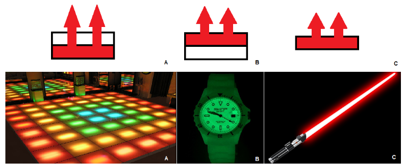
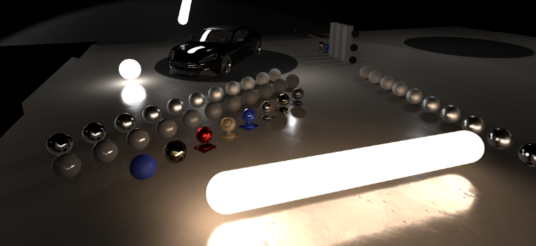
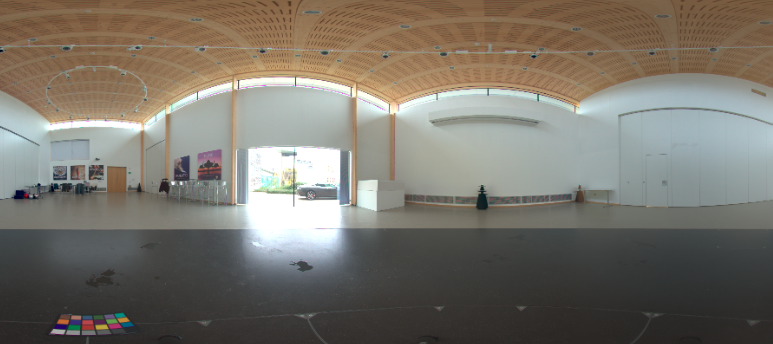
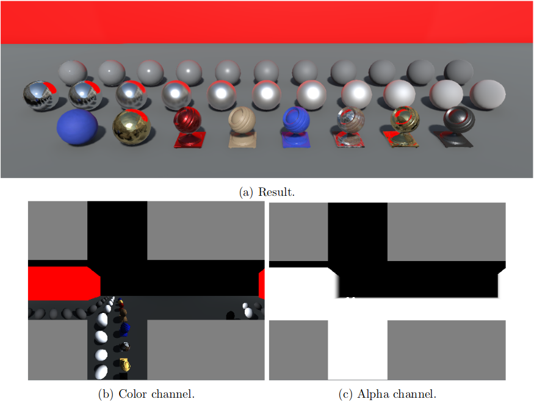
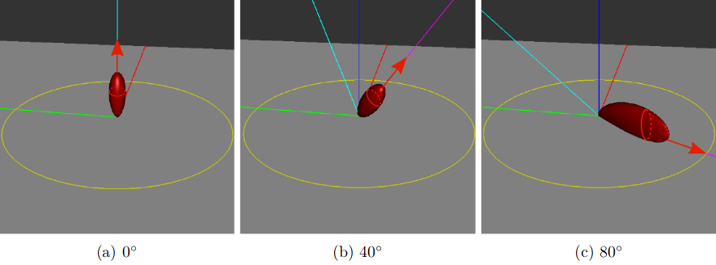
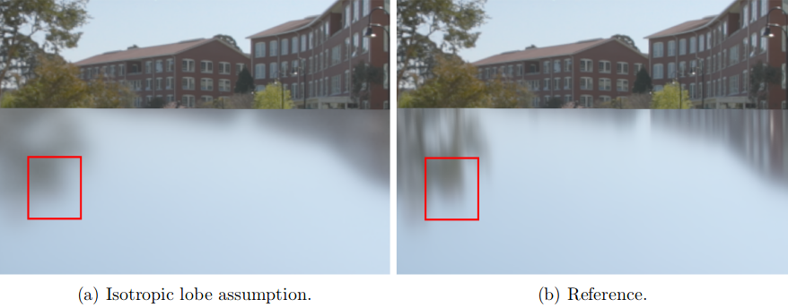
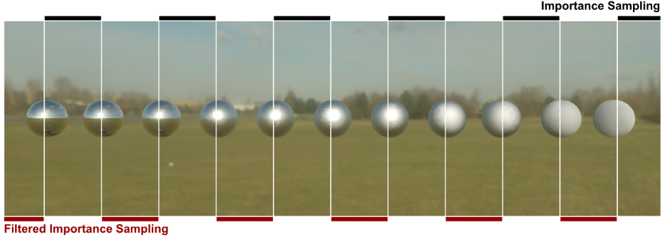
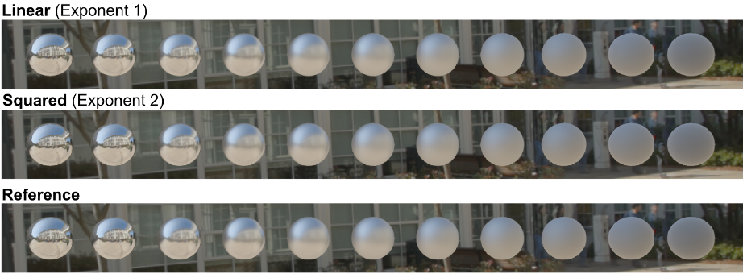
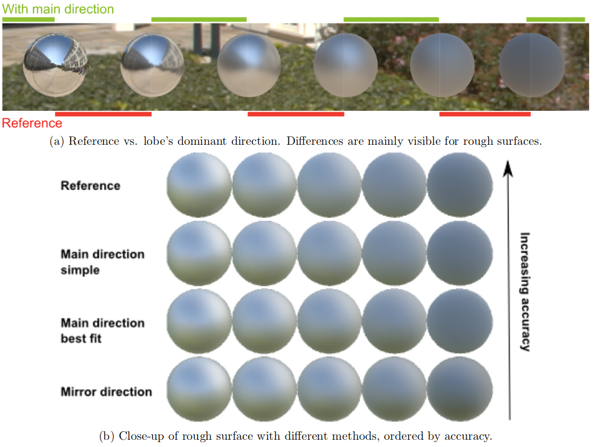
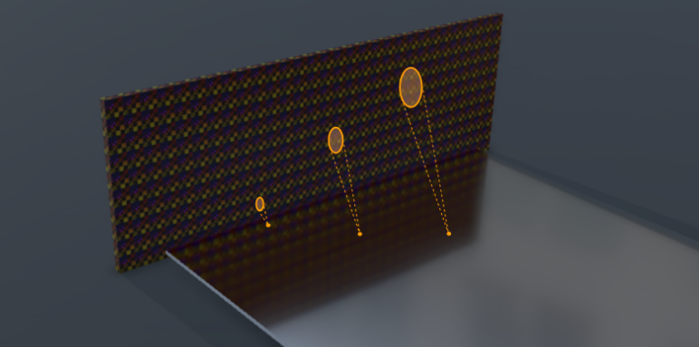

# まえがき(Introduction) {id="sec:1"}

# リファレンス(Reference) {id="sec:2"}

# マテリアル(Material) {id="sec:3"}

## マテリアルモデル(Material models) {id="sec:3.1"}

### 外観(Appearance)

### マテリアルモデル(Material models)

### エネルギー保存則(Energy conservation)

### 形状の特徴(Shape characteristics)

### Frostbiteの標準モデル(*Frostbite* standard model)

## マテリアルシステム(Material system) {id="sec:3.2"}

### マテリアル(Material) {id="sec:3.2.1"}

### レンダループ(Render loop)

## PBRとデカール(PBR and decals) {id="sec:3.3"}

# ライティング(Lighting) {id="sec:4"}

## 一般(General) {id="sec:4.1"}

## 解析的ライトパラメータ(Analytical light parameters) {id="sec:4.2"}

## ライト単位(Light unit) {id="sec:4.3"}

## パンクチュアルライト(Punctual lights) {id="sec:4.4"}

## 測光ライト(Photometric lights) {id="sec:4.5"}

## 太陽(Sun) {id="sec:4.6"}

## エリアライト(Area lights) {id="sec:4.7"}

### エリアライトの単位(Area light unit) {id="sec:4.7.1"}

### ディフューズエリアライト(Diffuse area lights) {id="sec:4.7.2"}

#### 一般(General) {id="sec:4.7.2.1"}

#### 球型エリアライト(Sphere area lights) {id="sec:4.7.2.2"}

#### ディスク型エリアライト(Disk area lights)

#### 球型とディスク型のエリアライトのマージ(Sphere and disk area light merging)

#### 矩形型エリアライト(Rectangular area lights)

#### チューブ型エリアライト(Tube area lights)

### 5倍ルール(Five times rule) {id="sec:4.7.3"}

### Disneyのディフューズによるディフューズエリアライト(Diffuse area light with Disney's diffuse) {id="sec:4.7.4"}

以前の導出のすべてはランバートBRDFに対して行われていた。しかし、マテリアルモデルの節で言及されるように、我々の標準マテリアルはDisneyのディフューズ項を用いる。これは解析的手法に対応しておらず、構造化されたサンプリングのアプローチで各サンプルのモデルに対する評価を呼び出すのが高価になる可能性があった。これを扱うために、我々はランバートエリアライトの照度へ単一のライト方向に対するDisneyのディフューズ評価を適用することとした。

$$
L_{\text{out}} = f_d(\boldsymbol{v}, \boldsymbol{l}) E(n)
$$ {#fig:45}

$\boldsymbol{l}$に対する最も単純な選択はライト位置を使うことである。いくつかのライトタイプでは、この近似は十分に良好である([@fig:45]参照)。しかし、より良い選択はDrobotのアプローチのように最も代表的な点の方向を取ることである([@fig:46]参照)。Frostbiteでは、パフォーマンス的な理由によりDisneyのディフューズ項に対して入力としてライト位置を使う。

{#fig:45}

{#fig:46}

BRDFローブの支配的な方向を計算に入れることでこの近似を改善することが可能である。この支配的な方向の処理は[@sec:4.9.3]にてその詳細を述べる。我々は表面の法線のシフトによりこれを取り戻す([@lst:15]参照)。しかし、その差異はとても微妙であるので、シェーダコストを減らすためにこのシフトを適用しないことにした。

~~~ {.c .numberLines id="lst:15"}
float3 getDiffuseDominantDir(float3 N, float NdotV, float roughness) {
    float a = 1.02341f * roughness - 1.51174f;
    float b = -0.511705f * roughness + 0.755868f;
    float lerpFactor = saturate((NdotV * a + b) * roughness);

    return normalize(lerp(N, V, lerpFactor));
~~~
: エリアライトを評価するとき、Disneyのディフューズ項のローブの支配的な方向を計算するための関数。

### スペキュラエリアライト(Specular area lights)

スペキュラエリアライトはリアルタイム制約下では本当に複雑な問題である。BRDFの入力(視線ベクトル、f0、ラフネス)の数と矩形(幅、高さ、向き、定数でない強度)のような標準ライトの形状のひとつはライトプロブと同様に事前計算アプローチを困難にする。文献で使える現在の解決法はGGXスペキュラモデルのリファレンスとの比較に耐えうるものではない。@Drobot2014b のMRPアプローチはPhongモデルに限りうまく行き、@Karis2013 の反射レイからの最短距離はうまいエネルギー保存の項が失われていおり、グレージング角でうまく動作しない。他の数学ヘビーな解決法と同じくエリアライトのためのフィルタされた重点サンプリング[@Colbert2010]に触発された他の解決法を試したが、シェーダコストは法外である。我々はground truthと一致させず、単純に最適なビジュアルを持つより安価な解決法を取ることを決めた。我々のライトはKarisのアプローチを用いているが、ディスクと矩形については、うまい粗いエネルギー保存の項をいずれも見つけられなかった([@fig:47]参照)。

{#fig:47}

粗い表面に対するスペキュラエリアライトの積分を多少改善するため、我々はBRDFローブの支配的な方向を計算に入れた。支配的な方向の処理は[@sec:4.9.3]でその詳細を述べている。鏡面方向のシフトによりそれを取り戻す([@lst:16])。エリアライトのバージョンはライトプロブで使われるそれよりも単純である。我々の場合ではそれで十分である事が判明した。[@fig:48]には鏡面と支配的な方向を使った比較を示す。これは相関ありと相関なしの両方のSmishのG項でうまく働く。

~~~ {.c .numberLines id="lst:16"}
float3 getSpecularDominantDirArea(float3 N, float3 R, float NdotV, float roughness) {
    // 単純な線形近似
    float lerpFactor = (1 - roughness);

    return normalize(lerp(N, R, lerpFactor));
}
~~~
: エリアライトを評価するとき、マイクロファセットGGXベースのスペキュラ項に対するローブの支配的な方向を計算する関数。

{#fig:48}

**備考**: ライトと表面の特性に依存すると、ディフューズエリアリアライトで計算される照度はスペキュラエリアライトには適切でないことがある(Lambertのコサインが常にディフューズとスペキュラの両方の項に適用されるパンクチュアルライトの場合とは異なる)。確かに、ライトの形状とBRDFの重点コーンの交差に対する立体角は異なる可能性があり、Lambertのコサインに関する積分結果が異なるはずである。

## エミッシブな表面(Emissive surfaces) {id="sec:4.8"}

現実世界では、エミッシブな表面はエリアライトと同等である。これらは光源のように近くの表面を照らす光を放射する。ゲームでは、パフォーマンス制約により伝統的なライトとして表面のエミッシブな部分を扱うことはできない。Frostbite内では、1)元となる表面に表示されるエミッシブライト、2)光を放つエリアライト、の2つの区別を設けた。エミッシブライトは他のライトと同様にエミッシブ色とエミッシブ強度値を与えることによりシェーダ内でピクセル精度で生成される。強度は輝度($\frac{cd}{m^2}$)かEV値で渡される。これらのエミッシブライトはライティングを生み出さず、見えている色のみを生み出す。しかし、その強度がカメラセンサーを飽和させたとき、これらはブルームを生み出す([@sec:5.1]参照)。我々は3つのエミッシブな表面のケースを大まかに示すことができる([@fig:49]を参照)。

- A. エミッシブマテリアルが非エミッシブマテリアルの下にある。
- B. エミッシブマテリアルが非エミッシブマテリアルの上にある。
- C. マテリアル全体がエミッシブである。

{#fig:49}

ケースBとCは、Bでエミッシブ層の下のマテリアルが覗けること以外、非常に近い。Frostbiteでは、暗黙的にケースCをサポートするケースBのみを扱う。エミッシブな表面を効率的にレンダリングするのは簡単ではない。ディファードなやり方でエミッシブな不透明オブジェクトを適切にレンダリングして、(Gバッファ生成パスの後にレンダリングされる)ディファードデカールとの互換性を保つためには、エミッシブ情報をGバッファに格納する必要がある。これはコストの高い追加のバッファを必要とする。Frostbiteでは様々なパスを持つ。

|||
|-|-|
|透明オブジェクト|エミッシブは表面のレンダリング中に適用される|
|フォワード不透明オブジェクト|エミッシブは表面のレンダリング中に適用される|
|完全なエミッシブを持つディファード不透明オブジェクト|エミッシブは表面の追加のレンダリングパスで適用される、つまり、表面は2回レンダリングされる|
|安価なエミッシブを持つディファード不透明オブジェクト|エミッシブはラジオシティバッファに格納され、間接ライティングとして同時に適用される|

間接ディフューズライティングはGバッファ生成時のディフューズアルベドで構成されていないが、これは後にディフューズアルベドを調整することをデカールで可能にするためである。アーティストがパフォーマンスを正確性とトレードしたいときに備えて、エミッシブ値をラジオシティバッファに格納できるようにしてある。このアプローチで問題になるのはエミッシブ色がディフューズアルベドと結合してしまうことである。ラジオシティバッファが適用されるとき、ディフューズアルベドをラジオシティバッファに乗算する。エミッシブでも同様である。ディフューズアルベドを調整するデカールはこの場合エミッシブも調整する。これが"安価"なエミッシブと呼ぶ所以である([@lst:17])。もうひとつの制約はこのテクニックがディフューズを持たないような金属質のオブジェクトで動作しないことである。

~~~ {.c .numberLines id="lst:17"}
// Gバッファ生成中に
float3 radiosity = ...;
// エミッシブをラジオシティにパックする(同じ単位(輝度)で)
radiosity += emissive * emissiveIntensity;
gBufferRadiosity = packLightingRGBA(gbufferRadiosity);

// ラジオシティアプリケーション中に
float3 unpackedRadiosity = unpackLightingRGBA(gbufferRadiosity);
indirectDiffuse = unpackedRadiosity * data.diffuseAlbedo;
~~~
: ディファードのケースで管理される安価なエミッシブ。

{#fig:50}

**備考**: エリアライトの場所に正確な強度を持つエミッシブ球を自動的に生成するツールを開発した。例を[@fig:51]に示す。これは実際に説得力のあるビジュアルシーンを生み出し、アーティストがこれらのライトをデバッグするのに役立つ。

{#fig:51}

## 画像ベースライト(Image based lights) {id="sec:4.9"}

画像ベースライト(IBL)は点を取り囲む入射するライティングを表すことができる。この取り囲むライティングはオブジェクトをその環境に"フィット"させるために重要である。アーティストから"反射"と呼ばれることが時折あるため、この入射ライティングはBRDFの式$f$、つまり、標準マテリアルに対するスペキュラ$f_r$の部分だけでなく$f_d$の部分も含めて、すべての部分に矛盾なく適用される必要がある。レイヤードマテリアルのようなさらに進化したマテリアルでは、すべてのレイヤがこのライティングによって影響を受ける必要がある。シェーダで反射テクスチャを直接追加することでこのライティングを"見せかけること(faking)"はライティングとマテリアルの情報の間の*鍵分離(key separation)* を破壊してしまい、異なる環境でアセットの再利用を難しくしている。IBLの$L$とBRDFの$f$との間の相互作用の計算は以下の積分を評価する必要があるコストの高い処理である。

$$
L(\boldsymbol{v}) = \int_{\Omega} f(\boldsymbol{l}, \boldsymbol{v}, \Theta) L(\boldsymbol{l}) d\boldsymbol{l}
$$ {#eq:46}

視線方向$\boldsymbol{v}$、マテリアルモデル$f$、パラメータ$\Theta$(Fresnel、ラフネス、アルベドなど)を持つ。連続的にオブジェクトを環境に合わせ、未だに良い反射の近似を提供するため、すべての状況で反射を提供できるようにする必要がある。このため、@Drobot2013 に触発された4つのタイプのIBLに頼る。こららのタイプのそれぞれは入射ライティングの特定のタイプか範囲を表現することを可能にする。

- **ディスタントライトプロブ**: 取り囲む遠く離れたライティングをキャプチャする。これはいかなる視差(parallax)を含まない(空、遠方の建物、背景の水滴など)。これは最も正確でない反射タイプであるが、いつでも利用できる。
- **ローカルライトプロブ**: ビューの単一の点からあるエリアに含まれるすべてのオブジェクトをキャプチャする(キューブマップ)。これらのキャプチャは、取り囲むジオメトリを一致させるためにアーティストにより慎重に調整された、単純なプロキシジオメトリに再投影される(例えば、球か箱)。この反射タイプはディスタントライトプロブより正確であるが、オブジェクトライティングと視差は完璧にキャプチャされない。
- **スクリーンスペース反射**: 深度バッファに対するレイマーチングによりライトバッファに基づく反射をキャプチャする。これは小から中の範囲の反射を捕らえ、良好なcontact hardening[^contact_hardening]反射を保証する。これは最も正確な反射源のひとつである。
- **平面反射(Planar Reflections)**: エンジンによる自動かアーティストによる手動いずれかでセットアップされた平面に反射したシーンをレンダリングすることで反射をキャプチャする。この反射タイプは反射が道路、建物、水面といったほぼ平坦な表面でうまく働く平面に横たわると仮定する。

[^contact_hardening]: 投影先への距離が近いほど像が正確になるような特徴。

**静的vs動的**: ディスタントライトプロブとローカルライトプロブは、ある瞬間における周辺のライティングをキャプチャした、通常"静的"なライティング情報を含む。これらのコンテンツは、要件や割り当てられたパフォーマンス予算に従い、要求に応じて又は毎フレームにリフレッシュさせることができる。SSRや平面反射は、それらの視点に依存するという特徴により毎フレーム更新されるため、"動的"なライティング情報を含む。これらの計算はそのコストを減らすためにいくつかのフレームに分散させることもできる。

簡単にSSRや平面反射を述べるが、この節は主にローカルライトプロブとディスタントライトプロブに焦点を当てる。まず、ライトプロブの取得とそのライティング単位を説明する。そして、それらのフィルタリング、評価、さまざまなIBLの合成を説明する。

### ライトプロブの取得と単位(Light probes acquisition and unit) {id="sec:4.9.1"}

Frostbiteでは、IBLは画像データに関連する定義によるものである。それらすべては、ライティングパイプラインの出力であるので、輝度単位を使う。

#### ディスタントライトプロブ(Distant light probe)

ディスタントライトプロブはキューブマップとして表される周囲の環境をキャプチャする。アーティストにはディスタントライトプロブを取得するための2つの方法がある。

- 任意に背景に合成される物理ベーススカイを通してライティングを取得する。
- 現実世界のカメラから取得したハイダイナミックレンジ画像(HDRI)を使う。

Frostbiteはディスタントライトプロブをキャプチャするために使われることがある物理ベーススカイを使う。ディスタントライトプロブは状況の変化(時刻サイクル、天候の変化など)に対処するときに必要に応じてリフレッシュさせることができる。スカイライティングはその他のライトのように輝度に変換される。キャプチャする時は、ライティングパイプラインのみを考慮する。我々はいかなる色管理処理(トーンマッピング、カラーグレーディング…)を含むポストプロセスを取り除き、HDRテクスチャフォーマットRGBA16Fに結果の輝度を格納する。

現実世界のディスタントライトプロブをうまく使うには何が取得されていたかを理解する必要がある。取得したHDR画像は静的な特徴によりインゲームで最終的なライティングにまれに使われる。これらはむしろ、アセットを設計したり、マテリアル特性が自然なライティングで正しく反応することを検証したりするために、入射ライティングとして使われる。しかし、取得したHDRIをインゲームライティングと混ぜ合わせる必要があるとき、注意して行う必要がある。HDRIのテクセルに格納してあるものが明確ではない。カメラが輝度値を出力すると考えられるかもしれないが、カメラの応答とポストプロセスステップは最高と最低の輝度値をカットする。出力されたピクセルはもはや輝度値を表さしておらず、むしろそれはもとのシーン輝度に関係するデバイス依存の値である。輝度からピクセル値への変換を詳しく述べる実際のプロセスは[@sec:5.1]にその詳細を述べる。

**HDRI生成**: LDRカメラでは、続くキャプチャの複雑なプロセスと再構築が **絶対輝度範囲(absolute luminance range)**[@Debevec1997]でHDR画像を得ることを可能にする。このプロセスは、複数の露出でシーン受け取り、(輝度HDR[@Anastasia]のような)ソフトウェアで後にそれらを組み合わせるということを暗に示す。ソフトウェアはデバイス依存の応答曲線によりもとのシーン輝度を再構成する。良い画像[^footnote36]を取得することと、カメラ応答曲線を識別できることという二重の困難は、アーティストによって生み出されたほとんどのHDR画像が **相対的輝度** か露出前の輝度を表現するだけになっている、ということを暗に示している([@fig:52]参照)。他のライトタイプとそのようなディスタントライトプロブを混ぜ合わせるために、我々は相対的輝度値を調整するためのマルチプライヤをアーティストに提供する。Mac-Bethチャート、カメラ設定、よく知られた輝度値に基づく手動のキャリブレーションにより、アーティストは絶対輝度を取り戻すために良いファクタを見つけることができる[^footnote37]。正しく再構築された画像では、晴れた空は約$8000[\frac{cd}{m^2}]$の輝度を持ち、曇り空では約$2000[\frac{cd}{m^2}]$の輝度を持つ。夜のシーンでは、$3000[\frac{cd}{m^2}]$から$5000[\frac{cd}{m^2}]$の値はストリートのライト照明では珍しくない。月の輝度は約$2500[\frac{cd}{m^2}]$で、他のオブジェクトは、環境光でのみ照らされるときは、$1[\frac{cd}{m^2}]$以下になるためかなり暗くなる[@McNeel2015]。

{#fig:52}

[^footnote36]: 脚注36: 自然な密度フィルタを使うと、特に太陽をキャプチャしようとする[@Reinhard2005]ときに、適切な輝度を再構築するのに役立つ。

[^footnote37]: 脚注37: MaxwellやVRayはHDRIを輝度単位ではなく放射輝度単位として考えていることを確認した。我々の結果と合わせるためにこのソフトウェアのHDRIを683で除算する必要がある。CañadaはMaxwellにおいて、これが下手に取得された古いHDRIに関する歴史的な理由によるものであることを確認していた。

**強い光源**: 取得したHDRIでは、事前のインテグレーション間のノイズを避け(次節を参照)、それらの可視性を扱うためにライトプロブから強い光源を取り除くことが必要である。例えば、ライトプロブにベイクする代わりに太陽をディレクショナルライトとすると、適切に太陽のシャドウイングを扱うことができる。HDRIから太陽を取り除くことは太陽に周囲の空の小さな部分を単純にコピペする必要がある。

### ローカルライトプロブ(Local light probes) {id="sec:4.9.2"}

ローカルライトプロブはそれらのボリュームの周りの限られたエリアにある周囲のオブジェクトをキャプチャする。その目標はローカルな環境を一致させることである。この取得は常にエンジン内で処理され、オフラインで"ベイク"又は一度だけキャプチャされる、要求に応じてリフレッシュされる、実行時に毎フレームリフレッシュさせる、のいずれかを行うことができる。その選択は予算や必要条件(動くオブジェクト、ライティング状況の変化、など)に依存する。ローカルライトプロブをキャプチャすると、レンダリングの問題が生じる。

- **順序依存性(Order-dependency)**: ローカルライトプロブをキャプチャし終わるまで、シーンはローカルライトプロブで照らすことができない。この鶏と卵[^chicken_and_egg]の問題は、ローカルライトプロブがあるものの後に別のものをキャプチャする場合にキャプチャの順序依存性を生じさせる。
- **メタリックな表面**: メタリックな表面はキャプチャ時にディフューズの寄与もスペキュラの寄与も持たないために問題となり、結果として真っ黒な見た目になる。光のバウンスをシミュレートするために何回かローカルライトプロブをキャプチャすることが可能になる。もうひとつの可能性として、ディスタントライトプロブのライティングに頼ることが挙げられるが、屋内の環境で明らかなライトリークが現れる可能性がある。
- **ビュー依存の効果**: ローカルライトプロブ単一の点(つまり、キューブマップの中心)でキャプチャされる。そして、光沢のある鏡のような表面から入射するこのライティングは、ビュー依存性のために、キャプチャされた点以外の視点では誤りである。

[^chicken_and_egg]: 生命の起源として鶏と卵のどちらが先に現れたのか、という循環する因果関係のジレンマ。

これらの問題を解決するため、我々はライトプロブの取得中にマテリアルのスペキュラ要素を無効化する。スペキュラ項のみを含むメタリックな表面はディフューズアルベドとしてFresnel$f_0$を用いることでディフューズ表面として近似される。キャプチャ中に、アルファチャンネルに周囲のオブジェクトの可視性も格納する。これはローカルライトプロブの寄与をフェードするためにIBL合成の間で後に使われる。[@fig:53]はキャプチャされたローカルライトプロブの例を示す。

{#fig:53}

**関与媒質**: 例えば霧がかった環境では、ローカルライトプロブの寄与を評価するときに、理想としては媒質の透過率を計算に入れるべきである。フォグをローカルライトプロブに直接的に取得するのは、それが3D($\theta$、$\phi$、深度)ではなく2D($\theta$、$\phi$)の関数をモデル化するので、正しく動作しない。なので、この単純な2D関数では、陰影付けされる点とローカルライトプロブのプロキシジオメトリとの間の実際の透過率を計算することはできない。

{#fig:54}

### ライトプロブのフィルタリング(Light probe filtering) {id="sec:4.9.2"}

[@eq:46]の積分は視線方向$\boldsymbol{v}$、マテリアルモデル$f$、そのパラメータ$\Theta$に依存する。通常はそのような積分は解析解を持たず、一般的にはMonte-Carloのような確率的な積分のテクニックによる、数値的な評価を必要とする。そのような積分を直接評価するには毎フレームに各ピクセルごとに大量のサンプルを必要になると思われる。これは可能であるが、ゲームのようなハイパフォーマンスアプリケーションの文脈では現実的ではない。重点サンプリングはサンプル数を減らすことができるが、複数重点サンプリング(multiple-importance sampling; MIS)でさえ各フレームで各ピクセルを評価するために必要とするサンプル数は多すぎる。

**スペキュラの事前統合**: この評価を単純化するため、いくつかの近似を作ることで積分を事前統合することができる。すべての$\boldsymbol{v}$と$\Theta$に対してこの式を事前に統合することは巨大なメモリフットプリントを必要とするだろう。そのため、初めの近似はビュー依存を取り除くことである。これはBRDFの粗い近似を引き起こすが、マイクロファセットフレームワーク及び/又は半角パラメータ化に基づくBRDFの形状は[@fig:54]に示されるように見る角度に強く依存するため、許容できるトレードオフである。法線入射方向では、BRDF形状は等方的である。グレージング角では、BRDF形状は異方的である。[@eq:46]を事前統合することでビュー依存を取り除くことはBRDF形状がすべての角度から見て等方的であるという仮定を行う。これは、引き伸ばされた反射(stretched refrections)を妨げるような、重要な(key)ビジュアルの差異を引き起こす。この近似は[@fig:55]に示されるように平坦な表面でかなり目立つ可能性があるが、曲がった表面では多少目立ちにくくなる[^footnote38]。

{#fig:55}

[^footnote38]: 脚注38:積分を正しく評価し、引き伸ばされた反射を復元するために事前にフィルタした重点サンプリング[@Krivanek2008]を使うか、事前統合と @Green2007 に示されるような等方的なローブの分解を使うかのいずれかが可能である。

事前統合の次元性をさらに減らすため、ラフネス$\alpha$と0°の入射角でのFresnel値$f_0$による$\Theta = (f_0, \alpha)$へパラメータ数を減らす必要がある。先に述べたように、[@eq:46]は数値積分する必要がある。"事前にベイク"されたローカルライトプロブにおいて、この積分は、すべての計算がオフラインで行われるため、あらゆるパフォーマンスに関する懸念を持たずに行うことができる。しかし、オンデマンドなライトプロブ、連続的にリフレッシュされるローカルライトプロブ、アーティストによる高速な操作(ローカルライトプロブの配置、ディスタントライトプロブの回転)では、パフォーマンスが重要(critical)であり、良好な質/速度の比率を達成する必要がある。重点サンプリング[^footnote39]は被積分関数の重要な部分での計算に注力することで集束を早めるために使うことができる。

[^footnote39]: 我々は事前統合でMISを使おうとしたが、確率テーブルの構築コストと各サンプルごとのバイナリサーチコストは収束の利得と比べて大きすぎた。

$$
L(v) = \frac{1}{N} \sum_i^N \frac{f_r(\boldsymbol{l}_i, \boldsymbol{v}, \Theta) L(\boldsymbol{l}_i)}{p_r(\boldsymbol{l}_i, \boldsymbol{v}, \Theta)} \langle \boldsymbol{n} \cdot \boldsymbol{l}_i \rangle
$$ {#eq:47}

$p_r$はBRDFのPDFを表す。$\boldsymbol{l}_i$は$p_r$から生成されたサンプルである。@Karis2013 はマイクロファセットBRDFの場合には、[@eq:47]の積分はLDとDFGの2つの項の積に分けることで近似することができることを示した。$p_r = D(\boldsymbol{h}, \alpha) \langle \boldsymbol{n} \cdot \boldsymbol{h} \rangle J(\boldsymbol{h})$とハーフベクトルからライティングベクトルへの変換のヤコビアン$J(\boldsymbol{h}) = \frac{1}{4 \langle \boldsymbol{v} \cdot \boldsymbol{h} \rangle}$により、以下を得る。

$$
L(v) = \frac{1}{N} \sum_i^N \frac{f_r(\boldsymbol{l}, \boldsymbol{v}, \Theta) L(\boldsymbol{l}_i)}{p_r(\boldsymbol{l}, \boldsymbol{v}, \Theta)} \langle \boldsymbol{n} \cdot \boldsymbol{l} \rangle
$$ {#eq:48}

$$
= \frac{1}{N} \sum_i^N \frac{D(\boldsymbol{h}, \alpha) F(\boldsymbol{v}, \boldsymbol{h}, f_0, f_{90}) G(\boldsymbol{l}, \boldsymbol{v}, \boldsymbol{h}, \alpha)}{4 \langle \boldsymbol{n} \cdot \boldsymbol{l} \rangle \langle \boldsymbol{n} \cdot \boldsymbol{v} \rangle} \frac{1}{p_r(\boldsymbol{l}, \boldsymbol{v}, \Theta)} L(\boldsymbol{l}) \langle \boldsymbol{n} \cdot \boldsymbol{l} \rangle
$$ {#eq:49}

$$
= \frac{1}{N} \sum_i^N \frac{D(\boldsymbol{h}, \alpha) F(\boldsymbol{v}, \boldsymbol{h}, f_0, f_{90}) G(\boldsymbol{l}, \boldsymbol{v}, \boldsymbol{h}, \alpha)}{4 \langle \boldsymbol{n} \cdot \boldsymbol{v} \rangle} \frac{1}{p_r(\boldsymbol{l}, \boldsymbol{v}, \Theta)} L(\boldsymbol{l})
$$ {#eq:50}

$$
= \frac{1}{N} \sum_i^N \frac{D(\boldsymbol{h}, \alpha) F(\boldsymbol{v}, \boldsymbol{h}, f_0, f_{90}) G(\boldsymbol{l}, \boldsymbol{v}, \boldsymbol{h}, \alpha)}{4 \langle \boldsymbol{n} \cdot \boldsymbol{v} \rangle} \frac{4 \langle \boldsymbol{v} \cdot \boldsymbol{h} \rangle}{D(\boldsymbol{h}, \alpha) \langle \boldsymbol{n} \cdot \boldsymbol{h} \rangle} L(\boldsymbol{l})
$$ {#eq:51}

$$
= \frac{1}{N} \sum_i^N \frac{F(\boldsymbol{v}, \boldsymbol{h}, f_0, f_{90}) G(\boldsymbol{l}, \boldsymbol{v}, \boldsymbol{h}, \alpha)}{\langle \boldsymbol{n} \cdot \boldsymbol{v} \rangle \langle \boldsymbol{n} \cdot \boldsymbol{h} \rangle} \langle \boldsymbol{v} \cdot \boldsymbol{h} \rangle L(\boldsymbol{l})
$$ {#eq:52}

$$
\approx \frac{1}{N} \sum_i^N \frac{F(\boldsymbol{v}, \boldsymbol{h}, f_0, f_{90}) G(\boldsymbol{l}, \boldsymbol{v}, \boldsymbol{h}, \alpha)}{\langle \boldsymbol{n} \cdot \boldsymbol{v} \rangle \langle \boldsymbol{n} \cdot \boldsymbol{h} \rangle} \langle \boldsymbol{v} \cdot \boldsymbol{h} \rangle \frac{1}{\sum_i^N \langle \boldsymbol{n} \cdot \boldsymbol{l} \rangle} \sum_i^N L(\boldsymbol{l}) \langle \boldsymbol{n} \cdot \boldsymbol{l} \rangle
$$ {#eq:53}

この分離はDFGとLDの2つの独立した項を導く。これらは個別に事前計算することができる。LD項は各ライトプロブごとに計算する必要があるが、DFGは一度だけ計算してすべてのライトプロブで再利用できる。[@lst:18]はDFG項を示す。ここでは、異なる重み付け$\frac{1}{\sum_i^N \langle \boldsymbol{n} \cdot \boldsymbol{l} \rangle}$と同様にLD項の追加の$\langle \boldsymbol{n} \cdot \boldsymbol{l} \rangle$に注意したい。これらの経験的な項は、この積分の分割可能性の粗い仮定に悩まされている再構築されたライティング積分を改善できるようにKarisにより導入された。これらの項には数学的な導出が存在せず、定数$L(\boldsymbol{l})$に完全一致することが目標であった[^footnote40]。[@Karis2013]で示されるように、Fresnel項のSchlickの式を用いることで、

[^footnote40]: 我々は分離を若干の改良を加えて数学的に定義してみた。しかし、理論がよくなったとしても、ビジュアル結果はKarisの分離で得たものより常に悪くなった。

$$
F(\boldsymbol{v}, \boldsymbol{h}, f_0, f_{90}) = f_0 + (f_{90} - f_0)(1 - \langle \boldsymbol{v} \cdot \boldsymbol{h})^5
$$ {#eq:54}

DFG項は見る角度$v$とラフネス$\alpha$にのみ依存する2D関数で表す事ができる。$f_0$と$f_{90}$は事前計算の外に出す。この2D関数は$DFG_1$と$DFG_2$の2つの項を格納する。

$$
DFG(\boldsymbol{v}, \boldsymbol{l}, f_0, f_{90}, \alpha) = \frac{1}{N} \sum_i^N \frac{(f_0 + (f_{90} - f_0)(1 - \langle \boldsymbol{v} \cdot \boldsymbol{h} \rangle)^5) G(\boldsymbol{l}, \boldsymbol{v}, \boldsymbol{h}, \alpha)}{\langle \boldsymbol{n} \cdot \boldsymbol{v} \rangle \langle \boldsymbol{n} \cdot \boldsymbol{h} \rangle} \langle \boldsymbol{v} \cdot \boldsymbol{h} \rangle
$$ {#eq:55}

$$
= \frac{1}{N} \sum_i^N (f_0 + (f_{90} - f_0) F_C) G_{\text{Vis}} \text{ with } G_{\text{Vis}} = \frac{G(\boldsymbol{l}, \boldsymbol{v}, \boldsymbol{h}, \alpha)}{\langle \boldsymbol{n} \cdot \boldsymbol{v} \rangle \langle \boldsymbol{n} \cdot \boldsymbol{h} \rangle} \langle \boldsymbol{v} \cdot \boldsymbol{h} \rangle, F_C = (1 - \langle \boldsymbol{v} \cdot \boldsymbol{h} \rangle)^5
$$ {#eq:56}

$$
\frac{1}{N} \sum_i^N f_0 G_{\text{Vis}} + f_{90} F_C G_{\text{Vis}} - f_0 F_C G_{\text{Vis}}
$$ {#eq:57}

$$
f_0 \frac{1}{N} \sum_i^N (1 - F_C) G_{\text{Vis}} + \frac{1}{N} \sum_i^N f_{90} F_C G_{\text{Vis}}
$$ {#eq:58}

~~~ {.c .numberLines id="lst:18"}
void importanceSampleCosDir(in float2 u, in float3 N, out float3 L, out float NdotL, out float pdf) {
    // ローカルなreferencial
    float3 upVector = abs(N.z) < 0.999 ? float3(0, 0, 1) : float3 (1, 0, 0);
    float3 tangentX = normalize(cross(upVector, N));
    float3 tangentY = cross(N, tangentX);

    float u1 = u.x;
    float u2 = u.y;

    float r = sqrt(u1);
    float phi = u2 * FB_PI * 2;

    L = float3(r * cos(phi), r * sin(phi), sqrt(max (0.0f, 1.0f - u1)));
    L = normalize(tangentX * L.y + tangentY * L.x + N * L.z);

    NdotL = dot(L, N);
    pdf = NdotL * FB_INV_PI;
}

float4 integrateDFGOnly(in float3 V, in float3 N, in float roughness) {
    float NdotV = saturate(dot(N, V));
    float4 acc = 0;
    float accWeight = 0;

    // 事前統合を計算する
    Referential referential = createReferential(N);
    for (uint i = 0; i < sampleCount; ++i) {
        float2 u = getSample(i, sampleCount);
        float3 L = 0;
        float NdotH = 0;
        float LdotH = 0;
        float G = 0;

        // 実装は[@Karis2013]を参照
        importanceSampleGGX_G(u, V, N, referential, roughness, NdotH, LdotH, L, G);

        // スペキュラGGXのDFG事前統合
        float NdotL = saturate(dot(N, L));
        if (NdotL > 0 && G > 0.0) {
            float GVis = G * LdotH / (NdotH * NdotV);
            float Fc = pow(1 - LdotH , 5.f);
            acc.x += (1-Fc) * GVis;
            acc.y += Fc * GVis;
        }

        // ディフューズDisneyの事前統合
        u = frac(u + 0.5);
        float pdf;
        // pdfは他の項で打ち消されるため使われない
        // (ディフューズBRDFから1/PIとLambertの法則からNdotL)
        importanceSampleCosDir(u, N, L, NdotL, pdf);
        if (NdotL > 0) {
            float LdotH = saturate(dot(L, normalize(V + L));
            float NdotV = saturate(dot(N, V));
            acc.z += Fr_DisneyDiffuse(NdotV, NdotL, LdotH, sqrt(roughness));
        }

        accWeight += 1.0;
    }

    return acc * (1.0f / accWeight);
}
~~~
: スペキュラGGXとディフューズDisneyBRDFの両方についての事前統合されたDFG関数。

LD項は時刻変化のように入射ライティングが変化するたびに再計算される必要がある。これはLDが実行時に計算される必要があり、つまり、高速でロバストである必要があることを意味している。重点サンプリングを使うと収束が改善されるが、かなりのサンプルが必要になる。@Krivanek2008 によって導入された事前にフィルタした重点サンプリングは低確率のサンプルのための事前にフィルタされた値に頼ることでサンプル数を削減できる。これは収束を著しく改善する(小さなバイアスを導入するコストについては[@fig:56]を参照)[^footnote41]。[@lst:19]はLD項を示す。ハイコントラストな環境において、特に中または高ラフネス$\alpha$の値で、依然としてノイズが観測される可能性がある。これは、ハイコントラストなライトプロブ(本当に高い強度を持ついくつかのピクセル)を伴う(特にGGXのようなロングテールのNDFで)半球球上のBRDFローブの幅広いサポートに主に起因する。このノイズを取り除くには、サンプル数を増やすか、ピクセルごとにサンプルパターンを回転/ジッタリングしない相関のあるバイアスとこのノイズをトレードするかのいずれかを行う。これはゴーストのアーティファクトを引き起こすが、通常はノイズより目立たない。

[^footnote41]: Frostbiteでは、インテグレーションに32個のサンプルを使う。

{#fig:56}

~~~ {.c .numberLines id="lst:19"}
float3 integrateCubeLDOnly(in float3 V, in float3 N, in float roughness) {
    float3 accBrdf = 0;
    float accBrdfWeight = 0;
    for (uint i = 0; i < sampleCount; ++i) {
        float2 eta = getSample(i, sampleCount);
        float3 L;
        float3 H;
        importanceSampleGGXDir(eta, V, N, roughness, H, L);
        float NdotL = dot(N, L);
        if (NdotL > 0) {
            // 事前フィルタされた重点サンプリングを使う(つまり、分散を減らすために低確率のサンプルをフェッチするために低いMIPMAPレベルを使う)。
            // (参照: GPU Gem 3)
            //
            // 法線方向で結果を事前統合するため、N == Vであり、NdotH == LdotHである。これがBRDFのpdfを単純化できる理由である。
            // pdf = D_GGX_Divide_Pi(NdotH, roughness) * NdotH / (4 * LdotH);
            //     = D_GGX_Divide_Pi(NdotH, roughness) / 4;
            //
            // MIPMAPレベルはキューブマップフィルタリングの問題を避けるために8x8より低い某かへクランプされる。
            //
            //   - OmegaS: サンプルに関する立体角。
            //   - OmegaP: キューブマップのピクセルに関する立体角。
            float NdotH = saturate(dot(N, H));
            float LdotH = saturate(dot(L, H));
            float pdf = D_GGX_Divide_Pi(NdotH, roughness) * NdotH / (4 * LdotH);
            float omegaS = 1.0 / (sampleCount * pdf);
            float omegaP = 4.0 * FB_PI / (6.0 * width * width);
            float mipLevel = clamp (0.5 * log2(omegaS / omegaP), 0, mipCount);
            float4 Li = IBLCube.SampleLevel(IBLSampler, L, mipLevel);

            accBrdf += Li.rgb * NdotL;
            accBrdfWeight += NdotL;
        }
    }
    return accBrdf * (1.0f / accBrdfWeight);
}
~~~
: 事前フィルタされた重点サンプリング関数。

**ディフューズ事前統合**: いままでは、スペキュラ$f_r$の部分の入射ライティングの
積分のみを考えてきた。以前に言及したように、すべてのマテリアルの部分が同じ入射ライティングを受け取ることが重要(crucial)である。故にライティングはディフューズ部分$f_d$に対しても統合される必要がある。$f_d$はDisneyのディフューズBRDFを使うために見る角度$\boldsymbol{v}$とラフネス$\alpha$に依存するので、DFGとLDの2つの項に分離することで、スペキュラ部分と同じような事前統合に頼る。LD項では、入射ライティングは$\langle \boldsymbol{n} \cdot \boldsymbol{l} \rangle$で重み付けされた定数のランバートローブと統合される。これは @Ramamoorthi2001 によって示されるような球面調和基底や重点サンプリングで効率的に行うことができる。我々は、(Disneyのローブ分布に従う代わりに)コサイン分布に従うサンプル分布を伴う重点サンプリングを、この低角周波ローブを採用するために、用いる[^footnote42]。

[^footnote42]: @Ashikhmin2000 は我々のものと類似性を持つ彼のディフューズモデルで同じ調査を行っている。$p_r = \frac{\langle \boldsymbol{n} \cdot \boldsymbol{l} \rangle}{\pi}$とすると、

$$
L(v) = \frac{1}{N} \sum_i^N \frac{f_d(\boldsymbol{l}, \boldsymbol{v}, \Theta) L(\boldsymbol{l})}{p_r(\boldsymbol{l}, \boldsymbol{v}, \Theta)} \langle \boldsymbol{n} \cdot \boldsymbol{l} \rangle
$$ {#eq:59}

$$
= \frac{1}{N} \sum_i^N \frac{\pi f_d(\boldsymbol{l}, \boldsymbol{v}, \Theta) L(\boldsymbol{l})}{\langle \boldsymbol{n} \cdot \boldsymbol{l} \rangle} \langle \boldsymbol{n} \cdot \boldsymbol{l} \rangle
$$ {#eq:60}

$$
= \frac{1}{N} \sum_i^N \pi f_d(\boldsymbol{l}, \boldsymbol{v}, \Theta) L(\boldsymbol{l})
$$ {#eq:61}

$$
= \frac{\pi}{N} \sum_i^N f_d(\boldsymbol{l}, \boldsymbol{v}, \Theta) \frac{1}{N} \sum_i^N L(\boldsymbol{l})
$$ {#eq:62}

LD項の計算は[@lst:20]で確認できる。DFG項は様々なビュー角度$\boldsymbol{v}$とラフネス$\alpha$でDisneyのディフューズBRDFを統合することで計算される([@lst:18]参照)。

~~~ {.c .numberLines id="lst:20"}
float4 integrateDiffuseCube(in float3 N) {
    float3 accBrdf = 0;
    for (uint i = 0; i < sampleCount; ++i) {
        float2 eta = getSample(i, sampleCount);
        float3 L;
        float NdotL;
        float pdf;
        // 付録の参考コードを参照のこと。
        importanceSampleCosDir(eta, N, L, NdotL, pdf);
        if (NdotL > 0)
            accBrdf += IBLCube.Sample(incomingLightSampler, L).rgb;
    }
    return float4(accBrdf * (1.0f / sampleCount), 1.0f);
}
~~~
: ディフューズ重点サンプリング関数。

**ストレージ**: これらの事前統合の結果を格納することは文献ではしばしば無視されるが、重要な詳細である。DFG項は128x128の解像度を持つ2Dテクスチャに簡単に格納できる。LD項は16ビット浮動小数点キューブマップのセットに格納できる3D関数である(Frostbiteでは、望ましいクオリティに依存して128x128から512x512までを解像度に使うが、滑らかな/鏡のような表面を良質に表現するとこができる最小限度は256x256であることを発見した)。事前統合されたライティングの周波数は$\alpha$が増加するたびにだんだんと小さくなるので、事前統合された結果をMIPレベルに格納することができる[^footnote43]。このストレージは$\alpha_{\text{lin}}$(知覚的に線形なラフネス)から$mipLevel$への関数マッピングで定義される。[@fig:57; @fig:58]で示されるように、$\alpha_{\text{lin}}$のexponent-2マッピングが良い結果をもたらす。線形マッピングは全体的により良い分布をもたらし、中範囲のラフネスを維持するが、低ラフネスで若干のブラーをもたらす。我々はexponent-2で行くことに決めた。

[^footnote43]: 最初のMIPレベルは完璧なスペキュラ反射をサポートするために事前畳み込みをしない。これは同時にいくつかの計算を節約することができる。

$$
mipLevel = \sqrt{\alpha_{\text{lin}}}
$$ {#eq:63}

{#fig:57}

{#fig:58}

### ライトプロブの評価(Light probe evaluation) {id="sec:4.9.3"}

ランタイムでは、ローカルとディスタントの両方のライトプロブは環境から来る光を計算に入れるために評価される。ディフューズとスペキュラの両方の事前統合がビューに依存しない方法で行われるが、実際のディフューズ$f_d$とスペキュラ$f_r$項はビュー依存である。これはそれらのローブ方向がビューベクトル$\boldsymbol{v}$に依存していることを意味する。スペキュラの$f_r$項では、事前統合された値をフェッチするためにミラー反射を使う代わりに、我々は主要方向(つまり、[@sec:3.1]に見られる"オフスペキュラピーク")でBRDFを評価する。

このズレをモデル化するため、我々は見る角度とマテリアルのラフネスに依存する最高の偏差値を調査した。完全な解析はこの文書の付属のMathematicaファイルとして利用できる。我々の提案したモデルは見る角度が小さいと誘電体マテリアルでは正しい振る舞いをキャプチャするには不十分である。これは実際のローブがある角度でのみ"出現"するためである。幸いにも、Fresnel値は見る角度によって緩やかに増加するため、この誤差はほとんど目立たず、この近似は十分なままである([@lst:21]参照)。いくつかの実験ののちに、スペキュラローブの支配的な方向のもっと単純な近似がオリジナルのベストフィットする近似よりよい結果をもたらすかについても調査した([@lst:22]参照)。手法の評価と比較の結果は[@fig:59]に示される。我々は相関ありのSmithのG項と相関なしのG項に対して支配的な方向の近似を行った。我々の単純な数式は両方でうまく動作しているように見える。

~~~ {.c .numberLines id="lst:21"}
// これはスペキュラピークの正確なフィッティングであるが、
// 分離処理中の他の近似によりうまく動作しない。
float3 getSpecularDominantDir(float3 N, float3 R, float  NdotV, float  roughness) {
#if GSMITH_CORRELATED
    float lerpFactor = pow(1 - NdotV, 10.8649) * (1 - 0.298475 * log(39.4115 - 39.0029 * roughness)) + 0.298475 * log(39.4115 - 39.0029 * roughness);
#else
    float lerpFactor = 0.298475f * NdotV * log (39.4115f - 39.0029f * roughness) + (0.385503f - 0.385503f * NdotV) * log(13.1567f - 12.2848f * roughness);
#endif

    // 結果はキューブマップでフェッチするので正規化されていない。
    return lerp(N, R, lerpFactor);
}
~~~
: ライトプロブを伴うスペキュラマイクロファセットのGGXベースのスペキュラ項の支配的な方向を計算する関数。

~~~ {.c .numberLines id="lst:22"}
// オフスペキュラピークの近似としてはもっと良い方法があるが、
// 他の近似との兼ね合いでこれがベターであることを発見した。
// Nは法線方向。
// Rは鏡面反射方向。
// この近似はSmithのGが相関をあってもなくてもうまく動作する。
float3 getSpecularDominantDir(float3 N, float3 R, float roughness) {
    float smoothness = saturate(1 - roughness);
    float lerpFactor = smoothness * (sqrt(smoothness) + roughness);
    // 結果はキューブマップでフェッチするので正規化されていない。
    return lerp(N, R, lerpFactor);
}
~~~
: ライトプロブを伴うスペキュラマイクロファセットのGGXベースのスペキュラ項の支配的な方向を計算する単純な関数。

{#fig:59}

純粋なランバート表面では、BRDFがビューに依存しないので方向のズレは起こらない。しかし、Disneyの自己反射ディフューズ項では、ローブの支配的な方向はビュー方向に依存する。支配的な方向は非線形なやり方でズレてしまう。スペキュラ項のときと同じ解析を適用すると、単純な線形モデルがこの挙動を比較的正確にキャプチャすることができることが判明した([@lst:23]参照)。Frostbiteでは、間接ディフューズライティングはGバッファ生成中に適用される。なので、支配的な方向を正確に扱うためにこのステップでこれを適用することが必要である。正確な支配的な方向を扱うことで得られる差異は微妙であり、我々はこれを採用しないことを決めた。更に、[@sec:3.3]で示すように、デカールは正しくサポートされない。

~~~ {.c .numberLines id="lst:23"}
// Nは法線方向。
// Vはビュー方向。
// NdotVはビューベクトルと法線とのなす角のコサイン。
float3 getDiffuseDominantDir(float3 N, float3 V, float NdotV , float roughness) {
    float a = 1.02341f * roughness - 1.51174f;
    float b = -0.511705f * roughness + 0.755868f;
    lerpFactor = saturate ((NdotV * a + b) * roughness);
    // 結果はキューブマップでフェッチするので正規化されていない。
    return lerp(N, V, lerpFactor);
}
~~~
: ライトプロブを伴うDisneyの自己反射ディフューズ項の支配的な方向を計算する関数。

スペキュラとディフューズの両方の項におけるディスタントライトプロブでのライティングを評価するためのコードを[@lst:24]に示す。

~~~ {.c .numberLines id="lst:24"}
float3 evaluateIBLDiffuse(...) {
    float3 dominantN = getDiffuseDominantDir(N, V, NdotV, roughness);
    float3 diffuseLighting = diffuseLD.Sample(sampler, dominantN);

    float diffF = DFG.SampleLevel(sampler, float2(NdotV, roughness), 0).z;

    return diffuseLighting * diffF;
}

float3 evaluateIBLSpecular(...) {
    float3  dominantR = getSpecularDominantDir(N, R, NdotV , roughness);

    // 関数を再構築する。
    // L.D.(f0.Gv.(1 - Fc) + Gv.Fc).cosTheta / (4.NdotL.NdotV)
    NdotV = max(NdotV, 0.5f / DFG_TEXTURE_SIZE);
    float mipLevel = linearRoughnessToMipLevel(linearRoughness, mipCount);
    float3 preLD = specularLD.SampleLevel(sampler, dominantR, mipLevel).rgb;

    // 事前統合されたDFGをサンプルする。
    //   Fc = (1 - H.L)^5
    //   PreIntegratedDFG.r = Gv.(1 - Fc)
    //   PreIntegratedDFG.g = Gv.Fc
    float2 preDFG = DFG.SampleLevel(sampler, float2(NdotV, roughness), 0).xy;

    //   LD.(f0.Gv.(1 - Fc) + Gv.Fc.f90)
    return preLD * (f0 * preDFG.x + f90 * preDFG.y);
}
~~~
: スペキュラとディフューズの両部分に対するディスタントライトプロブの評価コード。

**エネルギー保存**: 先に述べたように、ライトプロブは一貫したライティングのためにマテリアルのスペキュラとディフューズの両方の部分で評価される。ある人はこの場合なら、特に両方の積分が半球上で行われる粗い表面の場合には、ライティングを2回適用しようかと考えられるかもしれない。しかし、DisneyディフューズBRDFに対する我々の修正のおかげで、マテリアルモデルのエネルギー保存則が保証されているので、入射エネルギーはエネルギーの追加なしにスペキュラとディフューズの項に正しい割合で影響を与える。

**再投影**: 周辺環境の視差を計算に入れるために、ローカルライトプロブは取得したライティング情報を再投影するためにプロキシジオメトリを使う。Frostbiteでは、球と向きを持つ箱(oriented box)2つの再投影ボリュームタイプをサポートする。これらのボリュームは周囲のジオメトリにできるだけ近くなるよう近似するためにアーティストにより手動で配置されてセットアップされる。実行時に、ローカルライトプロブ内のオブジェクトはサンプリング方向とプロキシジオメトリとの交差を計算し、この交差に基づく補正された方向でローカルライトプロブを評価する[@Lagarde2012]。ライトプロブはボリュームの中心から事前畳み込みされている。アーティファクト(鋭い不連続性)を制限するため、我々はラフネスに基づいて補正された方向をもとの方向へ滑らかに補間する。さらに、キューブマップのキャプチャ中心に移動するためのオフセットベクトルを提供する。これはアーティストに重要な箇所で解像度をあげることができるようになり、ボリュームの中心の望ましくないオブジェクト場所を迂回することができる。

我々のローカルライトプロブはマテリアルのスペキュラ部分でのみ使われる。スペキュラ部分のローカルライトプロブに対するライティングを評価するコードは[@sec:F]に提供される。ディフューズ要素では、ライティング情報はラジオシティシステムに由来する。これは、ライトマップかプロブボリュームを通した入射ライティングを問い合わせることができる。このディフューズライティングは自己反射ローブの支配的な方向で評価される。

**距離ベースラフネス**: BRDFローブはどのように入射ライティングが半球上で積分されるかを説明する。この角度の説明はBRDFフットプリントを距離依存にする。与えられた陰影付けされる点に対して、オブジェクトの反射はこのオブジェクトが陰影付けされる点に近ければシャープになり、離れるごとにぼやけてゆく([@fig:60; @fig:61]参照)。ローカルライトプロブのプロキシジオメトリは陰影付けされる点と入射ライティングの間の距離を計算できるようになる。この情報をもって、我々は環境にキャストされるBRDFフットプリントを粗く近似できる。評価中では、似たようなフットプリントに一致させるためにBRDFラフネスを修正して、この"距離ベースラフネス"を近似する([@lst:25]参照)。

{#fig:60}

{#fig:61}

~~~ {.c .numberLines id="lst:25"}
float computeDistanceBaseRoughness(float distInteresectionToShadedPoint, float distInteresectionToProbeCenter, float linearRoughness) {
    // アーティファクトを回避するため、もとのlinearRoughnessへクランプする。
    // これは、許容可能なバイアスを引き起こし、滑らかな表面において鏡面反射の振る舞いの維持を可能にする。
    float newLinearRoughness = clamp(distInteresectionToShadedPoint / distInteresectionToProbeCenter * linearRoughness, 0, linearRoughness);
    return lerp(newLinearRoughness, linearRoughness, linearRoughness);
}
~~~
: 距離ベースラフネスの計算。

このラフネス補正を計算するため、NDFを境界として支配的なBRDF方向に平行なコーンを計算する。境界コーンの角度$\theta_{\text{lim}}$は$\theta_{\text{lim}} = \text{atan}(\frac{E \alpha^2}{1 - E})$によりラフネス$\alpha$と関係する。ここで、$E$は保存されたエネルギーのパーセンテージであり、$E = 75\%$であれば、コーンは75%のNDFボリュームを含んでいるということになる(詳細なプロットは付属のMathematicaファイルで利用可能)。この半径$R$から、ライトプロブの中心から始まるコーンを計算できる。そこから、対応するラフネスを推論する。この完全な連鎖的な操作は項のほとんどを排除することができ、"距離ベースラフネス"はこの単純な式$\alpha' = \frac{distanceInteresectionToShadedPoint}{distanceInteresectionToProbeCenter} \alpha$によるラフネスと関連させることができる。これは粗い近似であることに注目することが重要である。近似された交差に加えて、スケールされたフットプリントとして事前に畳み込まれた輝度を使ってみる。これは低ラフネス値ではまともに動作するが、高ラフネスでは不正確になる。この問題を回避するため、また、この効果が低ラフネス値でより鮮明になるようにするため、我々はラフネス値に基づいて"距離ベースラフネス"をもとのラフネスと線形に補間する。我々はlinerRoughnessを用いた処理がより良い結果をもたらすことも発見した。

後の[@sec:4.9.5]で説明されるように、SSRパスが与えられたピクセルに対して反射情報を提供できないときにSSRはローカルライトプロブにフォールバックする。異なるライティングインテグレーション(SSRはBRDFを適切に統合して完全な視差の世話をしてくれるが、ローカルライトプロブは単一点から事前統合されて視差は近似される)により、この距離ベースラフネスを計算に入れることはSSRとローカルライトプロブとの間を合わせることができ、結果としてより良い遷移が現れる。

### スクリーンスペースリフレクション(Screen space reflections) {id="sec:4.9.4"}

スクリーンスペースリフレクション(SSR)は近から中範囲の反射をキャプチャすることができ、小さなオブジェクト/ディテールではこれが正確な遮蔽をもたらすために非常に重要である。我々のテクニックはシーンの深度バッファの頂点で構築されるHierarchical-Z構造に頼っている。これは長いレイを素早くトレースして、利用可能なシーン情報をできるだけ多く使うことができる。入射ライティングはマテリアルBRDFに対して統合される。我々のアプローチは @Uludag2014 の"Hi-Z Screen-Space Cone-Traced Reflections"により説明される。

**SSRとエミッシブ**: [@sec:4.8]に見られるように、エリアライトは2つの部分で構成する必要がある。

- 放射(emission)特性を説明したり、BRDFで統合されたりする**解析的ライト**。
- 放射する光(emitting light)の実際の形状を説明する**エミッシブ表面**。

最初の部分は解析的ライティング評価パス中に評価される。純粋に視覚的なことである次の部分はSSRパスかローカルライトプロブパスでキャプチャされることができる。ここではエミッシブ形状のキャプチャは入射ライティングとして取り扱われるため、この場合の光は、解析的評価中に1回、画像ベース評価中に
1回、の2回分寄与することになる。残念ながら、この問題に対処するための簡単な解法は存在しない。

### 画像ベースライト合成(Image based lights composition) {id="sec:4.9.5"}

各IBLタイプは異なる入射ライティングを表し、それら自身の制限を持つ。環境に継続的に合わせるオブジェクトを持つことを可能にするため、これらすべてのIBLを階層的な方法で組み合わせる。

SSRは正しい反射を得る良いテクニックであるが、スクリーンスペース制限によりかなり頻繁に失敗する(現在の錐台に制限された情報、単一の深度レイヤ情報)。様々なヒューリスティクスを用いることで主な失敗ケースを特定することができる(スクリーンボーダー付近、レイの向き、交差タイプ、などなど)。SSRが失敗するとき、ローカルライトプロブ情報にフォールバックする。単一の視点からキャプチャされるが、ライトプロブはSSRパスで欠けている情報を滑らかに埋めるためにそれらのプロキシジオメトリへキャプチャされた情報を再投影することができる。ローカルライトプロブはレベルのすべてでアーティストにより手動で配置される。ローカルライトプロブは小さいボリュームから大きなボリュームまで反射情報が完全に復元されるまで階層的に評価される。そのため、アーティストはこれらをネストして、ある位置で反射を局所的に洗練することができる。反射情報が依然として欠けている場合、ディスタントライトプロブが評価される。

[@fig:62]はこの合成の概要を示し、様々なステップの疑似コードをいかに示す。

~~~
// 短距離反射
SSRを評価する
RGB = SSR.rgb
Alpha = SSR.a

// 中距離反射
While　ローカルライトプロブ And Alpha < 1 do
    ローカルライトプロブを評価する
    a = saturate(localLightProbe.a - Alpha)
    RGB += localLightProbe.rgb * a
    Alpha = saturate(a + Alpha)

// 長距離反射
If Alpha < 1 Then
    ディスタントライトプロブを評価する
    RGB += distantLightProbe.rgb * (1-Alpha)
~~~

{#fig:62}

ローカルライトプロブのアルファチャンネルは与えられたピクセルが近い周囲の環境に属しているかを示している。このタグ付けは空のピクセルをリジェクトし、ディスタントライトプロブをフェッチすることを強制することができる。これには、ディスタントライトプロブは(動く雲[^footnote44]のような)動的な要素を低コストで含むことができる、ディスタントライトプロブは通常ローカルライトプロブより高解像度であり、詳細がより鮮明になる、といったいくつかのアドバンテージがある。この欠点は入射ライティングの統合結果がこの方法で組み合わせたときに完全に正しくならないことである。

[^footnote44]: フローマップのテクニックによるHDRIで動く雲っぽさ(the impression of moving clouds)を与えることができる。[@Guerrette2014a]

だいたい中くらいの範囲の反射は計算を重み付けする。各ローカルライトプロブの重複部分が同じ可視性情報を含み、厳密に同じ方法でBRDFローブを遮蔽すると仮定する。10個の可視性0.1を持つオーバーラップしたローカルライトプロブを追加した場合、0.1を得るようにすべきである。このスキームは、階層のライトプロブの可視性が1にならない場合に、ディスタントライトプロブの寄与を常に持つことを可能にする。このアルゴリズムはローカルライトプロブの順に依存することに注意する。

**平面反射**: 加えて、平面反射情報が利用可能であるとき、フォワードでオブジェクト毎の基準によってか、ディファードでオブジェクトが受け取るタグによってかのいずれかを適用できる。平面反射は通常、単一の深度レイヤ制約や錐台制限の両方を緩和するため、平坦な表面でのSSRの良好な代替となり、さらにロバストにする。

## 影と遮蔽(Shadow and occlusion) {id="sec:4.10"}

### ディフューズ遮蔽(Diffuse occlusion) {id="sec:4.10.1"}

TODO

### () {id="sec:4.10.2"}

### () {id="sec:4.10.3"}

### () {id="sec:4.10.4"}

## (Deferred / Forward rendering) {id="sec:4.11"}

# (Image) {id="sec:5"}

## () {id="sec:5.1"}

## () {id="sec:5.2"}

## () {id="sec:5.3"}

# (Transition to PBR) {id="sec:6"}

\appendix

# (Listing for reference mode) {id="sec:A"}

# (Oren-Nayar and GGX's diffuse term derivation) {id="sec:B"}

# (Energy conservation) {id="sec:C"}

# (Optimization algorithm for converting Disney's parametrization) {id="sec:D"}

# (Rectangular area lighting) {id="sec:E"}

# (Local light probe evaluation) {id="sec:F"}

# 参考文献(References)
