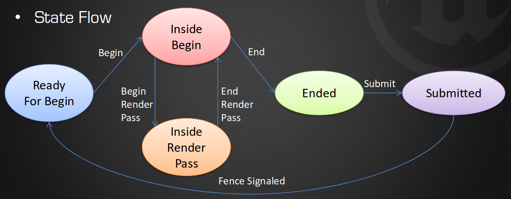

# UE4のRHIアーキテクチャを駆け足で(UE4 RHI Architecture in a hurry)

- RHI = Render Hardware Interface
    - aka 各グラフィクスAPIとをやり取りするためのクロスプラットフォームな方法。
- オリジナルのアーキテクチャ。
    - ゲームスレッドはレンダリングコマンドをキューに入れる。
    - レンダリングスレッドはVulkanのコマンドバッファを生成する。
- 改良したアーキテクチャ。
    - ゲームスレッドはレンダリングコマンドをキューに入れる。
    - レンダリングスレッドはRHIのコマンドリストを生成する。
    - RHIスレッドはVulkanのコマンドバッファに翻訳する。
- 最終的に、N個のレンダスレッドとM個のRHIスレッドでマルチスレッド化する。
- なぜRHIコマンドリストやRHIスレッドを使ったり、直接Vulkanコマンドを生成しないの？
    - 新しいRHIを導入しやすくする。
    - フロントエンドとバックエンドを分けて、マルチスレッド化しやすくする。
    - (命令とデータの両方の)キャッシュの局所化によりCPUで5-10%の改善を得られた。

# Vulkan

- なんで？
    - クロスプラットフォームなハイパフォーマンスAPI。
    - 予測可能性。
        - 例: 同じドローコールならば別々に実行されてもドライバは異なる時間をかかることはない。
    - メモリアロケーションやエイリアシング全体を制御する。
    - GPUパフォーマンス全体を制御する。
        - フラッシュ、キャッシュ、など。
    - D3D12やMetalと非常に似ている。

# Protoster

- Epic、Samsung、Qualcomm、Confettiのコラボレーション。
- Samsung S7とモバイルのVulkan APIを披露するテックデモ。
    - 業界のVulkan採用を後押しするよ！

# Vulkan RHI 0.1

- デスクリプタセットのためのひとつの大きなプール。
    - 32k個のエントリ。
    - しばらくすると使い果たす。いくつか同期に関する問題がある。
- バッファやテクスチャへの更新のすべてはその場でマップとアンマップを行う。
    - host visibleなメモリで線形なテクスチャを扱えないドライバではこの方法は使えない。
- すべてのアンマップのあとすぐに、コマンドバッファをサブミットして待機する。
    - GPUの処理中はCPUがストールする。
- PSOの生成中はヤベーくらいのヒッチングが発生する。
    - 詳しくは後述。
- RHIスレッドなし。
    - レンダリングスレッドが直接Vulkanコマンドを生成する。
- CPUでかろうじて20FPSに届く程度。

# Vulkan RHI 0.2

- 最適化の時間だ！
    - 階層的なカウンタを用いてCPUをプロファイルして、各ボトルネックに対処する。
        - 例: デスクリプタセットの書き込みが更新時に毎回生成されていたので、キャッシュする。
        - 例: デスクリプタセットを頂点シェーダ用とピクセルシェーダ用に分ける。
        - 例: 大量の動的オブジェクト割り当てを除去する。
    - すすいで(rinse)繰り返せ！
- 2、3週間ほど最適化を行うと、CPUとGPUの両方で30FPSに届いた。
- しかし、バリデーションの問題が多数ある…
- 出荷しよう！

# Vulkan RHI 1.0

- デモは公開された。(Demo out of the door!)
- きちんとしたタイトル(full titles)でも使えるようにするために必要なことを把握する。
    - とりあえずリストに書き出してみるか…(Just come up with a list...)

# Vulkan RHI 1.0 タスクリスト(Vulkan RHI 1.0 Task List)

- 後処理。
    - TODOとハックをすべて取り除く。
- 堅牢性と耐障害性(fault tolerant)を高める。
- RHIスレッドの分割をサポートする。
    - そして、並列なRHIスレッドをサポートする。
- バリデーションレイヤの警告にすべて合格させる。
    - いくつかの性能的な警告は許容*してもよい*。
        - 例: ピクセルシェーダが無効化されたアタッチメントに出力する。
- D3D12やMetalと機能的に同等にする。
- Kiteを動作させる！
- Paragonを動作させる！
    - D3D11と同等かそれ以上で。

# その先へ(And Beyond!)

- 完全にエディタで動作するようにする…

# 今現在のVulkan RHI(Today's Vulkan RHI)

- 今現在の状態:
    - コマンドを翻訳する別々のRHIスレッドを持つ。
    - モバイルレンダラで動く。
    - まともな(decent)性能。
        - デスクリプタセットレイアウトの最適化が足りない。
    - ほとんどのバリデーションに合格。
        - 大抵はイメージレイアウトの間違い。
    - シェーダモデル4またはディファードを得るところから初めて今では動作する。[?]

## Vulkan RHI: Command Buffers

- RHIスレッド/コンテキストごとにコマンドバッファマネージャを持つ。
- コマンドバッファマネージャは永続的なコマンドバッファのリストを持つ。
    - アクティブなコマンドバッファとアップロード用コマンドバッファも持つ。
        - アップロード用はレンダパスの真ん中ではデータをコピーできないので必要になる。
- 各コマンドバッファは、
    - フェンスとカウンタを持つ。
        - フェンスが何回シグナルを受けたかを追跡する。(定期的に問い合わせて、シグナルを受け取っていない状態にリセットする)
    - その状態を知る。(開始準備完了、レンダパス内/外、終了、サブミット後)

## Vulkan RHI: Resources

- バッファ、イメージ、フェンス、セマフォ。
- リソースの割り当てはそのプールからひとつを取得することを意味する。
    - 再利用したものの可能性もある。
    - まったく新しいものの可能性もある。
- リソースの解放はアプリケーションによって使われなくなったことを意味する。
- リソースの破壊は`vkDestroy*`の呼び出しを意味する。

# Vulkan RHI: Resource Managers

- マネージャの一般的なパターン。
    - UsedList、PendingFreeList、FreeListを持つ。
    - リソースの割り当て。
        - FreeListに合致するものがあればそれを、なければ新しく作って、UsedListに入れる。
    - リソースの解放。
        - UsedListからPendingFreeListに移動して、フェンスカウントを格納する。
    - 定期的に(フレームごとに一回とか、コマンドバッファのサブミットごと)
        - FreeListを走査して、Nフレーム使っていないものを破壊する。
        - PendingFreeListを走査して、コマンドバッファのフェンスカウンタが解放済みフェンスカウンタ以上になれば、FreeListへ移動する。

# Vulkan RHI: Other Managers/Utils

- バッファの副割り当て。
    - サブ範囲を管理しているので、常に`VkBuffer`を生成する必要はない。
- フェンスマネージャ。
- 一時フレームアロケータ(TempFrameAllocator)。
    - テープ(tape)/線形バッファの副割り当てと毎フレームにリセットする(フェンスがシグナルを受け取った後に)。
- 遅延破棄キュー(Deferred Deletion Queue)。
    - 高レベルがテクスチャやバッファの参照カウントポインタを解放すると、このキューに追加される。
    - フェンスをチェックして、適切なリソースマネージャに指示する。

# Vulkan RHI: BackBuffer/Swapchain

TODO

# References
