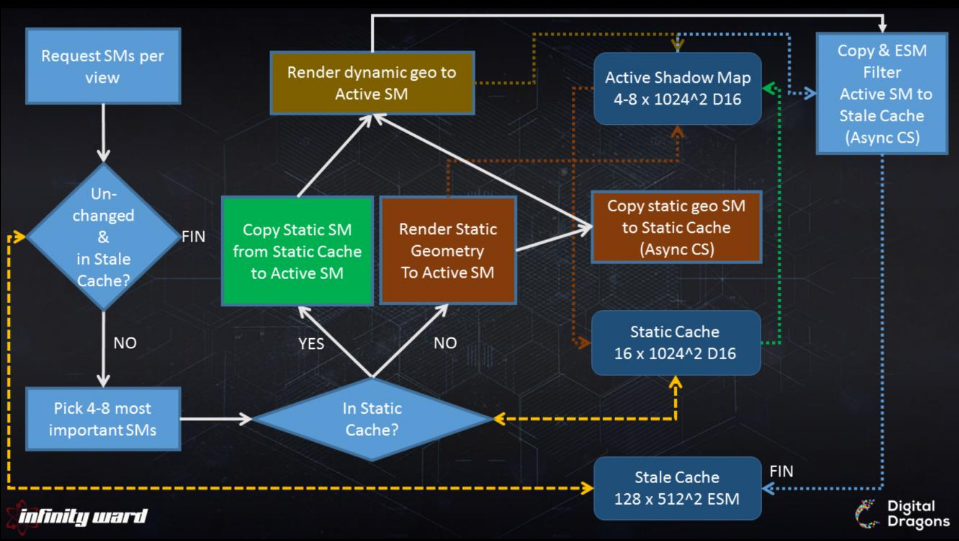
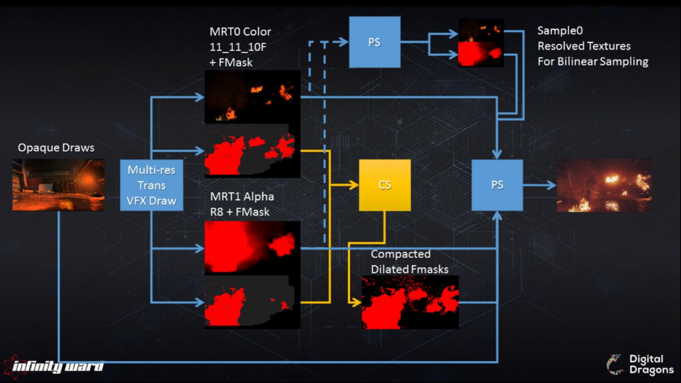

# Forward+ Data Structures

# Voxel Tree

- ワールドスペース八分木。
- 遮蔽を含めて事前計算する。
    - ライトは影付けされ、影響のある範囲だけが含まれる。
- 事前計算/キャッシュされた錐台外の3Dルックアップが簡単にできる。
    - 動的反射プロブのライト、動的ライトマップされたパーティクル、四面体GIライトグリッドで使われる。
- 高価な走査。
    - 階層の走査の必要性、複数のキャッシュミス、間接読み出し。
    - 非同期コンピュートが良い候補となる。
- 重大な事前計算時間。
- リーフのペイロード。
    - ライト。
    - ライトグリッドキャッシングのためのルート。
    - 可視性。

- 色は各ピクセルにヒットするライトの量を表す。
- 各ボクセルは事前にカリングされたライトを格納する。

# Frustum Space

- タイルベースビットマスク。
    - 8x8のピクセルサイズ。
    - 不透明ジオメトリで使われる。
- クラスタベースビットマスク。
    - ボリューム換算で4x4x4のカーネルと一致するサイズ。
        - 160/4 * 90/4 * 128/4 = 40x25x32 @ 1080p
    - 不透明ジオメトリとボリューメトリックスで使われる。
<!--  -->
- アイテムはビット列でインデックス付けされる。
    - ライト。
    - 反射プロブ。
    - 密度ボリューム。
    - デカール[0]。

# Mesh Rendering

#　Smodels / Xmodels

- 静的モデルと動的モデル。
- 標準のゲームエンジンメッシュと似ている。
- 小道具(props)、キャラクター、車両、武器、などで使われる。

# BSP

- 放射状ブラシベースのジオメトリ[^radiant_brush]。
- 大雑把に示された(blocking out)レベル。
- 地形(terrain)。
- 環境の静的な構造部分。
- 個々のマテリアルを持つ複数のブラシは最適化されたサブメッシュとサブシェーダに一緒にマージされる。
- 高いパフォーマンスで世界のユニークなディティール付けを可能にする。
- テッセレーションとディスプレースメントマッピングをサポートする。
<!--  -->
- ベースBSPは物理やAIのレイキャストにふさわしい。
- 単純なジオメトリで、イテレーションが簡単。

# Tessellation & Displacement

- ベースBSPは適応型テッセレーションとディスプレースメントマッピングを適用できる。
- 適応型テッセレーションはディスプレースメントデルタ、カメラへの距離、カメラへのパッチ角度に基づく。
- 生成されたサブパッチはGPUで錐台、オクルージョン、背面のかリングを通る。
<!--  -->
- テッセレーションとディスプレースメントは適度な適応的パフォーマンスヒットで大きなビジュアル的インパクトを作る。

[^radiant_brush]: 訳注:ブラシの形状が放射状(円対称)という意味？

# Shadow Map Cache

# ESM Shadow Map Cache : Motivation

- テッセレーションしたジオメトリはシャドウマップレンダリングでは高価になる。
- 大多数のライトは動かない(stationary)。
- 多くのライト。
    - 視錐台の中に256個以下。
- 多くのシャドウ。
    - 視錐台の中に128個以下。

# ESM Shadow Map Cache

- PCFはF+では高価すぎる(VGPRプレッシャー)。
- **静的で高品質な影付けされたライト**と**キャッシング**を重要視。
- 指数シャドウマップ
    - 512x512の16ビットUNORM。
    - 1024x1024のシャドウマップからダウンサンプリングした。
    - 3x3のガウスフィルタをかける。
        - フィルタリングに対するアーティスト的な制御。
    - 一度だけ事前にフィルタリングして、キャッシュする。

# Caching algorithm

- ビューごとにシャドウマップを要求する。
    - カリングテストを通過したビューで見えているすべてのシャドウマップを得る。
- 更新の必要が**ない**シャドウマップのStale(古くなった)キャッシュをチェックする。
    - ライトがStaleキャッシュにある(resident)か？
        - 最後のフレームでライトが移動したか？
        - 最後のフレームでライト錐台内で何かが移動したか？
        - 更新が強制されたか？
- 4から8つの最も重要なシャドウマップを選び出す。
    - 優先順位でソートする。
        - アーティスト駆動の優先順位(プレイヤーのフラッシュライトなど)。
        - 距離、射影サイズ、強度。
- 選んだライトごとに、
- シャドウマップのStaleキャッシュをチェックする --- Staticキャッシュは実際には静的ジオメトリのみを含むD16のシャドウマップを持つ。
    - ライトがStaticキャッシュにキャッシュされている場合、
        - Staticキャッシュから静的シャドウマップをActiveキャッシュにコピーする。
    - ライトがStaticキャッシュにキャッシュされてい**ない**場合、
        - 静的ジオメトリをActiveキャッシュにレンダリングする。
        - 静的ジオメトリのシャドウマップをStaticキャッシュにコピーする。
- 動的ジオメトリをActiveシャドウマップにレンダリングする --- Activeキャッシュは4から8つのD16シャドウマップである。
- 技術的には、必要なのは1つだけだが、実際のシャドウマップのレンダリングでは、シャドウキャッシュシステムから複数の非同期コンピュートジョブがオーバーラップする(つまり、コピーして、ESMフィルタリングして、ダウンサンプリングして、クリアする)。そして、シャドウマップ0のCSジョブはシャドウマップ1のレンダリングとオーバーラップさせる。
- ActiveシャドウマップをStaleキャッシュにコピーしてESM処理する。

# ESM Shadow Map Cache : Performance

- キャッシュのコピーやESMジョブは非同期コンピュートを使う。
- '次'のシャドウマップ生成処理とオーバーラップする。
- 平均のリアルコスト:レンダリングを除いたシャドウマップあたり0.1ms以下。
- Forward+ではサンプリングコストが下がる。
    - ALUは完全に償却される。
    - レジスタ(VGPR)インパクトがない。

# Deferred Sun Shadows

- 以下では高品質なシャドウが必要である。
    - シネマティックのキャラクター。
    - ビューモデル。
- 複数の高解像度のオブジェクトスペースのシャドウマップが必要である。
    - 標準のシャドウマップキャッシュではプレッシャーが強すぎる。
        - 多くのアクティブスロットが必要である。
<!--  -->
- スクリーンスペースシャドウ。
    - 光源の方向にデプスバッファレイトレースを行う。
- 太陽のみのディファードパス。
    - ビューモデルに最適化される(深度境界/ステンシルテスト)。
    - シーン全体で実行すると、うまく働く。

# SS Shadows

- F+に統合される。
    - ピクセルごとの一番強い光源を格納する。
        - キーライトとしてアーティストにより設定されたり、最大値として実行時計算から導いたりする。
    - キーライト方向に単一のトレースを行う。

# Particle Lighting

# Particle Lighting with lightmaps

- 各quadは自動的に1x1から32x32のライトマップタイルに割り当てる。
    - 解像度は射影されるスクリーンスペースのquadサイズに依存する。
- 各テクセルごとに、
    - 各サンプリングポイントの位置を格納する。
    - CSはアンビエントの寄与のライトグリッドをサンプリングする。
    - CS主体のライティング。
        - ワールドスペースのボクセルツリー。
        - サンプリングポイントは錐台境界の外にすることができる。
        - RGB SH1として変換して格納する。

# Deferred Lightmap

- 512x512のRGBのFP11_11_10
    - 全方向ライティング。
    - 単純なパーティクル。
- 3つの512x512のRGBAのFP16_16_16_16
    - ディレクショナルライティング。
    - RGB x SH1として格納される(RGBAに係数4つが格納される)。
    - 法線マップを持つ複雑なパーティクル。
- 法線マッピングされたパーティクルはF+を通したスペキュラ反射をサポートする。
- 以下をサポートする。
    - VFX impact marks
    - デカールメッシュ。

## Simple Lit Particles

- 全方向ライティングを伴う単純に照らされたパーティクル。
- 複雑なラティングシナリオ。
    - 明るい天球ライティングと反対の色調を持つ強い太陽光。
- 合わさって、平坦なレンダリングになる。

## Normal Mapped SH Lit Particles + Extinction Transmittance Map for Sun [2]

- SHディファードライトマップは、法線マッピングされたパーティクルを用いており、正確にライティング方向と奥行き感を与える色を分けている。
- これは太陽でのみ使われるExtinction Shadow Mapによってさらに改善される。

## No Scattering

- スクリーン上のパーティクルとアンダーサンプリングの結果によるライトマップのテクセルサイズとの間の相対的なサイズの違いのためにブロックのような拡大アーティファクトが発生する可能性がある。
- ライトのマルチスキャッタリングが失われている(ライトマップは主要なスキャッタリングのみを格納する)。
- これらの問題はライトマップスキャッタリングパスで改善できる。

## Scattering

- ライトマップライティングスキャッタリング。
    - 各タイルごとに、
        - CSスキャッタリングぱす。
            - スキャッタリングをシミュレートするためにブラ―をかける。
            - アンチエイリアシングのための逆トーンマッピング。
    - CSでパッキングして、最も高い占有率に対するタイルサイズでソートする。
- 加えて、(または、スキャッタリングの代わりに、)パーティクルをレンダリングしている間に高価なキュービックフィルタリングを実装する。
    - パーティクルのレンダリングごとに最大10%遅くなる。
    - 出荷しなかった。

# Particle Lighting : Performance

- すべての処理は非同期コンピュートを利用している。
    - ほとんどの場合、非透明ジオメトリパス上で償却される。

|RGB SH1 512 CS Job|時間[ms] @ PS4|
|-|-|
|ライティング|0.1〜0.7|
|スキャッタリング|0.1|

# Multi-Res Rendering

- 密なVFXは著しいオーバードローをもたらす --- 最適化する必要がある。
- VFXチームはソートを'そのまま(as is)'にしておくことを望んでいた。
    - クラシックな低解像度レンダリングはレンダリング中に注入されるマージパスを必要とする。
    - ソート順が変化する/複雑化する。
- MSAAベースのマルチ解像度レンダリングパイプライン。
    - レンダリングを'そのまま'にしておくことを可能にする。
    - 個別のエフェクト/マテリアルに'低解像度レンダリング'のためのタグを付けることができる。
    - 現時点ではコンソールのみ(MSAA拡張のIHVサポート待ち)。

## Full Res : 5ms VFX

## Multi Res : 2.8ms VFX

## Low Res : 2.4ms VFX

# Multi-Res Algorithm

- 4xMSAAのハーフ解像度のバッファとしてエイリアスされたフレームバッファにレンダリングする。
- 事前乗算アルファレンダリングを使う。
- 使うMSAAレベルを描画ごとに決める。
    - 1サンプル => フル解像度の深度テストを伴うハーフ解像度レンダリング。
    - 4サンプル => フル解像度レンダリング。
- PSは正しい再構築手法をえらぶためにFMask[3]を読み出す。
    - すべてのサブサンプルを読み出す。
        - エッジ/複数サンプルに近い。
    - バイリニアでサンプル0をアップサンプリングする。
        - エッジ/複数サンプルの付近(proximity)なし。
- メインバッファに合成する。
<!--  -->
- GCNのレンダターゲットフォーマットは直接のエイリアシングを妨げる。したがって、実際にはCSでデプスバッファを手動で再書き込みと再swizzleを行う必要がある。
- このステップは他の深度関連の処理で償却される。

## Color Buffer

## Color Buffer FMask

- ジオメトリのエッジが複数サンプルでマークされていることに注目する。
- 灰 -> 1サンプル。ブレンディングのためにCMaskに触る。
- 青/緑 -> 2/3サンプル。深度交差のためにラスタライザに渡される。
- 赤 -> 4サンプル。フル解像度レンダリング、または、すべてのサブサンプルが深度交差ヒット。

## Alpha Buffer

## Alpha Buffer FMask

- ジオメトリのエッジが複数サンプルでマークされていることに注目する。
- 異なるブレンドモードの可能性があるため、色のFMaskとの違いにも注目する。

## Dilated Combined Compacted FMask Buffer

- コンパクト化されたFMASK。
- カラーのFmask > 0 || アルファのFmask > 0
- 16ビットバッファにパッキングされる --- ピクセルあたり16個のブール値。

##

- FMask/CMask --- 色とアルファで異なることができる。
    - ブレンドモードセットアップとハードウェアセットアップに依存する。
        - アルファブレンド。
        - 加算。
        - 高速ブレンドモード(ハードウェア固有)。

## Full Res Glass : 1.3ms

- プレイヤーのヘルメット、バイザー、車両のフロントガラス(windshield)といった、フル解像度の透明物はとても高価になる可能性がある。

## Multi Res Glass : 0.4ms

- レンダラは透明物と通常のメッシュの解像度を混ぜることができる。
    - 車両のフロントガラス。
    - ガラス。
    - 重大なパフォーマンス改善(1.3ms -> 0.4ms)。
    - 質の劣化 --- 主にガラスの傷のような高周波で詳細が見える。

# Multi-Res Issues

- 'ポイントサンプルされたビジュアル'になる可能性がある。
    - 低解像度のピクセルは単一の色サンプルとして格納される。
    - ブレンディングはレンダリング中にハードウェアで起こる。
    - 多いサンプルでのブレンディングが必要とするならば、ブレンダーは少ないサンプルを複製する。
- サンプル0に対してのみ実行した場合、ピクセルごとのシェーディングはエイリアシングを含むことがある。
    - Z-Feather
- 問題を和らげるためテンポラルディザリングを使う。
    - 色ビット深度(color bit-depth)の問題に役立つ。

## Low Res Effect Seen Through Low Res Grass | Low Res Effect Seen Through High Res Grass

- ピクセルの失敗ケース:
- 低解像度の描画をレンダリングする --- サンプル0(火のエフェクト)を書き込む。
- FMaskが1サンプルにセットされる --- まだバイリニアでアップサンプリングできる。
- 高解像度の描画をブレンドしてレンダリングする --- サンプル0をソースとして複製して、サンプルごとにブレンドする(火のエフェクトの前のガラス)。
- FMaskが1サンプル以上にセットされる --- バイリニアでアップサンプリングできない。

# Multi-Res Performance

- 3から3.8倍の低解像度のタグ付けされたマテリアルによるパフォーマンススケーリング。
    - 分散は以下に依存する。
        - レンダターゲットのマイクロタイルのヒット量。
        - スクリーン上でのフル解像度と低解像度のパーティクル間のオーバーラップ。
            - 高速ブレンド/MSAA帯域幅の利点はMRTマイクロタイルが伸長のタグが付けられる==フル解像度レンダリングが発生するとすぐに失われる。
    - 常にピクセル処理が少ない。
- 0.3から0.4msのアップサンプリング/解決/再構築パス。
    - 分散はすべてのサブサンプルを必要とするマイクロタイルの量に起因する。
- 燃費(mileage)はGPUのMSAA効率に依存して変化する。

# Multi-Frequency Rendering : R & D

- 8xMSAAでの実験。
- 1、２、４、８サンプルが可能。
    - テンポラルスーパーサンプリングを伴う結合(conjunction)でサンプルパターンを変化する。
- OITに基づくテンポラル確率的MSAA。
- MFRを用いて不透明シーンをレンダリングする。
    - キャラクターといった、高解像度で関心のあるオブジェクトを選び取る。
    - 重要性の低いオブジェクトでサンプルカウントを無作為に変化する。

# Reflections & Refractions

TODO

# References
