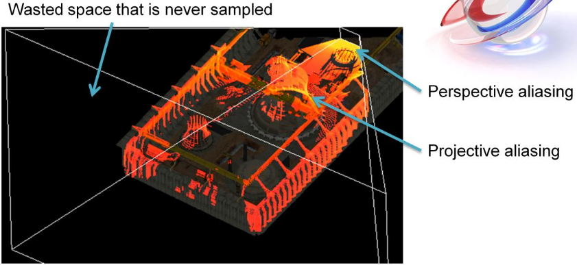
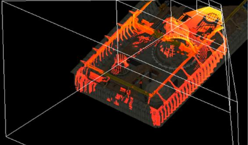
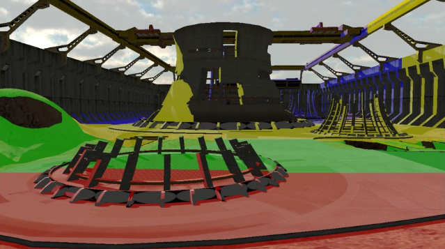

# 影付け問題(Shadowing Problem)

- 効率的に解決したい一般的な問題:
- ライトとビュースペースの一連のピクセルが与えられたとき、各ピクセルとライトとの間の遮蔽を解決する。

# ナイーブなシャドウマッピング(Naïve Shadow Mapping)

- 絶対にサンプルされない無駄なスペース。
- パースによるエイリアシング(perspective aliasing)。
- 射影によるエイリアシング(projective aliasing)。
<!--  -->
- この問題を可視化するため、ライト視点からのシャドウレイを考える。
- カメラの錐台は白色で可視化される。
- 色付けされたピクセルはカメラが見ることができる、すなわち、シャドウデータを必要とするサンプルを表す。
- 黄色が強いピクセルほど、サンプルが密集している。
- この画像説明するように、ナイーブなシャドウマッピングの射影はかなり非効率である。
- ライトスペースでオブジェクトの存在しないところの解像度を無駄にしている。
- カメラ近くではパースによるエイリアシングが発生する(そこにある多くのサンプルが大きな解像度を必要としていることを意味する)。
- そして、シャドウレイと平行に近いオブジェクトでは射影によるエイリアシングが起こる。

# 関連研究(Related Work)

- 錐台分割(frustum partitioning)が必要。
    - Z分割(Z-partitioning)は単純だが、良好な結果を生む。
        - [@Lloyd2006]
        - "Cascaded Shadow Maps"とも呼ばれる。[@Engel2006]
        - この研究の基礎を成す。
    - 歪ませる手法(warping)が使うことができるが、分割が必要になる。
    - パースによるエイリアシングに対処する。
<!--  -->
- これらの問題に対処する方法はいくつかある。
- Z分割(Cascaded Shadow Mapsとも)は最も一般的で、良好な結果を生み出す。
- Perspective Shadow Mapsのような歪ませる手法も使うことができるが、分割が常に必要になる。
- しかし、これらの手法はパースによるエイリアシングに明示的に対処するのみである。

<!-- p.5 -->

- 射影によるエイリアシングは難しい。
    - 不規則で際限がない。
    - 良好な分割は役立つが、このエイリアシングを解決しない。
    - 固定化したパフォーマンスで対処するのは難しい。
- パフォーマンス的には辛いが、クオリティは保つ手法。
    - Resolution-Matched Shadow Maps [@Lefohn2007]
    - Irregular Z-Buffer [@Johnson2005]
<!--  -->
- 射影によるエイリアシングは、際限なく極めて不規則なサンプル分布を生み出すため、単純に難しい問題である。
- 故に、与えられたパフォーマンスやメモリ予算を維持しつつ対処するのは難しい。
- 我々の目標は固定化したパフォーマンスとメモリ予算を維持しながら、その予算内でできる限り良好なクオリティを得ることである。
- 反対に、Resolution-Matched Shadow MapsやIrregular Z-Bufferのようなテクニックはクオリティレベルを保証することができるが、射影によるエイリアシング過多のような複雑なケースではパフォーマンスが低下する。
- 故に、これらは固定化したフレーム予算を持つゲームでは一般的に不適当である。

# Z分割(Z-Partitioning)

- Z方向にカメラ錐台を分ける。
- 各区画ごとに異なるシャドウマップを使う。
<!--  -->
- 我々の研究はZ分割に基づいている。
- Z分割のアイデアは錐台を複数のセグメントに分割して、それぞれで異なるシャドウマップを使うことである。

<!-- p.7 -->

<!--  -->
- この画像はZ分割の可視化を示している。
- 色付けされた領域はシーンの各部分にどのシャドウマップが使われているかを示している。
- ご覧の通り、シャドウマップはカメラのZ軸を分割する。

<!-- p.8 -->

- 固定化したパフォーマンスとメモリコスト。
    - 分割数とそれぞれの解像度を選択する。
- 他のアルゴリズムのほとんどと直交である。
    - 各区画は単なる通常のシャドウマップと同じである！
- 未解決の問題。
    - (Zで)錐台を分けるのはどこ？
    - ライトスペースでシャドウマップを置くのはどこ？
<!--  -->
- Z分割は実際に予測可能なパフォーマンス、メモリコスト、単純さといった望ましい特性を多数伴う本当に良い解法である。
- 歪ませる手法、フィルタリングといった多くの他のシャドウマップアルゴリズムと直交でもあり、確立されたパイプラインに合わせやすい。
- しかし、いくつかの未解決の問題が残る。
- 特に、シャドウマップを最適に用いるにはZ範囲をどのように分割すればよいのか？
- 分割を行ったのち、無駄になるのを避けつつできるだけ最良な解像度となることを確実にするためには、シャドウマップをライトスペースのどこに配置すればよいか？

# Zをどこで分けるか？(Where to Partition Z?)

- 対数による手法が最適。[@Lloyd2006]
    - ただし、Z範囲全体がカバーされている場合に限る。
    - タイトなNear/Far平面が必要になる。
- Parallel-Split Shadow Maps [@Zhang2006]
    - 対数式と一様式のミックス。
    - ユーザーがパラメータを調整する必要がある。
        - 最適な値はタイトなNear平面に関係する…
<!--  -->
- @Lloyd2006 は対数による分割がZ範囲上の最大誤差を最も小さくなることを示した。
- 彼は、特にNear平面でタイトな境界を持つことがとても重要であり、そうではないと、多数の分割や解像度がカメラの近くの何もない空間で無駄使いされることを指摘した。
- 実践的な方法でこの問題に対処するため、Parallel-Split Shadow Mapsは対数による分布と一様な分布を調節可能なパラメータと一緒にミックスする。
- しかし、このパラメータの最適な値はシーンの最適なNear平面に関連しているため、大局的に最適な方法で設定する事ができない。

<!-- p.9 -->

- 実践では、アーティストが特定の視点で調整する。
    - 退屈。
    - シーン/カメラの変更にロバストではない。
    - 究極的には任意の視点で準最適である。
<!--  -->
- 実践では、アーティストは特定の視点やシーンで区画を手動で配置するが、これは時間がかかり、究極的に準最適である。
- これはゲーム開発者から聞くZ分割についての最も多い苦情である。

# 静的区画(PSSM)(Static Partitions (PSSM))

TODO

# References
