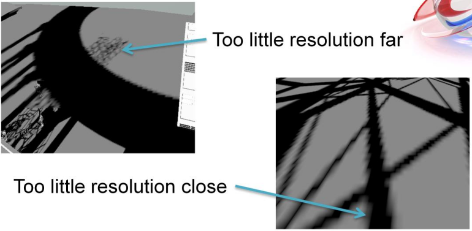
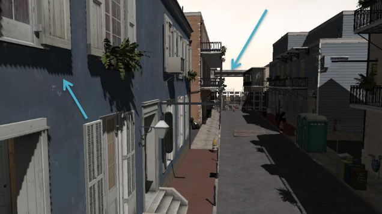
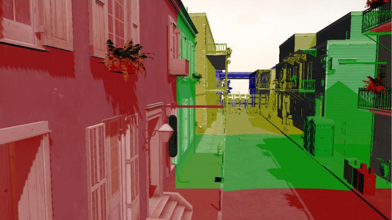
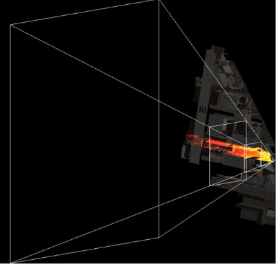
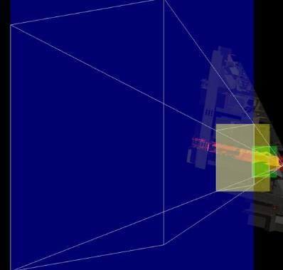
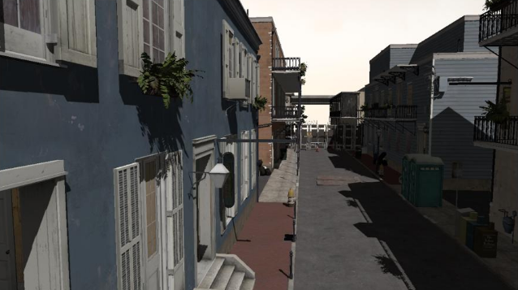
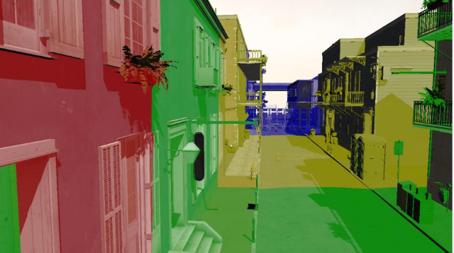
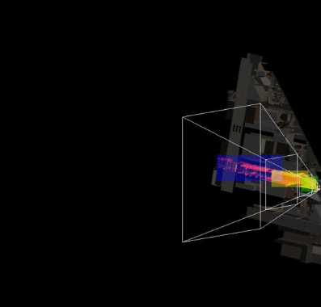

# 影付け問題(Shadowing Problem)

- 効率的に解決したい一般的な問題:
- ライトとビュースペースの一連のピクセルが与えられたとき、各ピクセルとライトとの間の遮蔽を解決する。

# ナイーブなシャドウマッピング(Naïve Shadow Mapping)

- 絶対にサンプルされない無駄なスペース。
- パースによるエイリアシング(perspective aliasing)。
- 射影によるエイリアシング(projective aliasing)。
<!--  -->
- この問題を可視化するため、ライト視点からのシャドウレイを考える。
- カメラの錐台は白色で可視化される。
- 色付けされたピクセルはカメラが見ることができる、すなわち、シャドウデータを必要とするサンプルを表す。
- 黄色が強いピクセルほど、サンプルが密集している。
- この画像説明するように、ナイーブなシャドウマッピングの射影はかなり非効率である。
- ライトスペースでオブジェクトの存在しないところの解像度を無駄にしている。
- カメラ近くではパースによるエイリアシングが発生する(そこにある多くのサンプルが大きな解像度を必要としていることを意味する)。
- そして、シャドウレイと平行に近いオブジェクトでは射影によるエイリアシングが起こる。

# 関連研究(Related Work)

- 錐台分割(frustum partitioning)が必要。
    - Z分割(Z-partitioning)は単純だが、良好な結果を生む。
        - [@Lloyd2006]
        - "Cascaded Shadow Maps"とも呼ばれる。[@Engel2006]
        - この研究の基礎を成す。
    - 歪ませる手法(warping)が使うことができるが、分割が必要になる。
    - パースによるエイリアシングに対処する。
<!--  -->
- これらの問題に対処する方法はいくつかある。
- Z分割(Cascaded Shadow Mapsとも)は最も一般的で、良好な結果を生み出す。
- Perspective Shadow Mapsのような歪ませる手法も使うことができるが、分割が常に必要になる。
- しかし、これらの手法はパースによるエイリアシングに明示的に対処するのみである。

<!-- p.5 -->

- 射影によるエイリアシングは難しい。
    - 不規則で際限がない。
    - 良好な分割は役立つが、このエイリアシングを解決しない。
    - 固定化したパフォーマンスで対処するのは難しい。
- パフォーマンス的には辛いが、クオリティは保つ手法。
    - Resolution-Matched Shadow Maps [@Lefohn2007]
    - Irregular Z-Buffer [@Johnson2005]
<!--  -->
- 射影によるエイリアシングは、際限なく極めて不規則なサンプル分布を生み出すため、単純に難しい問題である。
- 故に、与えられたパフォーマンスやメモリ予算を維持しつつ対処するのは難しい。
- 我々の目標は固定化したパフォーマンスとメモリ予算を維持しながら、その予算内でできる限り良好なクオリティを得ることである。
- 反対に、Resolution-Matched Shadow MapsやIrregular Z-Bufferのようなテクニックはクオリティレベルを保証することができるが、射影によるエイリアシング過多のような複雑なケースではパフォーマンスが低下する。
- 故に、これらは固定化したフレーム予算を持つゲームでは一般的に不適当である。

# Z分割(Z-Partitioning)

- Z方向にカメラ錐台を分ける。
- 各区画ごとに異なるシャドウマップを使う。
<!--  -->
- 我々の研究はZ分割に基づいている。
- Z分割のアイデアは錐台を複数のセグメントに分割して、それぞれで異なるシャドウマップを使うことである。

<!-- p.7 -->

<!--  -->
- この画像はZ分割の可視化を示している。
- 色付けされた領域はシーンの各部分にどのシャドウマップが使われているかを示している。
- ご覧の通り、シャドウマップはカメラのZ軸を分割する。

<!-- p.8 -->

- 固定化したパフォーマンスとメモリコスト。
    - 分割数とそれぞれの解像度を選択する。
- 他のアルゴリズムのほとんどと直交である。
    - 各区画は単なる通常のシャドウマップと同じである！
- 未解決の問題。
    - (Zで)錐台を分けるのはどこ？
    - ライトスペースでシャドウマップを置くのはどこ？
<!--  -->
- Z分割は実際に予測可能なパフォーマンス、メモリコスト、単純さといった望ましい特性を多数伴う本当に良い解法である。
- 歪ませる手法、フィルタリングといった多くの他のシャドウマップアルゴリズムと直交でもあり、確立されたパイプラインに合わせやすい。
- しかし、いくつかの未解決の問題が残る。
- 特に、シャドウマップを最適に用いるにはZ範囲をどのように分割すればよいのか？
- 分割を行ったのち、無駄になるのを避けつつできるだけ最良な解像度となることを確実にするためには、シャドウマップをライトスペースのどこに配置すればよいか？

# Zをどこで分ける？(Where to Partition Z?)

- 対数による手法が最適。[@Lloyd2006]
    - ただし、Z範囲全体がカバーされている場合に限る。
    - タイトなNear/Far平面が必要になる。
- Parallel-Split Shadow Maps [@Zhang2006]
    - 対数方式と一様方式のミックス。
    - ユーザーがパラメータを調整する必要がある。
        - 最適な値はタイトなNear平面に関係する…
<!--  -->
- @Lloyd2006 は対数による分割がZ範囲上の最大誤差を最も小さくなることを示した。
- 彼は、特にNear平面でタイトな境界を持つことがとても重要であり、そうではないと、多数の分割や解像度がカメラの近くの何もない空間で無駄使いされることを指摘した。
- 実践的な方法でこの問題に対処するため、Parallel-Split Shadow Mapsは対数による分布と一様な分布を調節可能なパラメータと一緒にミックスする。
- しかし、このパラメータの最適な値はシーンの最適なNear平面に関連しているため、大局的に最適な方法で設定する事ができない。

<!-- p.9 -->

- 実践では、アーティストが特定の視点で調整する。
    - 退屈。
    - シーン/カメラの変更にロバストではない。
    - 究極的には任意の視点で準最適である。
<!--  -->
- 実践では、アーティストは特定の視点やシーンで区画を手動で配置するが、これは時間がかかり、究極的に準最適である。
- これはゲーム開発者から聞くZ分割についての最も多い苦情である。

# 静的区画(PSSM)(Static Partitions (PSSM))

- 遠くで解像度が低すぎる。
- 近くで解像度が低すぎる。
<!--  -->
- 同じシーンの異なる2つの視点を持つPSSMの例。
- 静的な分割はこれら両方のケースをうまく扱うことはない。

# シャドウマップをどこに配置する？(Where to Place Shadow Maps?)

- 錐台セグメントのAABB？
    - 遮蔽されたり何もなかったりするライトスペースの広大な領域を利用できない。
<!--  -->
- さらなる問題は、錐台を分割したあと、シャドウマップをライトスペースのどこに置くかということである。
- ほとんどみんなは錐台の角の単純な軸平行な境界箱(axis-aligned bounding box)を使うが、これは、何もない空間や遮蔽された空間を考えないので、しばしば準最適である。

# Sample Distribution Shadow Maps

- シャドウサンプル分布を解析する。
    - タイトなZの最大最小値を見つける。
    - タイトなZ境界で対数的に分割する。
    - 調整する必要なしに視点やジオメトリに適合させる。
- タイトなライトスペース境界を計算する。
    - 区画ごとのタイトなAABB。
    - 有用なシャドウの解像度を大きく増加させる。
<!--  -->
- Sample Distribution Shadow Mapsは現在の視点を影付けするのに必要な実際のライトスペースのサンプル分布を解析することでこれらの問題の両方に対処する。
- 無駄になるシャドウマップスペースが最小となることを保証するため、各区画ごとに必要なシャドウマップサンプルのタイトなライトスペース境界箱を計算する。
- これはライトスペースでの遮蔽された領域や何もない領域を活用することで有用なシャドウマップスペースの量を大幅に増加させる。

# 例: PSSM(Example: PSSM)

<!--  -->
- カメラに近い所と遠く離れた所の両方で重大なエイリアシングの問題が起こっている。
- PSSMの調整可能なパラメータは理に適った解法を提供するためにこの視点に対して調整されてた。
- 実践では大幅に酷い結果を引き起こす。

# 例: PSSMの区画(Example: PSSM Partitions)

# 例: PSSMのライトスペース(Example: PSSM Light Space)

<!--  -->
- これはカメラの錐台がライトスペースから見ているものである。

# 例: PSSMの区画(Example: PSSM Partitions)

<!--  -->
- 単純な錐台の区画の境界箱は結果として大量の無駄なスペースとなる。
- 錐台の大部分は何もないか遮蔽されている(これは典型的である)。

# 例: SDSM(Example: SDSM)

<!--  -->
- 比較すると、SDSMはほぼすべての場所でサブピクセル解像度を達成している。
- フィルタリングやシャドウMSAAはそのままの解像度をより反映するために無効化していたことに注目する。

# 例: SDSMの区画(Example: SDSM Partitions)

<!--  -->
- 分割は手で調節した解と似ているが、完全に自動化されており、視点に適合する。
- タイトな境界は至るところで大幅により良いシャドウ解像度を達成する。

# 例: SDSMのライトスペース(Example: SDSM Light Space)

<!--  -->
- Near/Farは可視サンプルのみをカバーするためタイトになった。
- タイトにしたNearは実際に最も重要であることに注目する。

# 例: SDSMの区画(Example: SDSM Partitions)

<!--  -->
- タイトなライトスペース境界はカメラスペース遮蔽に活用され、各区画ごとに素晴らしい境界を生み出す。

# 分割のバリエーション(Partitioning Variants)

- K平均法(K-means clustering)
    - Zで大量のサンプルが存在する所に区画を配置する。
    - 平均誤差は良好な結果になるが、弱点(glass jaw)がある。
- 適応的な対数方式。
    - 基本は対数方式だが、Zでの隙間(gap)を回避する。
    - かなり状況による…通常はその努力に見合わない。
- これらのスキームは深度のヒストグラムを必要とする。
<!--  -->
- 単純な対数スキームを越えてサンプル分布データからZ分割を導く多数の選択肢がある。
- K平均法や適応型ギャップスキップアルゴリズムを含むいくつかのより複雑なアルゴリズムを探した。
- 残念ながら、これらのアルゴリズムはかなり状況による傾向にあり、特に貧弱な解法が選択される所に弱点を時折導入する。
- これらのより手の込んだ(fancier)スキームは、単純な対数スキームがZの最大最小値のリダクションのみを必要とするのに対して、完全なヒストグラムを生成することも伴う。

# 実装(Implementation)

- 異なる2つの実装。
    - 対数による単純な"解く(reduce)"の実装。
        - DX9/10ハードウェアのピクセルシェーダで実装できるかも。
    - 一般的な深度ヒストグラムの実装。
        - シェーダメモリのアトミック演算がこれを実現可能にする。
        - DX11以前のハードウェアでは遅すぎるし、データ依存である。
<!--  -->
- 我々はDirecX11でコンピュートシェーダを用いてこれらのアルゴリズムを実装しており、GPUで全体的に動作する。
- 2つのパスがある。ひとつは対数スキームが必要とするすべてである単純なリダクションを使う。
- このパスはピクセルシェーダで実装でき、旧世代のハードウェアに適当である。
- もうひとつのパスは一般化したヒストグラムを用いており、すべてのバリエーションをサポートできる。
- このパスは効率的にヒストグラムを生成するために共有メモリのアトミック演算を用いる。
- この機能がないと、このヒストグラムの生成は一般的に実践的とするには遅すぎる。

# パフォーマンスオーバーヘッド(Performance Overhead)

- 1080pでのSDSM解析のオーバーヘッド。
    - リダクションパス。
        - ATI 5870: 1.1ms
        - NVIDIA 480: 0.9ms
    - ヒストグラムパス。
        - ATI 5870: 1.4ms
        - NVIDIA 480: 7.2ms
- リダクションパスでの対数方式が最も実践的である。
<!--  -->
- 静的な区画を用いた場合と比較するためにSDSMの解析ステップのコストを計測した。
- 1080pにおいて、リダクションパスのオーバーヘッドはこれらのGPUでは約1msである。
- ヒストグラムパスはATIグラボでは実践的である。
- NVIDIAのグラボでは実用にならないほど遅いが、これはおそらく共有メモリのアトミック演算を多用しているためである。
- なので、最もロバストであるとともに、リダクションパスによる対数スキームを用いることを推奨する。

# パフォーマンス (フレーム全体の時間)(Performance (Full Frame Time))

TODO

# References
