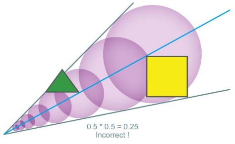

# 概要(Overview)

- "The Tomorrow Children"に取り入れた技術のお話。
- 以下の詳細を含む。
    - ライティング(リアルタイムGI)。
    - ランドスケープシステム。
    - 非同期コンピュート。

# ライティング(Lighting)

- 目指していた独自のルックにGIの必要性を感じた。
- PS4ならやってくれるだけのパワーがあると確かに感じていた。
- はじめはベストなやり方が明確ではなかった。
- Light Propagation VolumesやVirtual Point Lightを調査した。
- 最も有望だと思ったのがVoxel Cone Tracing [@Crassin2011]だった。

## ボクセルコーントレーシング(Voxel Cone Tracing)

- ハイエンドGPUでリアルタイムGIを可能にする。
- 以下によって実現する。
    1. ボクセル化したシーンをSparse Voxel Octreeへ格納する。
    1. Sparse Voxel Octreeへライティング情報を注入する。
    1. コーン(円錐)をトレースして、ピクセル位置の間接照明の影響を収集する。

### コーントレーシングとは(Cone Tracing?)

{#fig:rays-vs-cones}

- レイトレーシングと類似性を持つ。
    - プリミティブを射出してシーンと交差させることで、ある点に入射する放射輝度のサンプルを得る。
    - 良く分布した(well distributed)サンプルを十分に得たら、それらを組み合わせてライティングを計算する。
- レイは無限小の点で交差する。
- コーンは面またはボリュームで交差する。
    - 当たりがひとつの点ではなく、複数の部分に現れる。
    - シーンを面で評価するために、シーンはフィルタリング可能でなければならない。
        - 平均値を用いるので、推定の正確さは低下する。
        - 平均値を用いるので、レイトレーシングでよく見られるノイズは低減する。
            - コーントレーシングの性質の中で、特に目を引いたポイント。

### どうやってサンプルするか(How do we sample?)

{#fig:how-do-we-sample}

- [@fig:how-do-we-sample] (左)のような交差した表面を評価するのは簡単ではない。
- 代わりに、[@fig:how-do-we-sample] (右)のように、コーンに沿ってボリュームをサンプルする。
    - 各サンプルはコーンの頂点に向けて反射する光の推定値を返す。
    - サンプルを組み合わせて、その方向の遮蔽率の推定値とする。
    - 組み合わせ方の基本はレイマーチングと同じ。

### 正確性の問題(Accuracy Issues)

{#fig:accuracy-issues}

- 部分的に遮蔽している場合に結果が不正確になる可能性がある。
    - 遮蔽の形状を考慮せずに、遮蔽率を単純に掛け合わせるため。
    - 実践だとそれほど問題にはならないが、コーントレーシングは大雑把な推定であることに留意しておく。

## シーン表現(Scene Representation)

TODO

# 参考文献(References)
