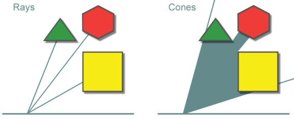
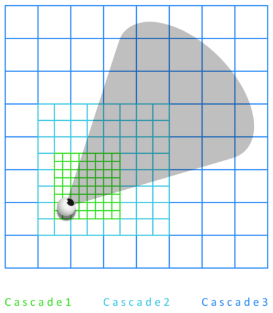

# 概要(Overview)

- "The Tomorrow Children"に取り入れた技術のお話。
- 以下の詳細を含む。
    - ライティング(リアルタイムGI)。
    - ランドスケープシステム。
    - 非同期コンピュート。

# ライティング(Lighting)

- 目指していた独自のルックにGIの必要性を感じた。
- PS4ならやってくれるだけのパワーがあると確かに感じていた。
- はじめはベストなやり方が明確ではなかった。
- Light Propagation VolumesやVirtual Point Lightを調査した。
- 最も有望だと思ったのがVoxel Cone Tracingだった。

## ボクセルコーントレーシング(Voxel Cone Tracing)

- ハイエンドGPUでリアルタイムGIを可能にする。
- [@Crassin2011]では以下によって実現する。
    1. シーンをSparse Voxel Octreeへ格納する。
    1. Sparse Voxel Octreeへライティング情報を注入する。
    1. コーン(円錐)をトレースして、ピクセル位置の間接照明の影響を収集する。

### コーントレーシングとは(Cone Tracing?)

{#fig:rays-vs-cones}

- レイトレーシングと類似性を持つ。
    - プリミティブを射出してシーンと交差させることで、ある点に入射する放射輝度のサンプルを得る。
    - 良く分布した(well distributed)サンプルを十分に得たら、それらを組み合わせてライティングを計算する。
- レイは無限小の点で交差する。
- コーンは面またはボリュームで交差する。
    - 当たりがひとつの点ではなく、複数の部分に現れる。
    - シーンを面で評価するために、シーンはフィルタリング可能でなければならない。
        - 平均値を用いるので、推定の正確さは低下する。
        - 平均値を用いるので、レイトレーシングでよく見られるノイズは低減する。
            - コーントレーシングの性質の中で、特に目を引いたポイント。

### どうやってサンプルするか(How do we sample?)

{#fig:how-do-we-sample}

- [@fig:how-do-we-sample] (左)のような交差した表面を評価するのは簡単ではない。
- 代わりに、[@fig:how-do-we-sample] (右)のように、コーンに沿ってボリュームをサンプルする。
    - 各サンプルはコーンの頂点に向けて反射する光の推定値を返す。
    - サンプルを組み合わせて、その方向の遮蔽率の推定値とする。
    - 組み合わせ方の基本はレイマーチングと同じ。

### 正確性の問題(Accuracy Issues)

{#fig:accuracy-issues}

- 部分的に遮蔽している場合に結果が不正確になる可能性がある。
    - 遮蔽の形状を考慮せずに、遮蔽率を単純に掛け合わせるため。
    - 実践だとそれほど問題にはならないが、コーントレーシングは大雑把な推定であることに留意しておく。

## シーン表現(Scene Representation)

- シーンを表現するためにはボクセルを使う。
    - そのままでは莫大なメモリが必要になるので、何か策を取らなければならない。
- [@Crassin2011]ではSparse Voxel Octreeを使う。
    - 非常にコンパクト。
    - GPUに100%最適化されているとは思えない。
        - データの参照先を行ったり来たりする(walking)。
        - ポインタ辿ってデータを参照する(pointer chasing)。
- 我々はVoxel Texture Cascadeを使うことにした。

### カスケード(Cascades)

{#fig:cascades}

- 前のレベルは次のレベルにオーバーラップされる。
- 各レベルは同じ解像度のテクスチャを持ち、次のレベルは前のレベルの各辺2倍の領域に対応する。
- 使用メモリの総量を削減でき、これ自体がLODとして機能する。
- 単なる3Dテクスチャであり、GPUで自然に扱うことができる。

### 何をボクセルに格納するか(What's stored in the voxels?)

- ジオメトリ情報。
- Gバッファに類似したもの。
- ただし、2Dではなく3Dで。

#### ボリューメトリックGバッファ(Volumetric G-Buffer)

|属性              |フォーマット      |バイト毎ボクセル面　|アルファ   |
|-----------------|---------------|---------------|---------|
|アルベド           |R8G8B8A8_UNORM |4              |重みファクタ|
|法線              |R8G8B8A8_SNORM |4              |未使用　   |
|占有率(Occupancy)　|R8_UNORM       |1              |N/A      |
|放射量(Emission)　 |R11G11B10_FLOAT|4              |N/A      |
: ボクセルに格納するジオメトリ情報。 {#tbl:volumetric-g-buffer}

- 各属性は別々の3Dテクスチャに持つ。
- アルベド、法線、占有率、放射量を格納する。

### ボリューメトリックライトバッファ(Volumetric Light Buffers)

|バッファ   |フォーマット      |バイト毎ボクセル面　|
|:--------|---------------|:--------------|
|直接光　　　|R11G11B10_FLOAT|4              |
|第１バウンス|R11G11B10_FLOAT|4              |
|第２バウンス|R11G11B10_FLOAT|4              |
: ボクセルに格納するライト情報。 {#tbl:volumetric-light-buffers}

- ディファード系アルゴリズムでいうライトバッファに相当する領域も必要になる。
- 直接光によるライティング、一回目のバウンスによるライティング、二回目のバウンスによるライティングを格納する。
- R11G11B10_FLOATは正確さとサイズの良いトレードオフを実現する。

### 異方的ボクセル(Anisotropic Voxels)

- 質を高めるため、ボクセルの面ごとに情報を格納する。
- 実際には[@tbl:volumetric-g-buffer; @tbl:volumetric-light-buffers]に記された情報を6面分格納する。
- これによりボクセルは方向により異なる色を返す(異方性を持つ)ことができるようになる。
- 面を考慮しないと、ボクセルはひとつの色しか持たないので、光の照っていない方向にもその情報を渡すことになる。

### データレイアウト(Data Layout)

- 32x32x32ボクセルのカスケードを6レベル分用意する。
- ボクセルごとに6つの面を持つ。
- ボクセル面とカスケードレベルは1つの3Dテクスチャにまとめて格納する。
    - X方向にボクセル面を、Y方向にカスケードレベルを配置する。
        - ボクセル間のトリリニア補間が簡単にできるようになる。
        - 他の面やレベルに値がにじまないように、常にカスケードレベルの境界でクランプする(clamp to edge)設定でサンプルする。

## GIを得るためにはこれをどう使うか(How do we use this to get GI?)

1. ボクセル化。
    - シーンをボクセルとしてVoxel Texture Cascadeに格納する。
    - ボクセル化のさいに、ボリューメトリックGバッファを構築する。
1. コーントレーシングによる光の注入。
    - ボリューメトリックライトバッファにライティング情報を注入する。
    - 実際には、各ボクセルで数個のコーンをトレースする。
    - コーンに沿ってサンプルし、その占有率から遮蔽率を推定する。
    - 1フレームに1レベル分の更新を行い、複数フレームをかけてすべてのレベルを更新する。
1. スクリーンスペースでコーントレーシング。
    - ピクセルが指すワールド座標からコーンをトレースして間接照明を取得する。

## カスケードの生成と更新(Generating and Update Cascades)

### カスケードの更新(Cascade Update)

- 1フレームごとに1つのカスケードレベルを更新する。
- 詳細度の高いカスケードレベルの更新頻度がより高くなるようにバイアスをかけている。
    - 一番近いカスケードレベルは2フレームごと、次のレベルは4フレームごと、などなど。
    - カメラの周囲が理にかなうスピードで更新されることを保証する助けになる。
- まずはカスケードの中心を計算する。
    - カメラ位置から求められる。
- 移動していたなら、カスケードデータをスクロールさせる。
    - ボリューメトリックGバッファとボリューメトリックライトバッファでも同様。

#### スクロール(Scrilling)

- 自分が動き回るかのように、放射照度データをスクロールする。
- 失われた端(edge)のデータは次のカスケードから取ってくる。
    - エッジではミップマップを使ってライティングを近似する。

### ボリューメトリックGバッファジオメトリ(Volumetric G-Buffer Geometry)

- カスケードレベルが移動したら、エッジにある新しいジオメトリをボクセル化する。
    - それと一緒に、現れたばかりのものや変化したものもボクセル化する。
- 何をボクセル化する？
    - 静的なオブジェクト(ポリゴン)。
        - 詳細度の低いLODモデルを使う。
    - ランドスケープ(span, LDC format)
        - ユーザが変更できるが、比較的には静的である。
        - 内部的にはspan listの一種で格納されている。
- 動的なオブジェクトはそれが動くたびにボクセル化を誘発するので含めない。

## オブジェクトのボクセル化(Object Voxelization)

TODO

# 参考文献(References)
