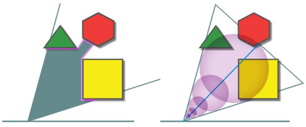
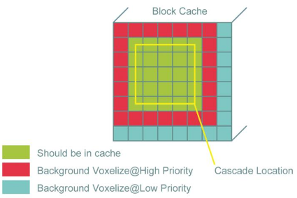
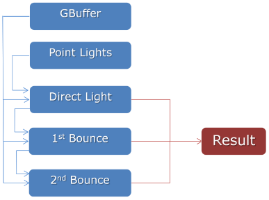
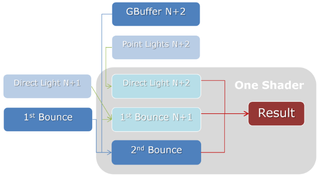
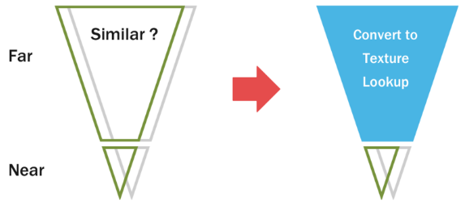

# 概要(Overview)

- "The Tomorrow Children"に取り入れた技術のお話。
- 以下の詳細を含む。
    - ライティング(リアルタイムGI)。
    - ランドスケープシステム。
    - 非同期コンピュート。

# ライティング(Lighting)

- 目指していた独自のルックにGIの必要性を感じた。
- PS4ならやってくれるだけのパワーがあると確かに感じていた。
- はじめはベストなやり方が明確ではなかった。
- Light Propagation VolumesやVirtual Point Lightを調査した。
- 最も有望だと思ったのがVoxel Cone Tracingだった。

# ボクセルコーントレーシング(Voxel Cone Tracing)

- ハイエンドGPUでリアルタイムGIを可能にする。
- [@Crassin2011]では以下によって実現する。
    1. シーンをSparse Voxel Octreeへ格納する。
    1. Sparse Voxel Octreeへライティング情報を注入する。
    1. コーン(円錐)をトレースして、ピクセル位置の間接照明の影響を収集する。

# コーントレーシングとは(Cone Tracing?)

{#fig:rays-vs-cones}

- レイトレーシングと類似性を持つ。
    - プリミティブを射出してシーンと交差させることで、ある点に入射する放射輝度のサンプルを得る。
    - 良く分布した(well distributed)サンプルを十分に得たら、それらを組み合わせてライティングを計算する。
- レイは無限小の点で交差する。
- コーンは面またはボリュームで交差する。
    - 当たりがひとつの点ではなく、複数の部分に現れる。
    - シーンを面で評価するために、シーンはフィルタリング可能でなければならない。
        - 平均値を用いるので、推定の正確さは低下する。
        - 平均値を用いるので、レイトレーシングでよく見られるノイズは低減する。
            - コーントレーシングの性質の中で、特に目を引いたポイント。

# どうやってサンプルするか(How do we sample?)

{#fig:how-do-we-sample}

- [@fig:how-do-we-sample] (左)のような交差した表面を評価するのは簡単ではない。
- 代わりに、[@fig:how-do-we-sample] (右)のように、コーンに沿ってボリュームをサンプルする。
    - 各サンプルはコーンの頂点に向けて反射する光の推定値を返す。
    - サンプルを組み合わせて、その方向の遮蔽率の推定値とする。
    - 組み合わせ方の基本はレイマーチングと同じ。

# 正確性の問題(Accuracy Issues)

{#fig:accuracy-issues}

- 部分的に遮蔽している場合に結果が不正確になる可能性がある。
    - 遮蔽の形状を考慮せずに、遮蔽率を単純に掛け合わせるため。
    - 実践だとそれほど問題にはならないが、コーントレーシングは大雑把な推定であることに留意しておく。

# シーン表現(Scene Representation)

- シーンを表現するためにはボクセルを使う。
    - そのままでは莫大なメモリが必要になるので、何か策を取らなければならない。
- [@Crassin2011]ではSparse Voxel Octreeを使う。
    - 非常にコンパクト。
    - GPUに100%最適化されているとは思えない。
        - データの参照先を行ったり来たりする(walking)。
        - ポインタ辿ってデータを参照する(pointer chasing)。
- 我々はVoxel Texture Cascadeを使うことにした。

# カスケード(Cascades)

{#fig:cascades}

- 前のレベルは次のレベルにオーバーラップされる。
- 各レベルは同じ解像度のテクスチャを持ち、次のレベルは前のレベルの各辺2倍の領域に対応する。
- 使用メモリの総量を削減でき、これ自体がLODとして機能する。
- 単なる3Dテクスチャであり、GPUで自然に扱うことができる。

# 何をボクセルに格納するか(What's stored in the voxels?)

- ジオメトリ情報。
- Gバッファに類似したもの。
- ただし、2Dではなく3Dで。

# ボリューメトリックGバッファ(Volumetric G-Buffer)

|属性              |フォーマット      |バイト毎ボクセル面　|アルファ   |
|-----------------|---------------|---------------|---------|
|アルベド           |R8G8B8A8_UNORM |4              |重みファクタ|
|法線              |R8G8B8A8_SNORM |4              |未使用　   |
|占有率(Occupancy)　|R8_UNORM       |1              |N/A      |
|放射量(Emission)　 |R11G11B10_FLOAT|4              |N/A      |
: ボクセルに格納するジオメトリ情報。 {#tbl:volumetric-g-buffer}

- 各属性は別々の3Dテクスチャに持つ。
- アルベド、法線、占有率、放射量を格納する。

# ボリューメトリックライトバッファ(Volumetric Light Buffers)

|バッファ   |フォーマット      |バイト毎ボクセル面　|
|:--------|---------------|:--------------|
|直接光　　　|R11G11B10_FLOAT|4              |
|一次バウンス|R11G11B10_FLOAT|4              |
|二次バウンス|R11G11B10_FLOAT|4              |
: ボクセルに格納するライト情報。 {#tbl:volumetric-light-buffers}

- ディファード系アルゴリズムでいうライトバッファに相当する領域も必要になる。
- 直接光によるライティング、一回目のバウンスによるライティング、二回目のバウンスによるライティングを格納する。
- R11G11B10_FLOATは正確さとサイズの良いトレードオフを実現する。

# 異方的ボクセル(Anisotropic Voxels)

- 質を高めるため、ボクセルの面ごとに情報を格納する。
- 実際には[@tbl:volumetric-g-buffer; @tbl:volumetric-light-buffers]に記された情報を6面分格納する。
- これによりボクセルは方向により異なる色を返す(異方性を持つ)ことができるようになる。
- 面を考慮しないと、ボクセルはひとつの色しか持たないので、光の照っていない方向にもその情報を渡すことになる。

# データレイアウト(Data Layout)

- 32x32x32ボクセルのカスケードを6レベル分用意する。
- ボクセルごとに6つの面を持つ。
- ボクセル面とカスケードレベルは1つの3Dテクスチャにまとめて格納する。
    - X方向にボクセル面を、Y方向にカスケードレベルを配置する。
        - ボクセル間のトリリニア補間が簡単にできるようになる。
        - 他の面やレベルに値がにじまないように、常にカスケードレベルの境界でクランプする(clamp to edge)設定でサンプルする。

# GIを得るためにはこれをどう使うか(How do we use this to get GI?)

1. ボクセル化。
    - シーンをボクセルとしてVoxel Texture Cascadeに格納する。
    - ボクセル化のさいに、ボリューメトリックGバッファを構築する。
1. コーントレーシングによる光の注入。
    - ボリューメトリックライトバッファにライティング情報を注入する。
    - 実際には、各ボクセルで数個のコーンをトレースする。
    - コーンに沿ってサンプルし、その占有率から遮蔽率を推定する。
    - 1フレームに1レベル分の更新を行い、複数フレームをかけてすべてのレベルを更新する。
1. スクリーンスペースでコーントレーシング。
    - ピクセルが指すワールド座標からコーンをトレースして間接照明を取得する。

# カスケードの生成と更新(Generating and Update Cascades)

# カスケードの更新(Cascade Update)

- 1フレームごとに1つのカスケードレベルを更新する。
- 詳細度の高いカスケードレベルの更新頻度がより高くなるようにバイアスをかけている。
    - 一番近いカスケードレベルは2フレームごと、次のレベルは4フレームごと、などなど。
    - カメラの周囲が理にかなうスピードで更新されることを保証する助けになる。
- まずはカスケードの中心を計算する。
    - カメラ位置から求められる。
- 移動していたなら、カスケードデータをスクロールさせる。
    - ボリューメトリックGバッファとボリューメトリックライトバッファでも同様。

# スクロール(Scrilling)

- 自分が動き回るかのように、放射照度データをスクロールする。
- 失われた端(edge)のデータは次のカスケードから取ってくる。
    - エッジではミップマップを使ってライティングを近似する。

# ボリューメトリックGバッファジオメトリ(Volumetric G-Buffer Geometry)

- カスケードレベルが移動したら、エッジにある新しいジオメトリをボクセル化する。
    - それと一緒に、現れたばかりのものや変化したものもボクセル化する。
- 何をボクセル化する？
    - 静的なオブジェクト(ポリゴン)。
        - 詳細度の低いLODモデルを使う。
    - ランドスケープ(span, LDC format)
        - ユーザが変更できるが、比較的には静的である。
        - 内部的にはspan listの一種で格納されている。
- 動的なオブジェクトはそれが動くたびにボクセル化を誘発するので含めない。

# ポリゴンオブジェクトのボクセル化(Voxelization of Polygonal Objects)

# オブジェクトのボクセル化(Object Voxelization)

1. 各軸に垂直な方向からラスタライズして、ピクセル情報をアペンドバッファに溜め込む。
    - Zテストと背面カリングは無効化する。
    - 各軸に対してドローコールを1回ずつ発行する。
    - 要するに、ジオメトリの入口(entry)と出口(exit)のリストを生成している。
        - 関連情報として深度、ピクセル座標、マテリアル属性を集めている。
1. 4x4x4のボクセル("マイクロブロック"と呼ぶ)に分割する。
    - マイクロブロック1つがコンピュートシェーダのスレッドグループ1つに対応する。
    - コンピュートシェーダでブロックに含まれるフラグメントをアペンドバッファから取り出す。
1. 各ボクセルの各面ごとに最小深度を計算して関連情報をLDSバッファに格納する。
    - 関連情報として、最小深度を持つフラグメントの番号、そのボクセル面のフラグメント数を格納する。
    - 計算はアトミックで行われる。
    - これにより、各ボクセル面における最前面のフラグメントを判別できる。
1. 最前面のフラグメントのマテリアル属性を使って、ボリューメトリックGバッファに書き込む。

- 各軸のラスタライズは最終解像度の16倍でスーパーサンプリングを行う。
    - ボクセル化したジオメトリのアンチエイリアスを行う助けになる。
- 更新が必要な場合のみ、1フレームに1つのカスケードのみをボクセル化する。
    - 更新が必要ないなら何もしない。
    - ボクセル化したデータをキャッシュすることでスパイクを平滑化する。

# オブジェクトボクセル化のキャッシュ(Object Voxelization Cache)

- 裏(background)ではカスケードレベルより少しだけ広いところにあるブロックをゆっくりとボクセル化してキャッシュに溜め込んでいる。
    - このブロックの範囲にはいくつかの"マイクロブロック"が含まれる。
- メモリ消費を抑えるため圧縮を施している。
- カスケードが動けば、このキャッシュを用いて空いたエッジを埋めてゆく。

# 解決(Resolve)

- ランドスケープはLayered Depth Cubeで格納されているのでボクセル化しやすい。
- 動いたときは、ランドスケープをボクセル化して伸長したオブジェクトキャッシュと組み合わせる。
- 組み合わせたら、32x32x32のカスケードレベルへ解決することができる。

# 後処理(Post Processing)

- ボクセル化が中までしっかり埋まっている状態(solid)であることを保証することがロバスト性にとって重要であること発見した。
- ボクセル化の後処理として、不透明ボクセルを持つ表面ボクセルの間のspanを埋める。
- 重要な情報を通り過ぎてトレースできないようにするためにボクセルのはじめの表面下層へ表面属性を伝播する。

- ジオメトリ表面のボクセルを走査して、バッファに書きだす。
    - これらのボクセルがライティング処理に用いられる。

# 中核ライティング更新ロジック(Core Lighting Update Logic)

- 出来上がったボリューメトリックGバッファをもとに、表面ボクセルにおいてコーンをトレースすることで、ボリューメトリックライトバッファを埋めてゆく。

# 方向の選択(Picking our directions)

- 直接照明と間接照明の情報を収集するとき、トレースする方向を選択する必要がある。
- 我々は単位球上にうまく分布した16の固定の方向をトレースをに用いることにした。
- これらを選択する方法を支持する数学の分野(Spherical T Designsを参照)が実際には存在するが、球上での積分がうまく行くことを保証する"良い"方向が選択できればそれで十分である。
- パイプラインを通して、ボクセルからトレースするコーンもピクセルのトレースするコーンも、すべての方法で同じ方向を用いる。

# 直接ライティング(Direct Lighting)

- 直接ライティングには3つのライトタイプをサポートする。
    - 空からの光。
        - 前述の16方向でコーントレーシングする。
        - トレースする方向に平行な16の球面放射基底関数(Spherical Radial Basis Function)で表現する。
            - これにより、太陽光とその影で高周波成分を表現するのが難しくなる。
            - 我々はアートスタイルを影響の少ないものにしたので、大きな制限にはならなかった。
    - ポイントライト。
        - 前述の16方向でコーントレーシングする。
        - ジオメトリシェーダを使ってボリュームテクスチャに注入する。
            - ボリュームテクスチャはカスケードされる。
    - 発光するマテリアル。
        - ライトバッファに直接注入する。

# バウンスライト(Bounce Light)

- 前述の16方向でコーンをトレースする。
- 直接光を注入したライトバッファから収集する。
- 同様に二次バウンスを一次バウンスを注入したライトバッファから収集する。

# ワンパス戦略(One Pass Strategy)

- 各表面ボクセルに対して、直接、一次バウンス、二次バウンスの3種を同じ方向にトレースする。
- 常に同じ方向にトレースするなら、それをひとつにまとめることができないだろうか。

# マルチパスのタイミングダイアグラム(Multi-pass Timing Diagram)

- ボリューメトリックGバッファとポイントライトテクスチャを使たトレース直接光を得る。
- 再びトレースして一次バウンスを、もう一度トレースして二次バウンスを得る。
- 直接光とバウンスを合算してボリューメトリックライティングを得る。
- ただし、これには3回のコーントレーシングを要する。

# ワンパスのタイミングダイアグラム(One Pass Timing Diagram)

- 計算をフレームをまたいで互い違いに行うことで単一のパスで行うよう変換する。
    - やっていることは以前と同じだが、2フレーム分のレイテンシー(遅延)が生まれる。
- そこで、現在のフレームのGバッファを利用して一次バウンステクスチャと二次バウンステクスチャを計算する。
    - ボリューメトリックGバッファは急激には変化しないので、結果はほぼ同じになる。
- 計算をインターリーブしたので、各フレームで直接光、一次バウンス、二次バウンスそれぞれを常に計算する。
    - 実際には、同じような結果になることを利用して、そのフレームで計算している値を足し合わせるだけで済ませる。
    - これにより、2フレーム分のレイテンシーを除去できる。
- 以上を踏まえると、上図のように1パスで構成できるようになる。
    - 現在のGバッファと2フレーム前の一次バウンスから、2フレーム前の二次バウンスを計算する。
    - げんざいのポイントライトから、現在の直接光を計算する。
    - 現在のGバッファと1フレーム前の直接光から、1フレーム前の一次バウンスを計算する。
    - 現在のGバッファと2フレーム前の一次バウンスから、2フレーム前の二次バウンスを計算する。

# 追加のマジック(Extra Magic)

- ボクセル粒度での2回のバウンスはいい感じなのだが、もう少し欲しい。
- 一次バウンス光より二次バウンス光を多く受け取る場所は三次バウンス光もより多く受けるだろうと推測して、そこを擬似的に増やしてやる。

# スクリーン空間のコーントレース(Screen Space Cone Trace)

- ピクセルをどうライティングするかが重要であるため、スクリーン空間でのデータを得る必要がある。
- 各ピクセルで空からの光、ポイントライト、間接光を収集したいが、何も考えずにやると何千万ものコーントレースが必要になり現実的ではない。

- 法線やマテリアルなどによってライティングはかなり変化するが、ライティング環境は一般的にあまり変化しない。
- 低解像度で低頻度の環境マップを使ってコーントレーシングを行うことで効率化する。
    - ハードシャドウを持たないので、深度の不連続性が小さければそれほど劇的には変化しない。
- 縦横1/4のレンダターゲットを用いる。
- ジオメトリを意識した方法で実解像度にアップサンプリングする。

# カスケードの選択(Cascade selection)

- どのカスケードレベルからトレースをスタートさせるかを決めなければならない。
- 我々は距離に基づいて開始カスケードレベルをブレンドした。
    - 無駄が増えるかもしれないが、ある方向に他の方向のディテールを持たせないようにすることが必要だった。
    - 開始レベルは滑らかにブレンドする。
    - 小さなノイズを加えることで、カスケード移動時に境目を見えづらくする。

# 最適化(Optimization)

- コーントレーシングは3Dテクスチャカスケードを以てしても遅い。
    - PS4上での実践的な速度ではない。
- 最後のスクリーン空間トレースに十数ミリ秒かかる。
- テクスチャ参照が多すぎる。

# 異方的ボクセルの事前結合(Pre-Combine Anisotropic Voxels)

- 各コーントレースごとに、3つのボクセル面の値を補間しなければならない。
    - テクスチャ参照コストが大きい。
- 16方向に対して事前に値を組み合わせて格納しておく。
    - トレース方向が固定されているために可能である。
    - 追加でオーバーヘッドが発生するが、テクスチャ参照を減らすことのほうが大事。

# コーントレースの分割(Split Cone Trace)

- 視差(parallax)のアドバンテージを得る。
- 近いワールド空間座標から同じ方向にトレースする場合、そのサンプルはコーンの終端に近づくに従って同じような値を返すようになる。
- そこで、"far"のコーンのデータは各ボクセルの中心から一度だけトレースして別のテクスチャカスケードに格納する。
- これにより、コーンの"near"部分をトレースするのみでよくなり、"far"部分はこのテクスチャを使う。
- nearとfarの境目は最も近いカスケードレベルから1メートル程度のところに設定してある。

# 微細なディテール(Fine Detail)

- コーントレーシングは大規模なライティングディテールをもたらす。
- 一番小さいボクセルでも0.4メートルしかない。
- スクリーン空間で計算した微細なディテールを補足してやる(augment)必要がある。

# SSDO(Screen Space Directional Occlusion)

- GPU Pro 3のスクリーンスペースベント(bent)コーンと似たようなことをやっている。
- スカラの遮蔽値ではなく2バンドのSH(球面調和関数)を統合する。
    - 特にスペキュラを扱うときに役に立つ。
- 可視性コーンに簡単に変換できる。
- 各トレース方向のコーンと可視性コーンを交差して、適宜入射光を調整する。

# キャラクター(Characters)

- キャラクターはそのサイズとオーバーヘッドによりボクセル化していない。
- コーンによる遮蔽テストの代わりに、コリジョンカプセルを使う。
- これは"Lighting Technology of The Last of Us"の方法と良く似ている。
    - ただし、主方向ではなく16方向で行う。
    - 16レイヤのディープスクリーンスペーステクスチャ配列を得る。

# 乗り物(Vehicles)

- このゲームで乗り物と呼ばれる動的オブジェクトは、カプセルにうまくフィットしない。
- 可視性を2バンドのSHに統合し、3Dテクスチャに格納する。
    - 16方向のコーンとの交差が簡単になる。
    - キャラクターと同じく、16レイヤのディープテクスチャ配列に出力される。

# パーティクル(Particles)

- パーティクルは潜在的にそのピクセルごとに16方向のコーントレースが必要になる。
    - コストがかかりすぎる。
- カスケードテクスチャをシンプルな放射照度プロブのような2バンドのSHに簡略化したもの使う。
    - テクスチャルックアップは3回で済む。
- パーティクルをテッセレートして、頂点ごとにテクスチャからサンプルする。
- 遮蔽情報はコーントレースにフィードバックされる。
    - 動的な遮蔽テクスチャに格納する。

# 表面下散乱(Subsurface Scattering)

- SS的な見た目を得るには、マテリアル内部のバウンスをシミュレートする必要がある。
- 可能な方法としては、テクスチャ空間かジオメトリ対応のスクリーン空間でライティング情報をぼかす。
    - オブジェクトの背後にあるライトがにじみ出てくる現象を扱えなくなる。

- パーティクルのために作ったSHテクスチャが役立つ。
    - このテクスチャは事実上その空間の任意の地点をサンプルできるライトの場(field)である。
    - つまりはその地点の放射輝度を得ることができる。
- カスケードレベルからはより大きな空間の入射光情報を得られる。
- 様々なカスケードレベルから放射照度の重み付き平均を取り、視点には直接的にヒットしていないライトを収集するのに用いることができる。
- 我々の実装では、このライティングを累計するため、第1SHバンドを取ることで球全体をサンプルする。
    - 我々はこれを"static SS"シェーディングと呼ぶ。

- 視点から離れるようにオブジェクトを通ってレイマーチングしたり、様々なカスケードレベルからサンプリングしたり、レイマーチの方向に射影したSHコーンを使ってライトを集めたりすることで指向性を持つ効果を得ることもできる。
    - 我々はこれを"directional SS"と呼ぶ。
- マテリアルルックのリッチな範囲を得るため、これら2つの表面下のライティング結果とコーントレーシングで得られる通常のディフューズライティングとの間を補間する。
- マテリアルのアルベドをいじって見た目を強調するために"frosting"と呼ぶパラメータを導入する。
    - SSDOと一緒に計算されるスクリーンスペースの厚さパラメータを使う。

# レイマーチによる反射(Ray Marched Reflections)

TODO

# 参考文献(References)
