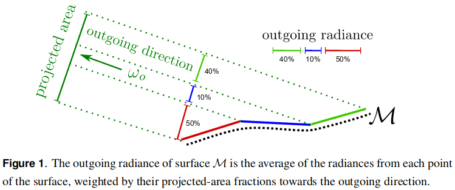

# Understanding the Masking-Shadowing Function in Microfacet-Based BRDFs, JCGT 2014

## 1. まえがき(Introduction)

マイクロファセット理論は元々、表面上の散乱を研究するために光物性(optical physics)の分野で開発された。グラフィクス界隈では物理ベースのBRDFを導入するために使われ、こんにちの3DCGには欠かせない技術となっている。2012年と2013年のSIGGRAPHにはマイクロファセット理論を扱うコースもあり、そこではアーティストによる調整のしやすさや計算の効率性などについても議論されている。マイクロファセットは、要素の組み合わせの数だけ可能性が存在するため、今なお盛んな分野である。しかし、要素の適切な選び方が明白でないことままあるため、混乱の主な原因になっている。

### この文書で取り上げること(What This Document Is About)

この文書では、マイクロファセットベースのBRDFにおけるmasking-shadowing関数の選び方に関する、新しい見方と長年の疑問に対する答えを提供する。

### この文書で取り上げないこと(What This Document Is Not About)

一般的に使われているモデルでのみ議論するのであって、新しいBRDFモデルを提案したりはしない。理解を深めるためにモデルについての背景知識を提供するのが目的であって、他のモデルを差し置いて特定のモデルをおすすめしたりはしない。物理パラメータの理解に注力するのであって、すでに使用実績があるからといってその実装や特定のレンダリング技法での使われ方を想定しない。

### マイクロファセットモデルにおける"物理ベース"が意味する所(On The Meaning Of "Physically Based" Regarding Microfacet Models)

物理的モデルとは、解析、説明、挙動の予測が可能であるシステムまたは物理現象の簡略表現である。

###

マイクロファセット理論において、研究対象であるモデルは、巨視的尺度(macroscopic scale)で見ると平坦な幾何的表面だが、微視的尺度(microscopic scale)で見るとその界面(interface)は荒く、マイクロファセットで構成されている。この表現は、幾何学的表面の界面(geometric surface interface)で発生する散乱現象(scattering events)を説明したり予測したりするときに使われる。

有意義なマイクロファセットモデルは、どれだけマイクロファセットが指定の方向を統計的に見て向いているかを示す法線分布と、どのようにマイクロファセットがマイクロサーフェス上に組織されているかを示すマイクロファセットプロファイルによって説明される。このような有意義なマイクロファセットモデルから導き出された方程式を持つマイクロファセットBRDFは、マイクロサーフェスモデルに基づくことから、まさしく"物理ベース"と呼ばれる。逆に、マイクロサーフェスモデルからBRDFが導けないなら、それは"物理ベース"とは呼ばれない。masking-shadowing関数は、マイクロファセットBRDFの一部で、マイクロファセットが出射方向から(masking)か入射方向から(shadowing)のいずれかから見えている確率を表す。BRDFのときと同様に、マイクロサーフェスモデルから導き出される場合のみ、masking-shadowing関数は"物理ベース"と呼ばれる。

本文書では、マイクロサーフェスモデルが正式にはどのように説明されているか、そこから物理ベースのmasking-shadowing関数がどのように導き出されるかを解説する。これが関連する物理ベースBRDFの導出にどうつながるかも紹介する。

ただし、マイクロファセットモデルは、幾何光学のみを扱う、完全な鏡面および拡散反射、複数回の散乱を考慮しない、といったマイクロサーフェスの光学的な振る舞いに関する仮定に基づく、単なる**モデル**であることに注意すべきである。したがって、"物理ベース"と呼ばれるそれは、現実の物理表面の測定値を正確に予測することができるという意味ではない、ということを頭に入れておく必要がある。仮定したものが間違っていれば、計測データと比較したとき、数学的に厳密な"物理ベース"のそれより経験則的モデルのほうが正確であることも十分にあり得る。

### アイデアとOrganization(Ideas and Organization)

この文書で述べられるアイデアは以下の3つの先行研究に強く影響を受けている:

- Smithのmasking関数は、コンピュータグラフィクスの文献のなかで最も有名なものの一つである。しかし、この関数が、正しいmasking関数から期待される性質である、visible projected areaを保持することを保証する性質を持つことを文書の最後に指摘していることはあまり知られていない。

- Ashikhminらはvisible projected areaが幾何学的表面からマイクロサーフェスに至るまで保存されている量であることを見つけ出した。この知見は、正しく正規化されていることとエネルギーが保存されていることを保証する、正しいmasking項の一般式を導出するために使われた。この導出の最中には、自然とSmithのmasking関数を再発明していた。彼らのmasking項は積分形式で表されており、閉形式を導くことはできない。彼らは数値的に前計算を行い、ルックアップテーブルに格納する方法を取った。

- Rossらは海面の反射率に関する研究を提案した。ガウス的な荒い表面(Beckmann分布)で海面をモデル化し、Smithのmasking-shadowing関数を組み込んだ正規化済みBRDFを計算した。彼らはガウス的表面ではBRDFの正規化係数とSmithのmasking関数が打ち消し合う?似通った式を持つことを発見した。この性質は計算機処理目的では便利だが、彼らはこれが発生する物理的理由を示さなかった。

###

この文書では、visible projected areaの保存の観点からこれまでのすべての研究結果を直接導き出せる、統一されたマイクロファセットフレームワークを提案する。

<<各章の概要>>

## 2. Masking関数の導出(Derivation of the Masking Function)

### 2.1 表面上での放射輝度の計測(Measuring Radiance on a Surface)

放射輝度(radiance)は立体角からある領域を通過するエネルギー密度で、単位は$W/sr/m^2$である。方向$omega_o$に出射する面$\mathcal M$の放射輝度$L(\omega_o, \mathcal{M})$は、出射方向に観測されるprojected areaにより重み付けされた、表面上の各区間(patch)の中心点$p_m$と出射方向$\omega_o$に対する放射輝度$L(\omega_o, p_m)$を積分したものである。

\[
L(\omega_o, \mathcal M) = \frac{\int_{\mathcal M} \text{projected area}(p_m) L(\omega_o, p_m) dp_m}{\int_{\mathcal M} \text{projected area}(p_m) dp_m}
\]

出射方向に投影される表面上の各地点での面積は視点依存であり、分母の積分$\int_{\mathcal M} \text{projected area}(p_m) dp_m$は正規化係数である。この正規化係数は式全体が放射輝度を単位とするよう調整している。

### 2.2

TODO
