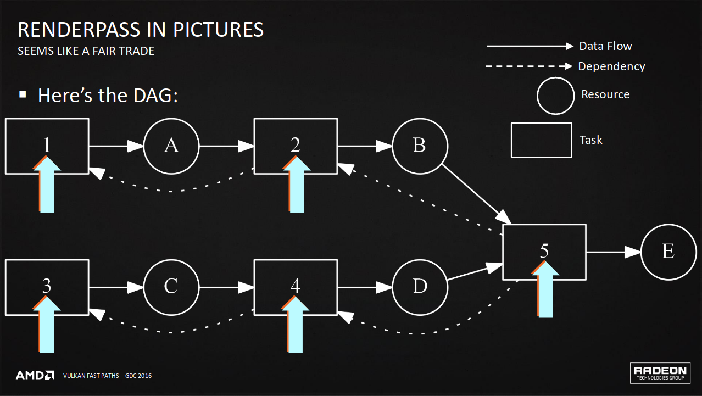
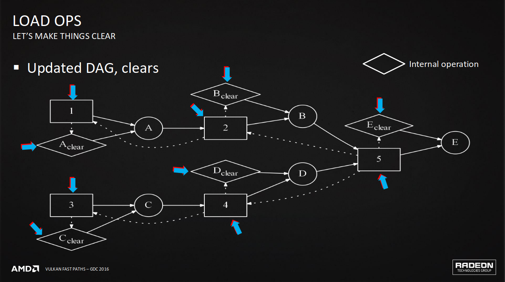
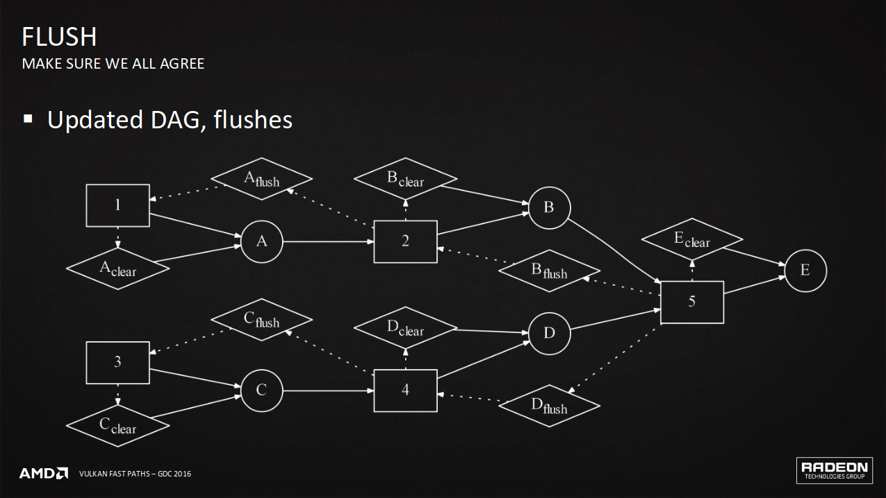
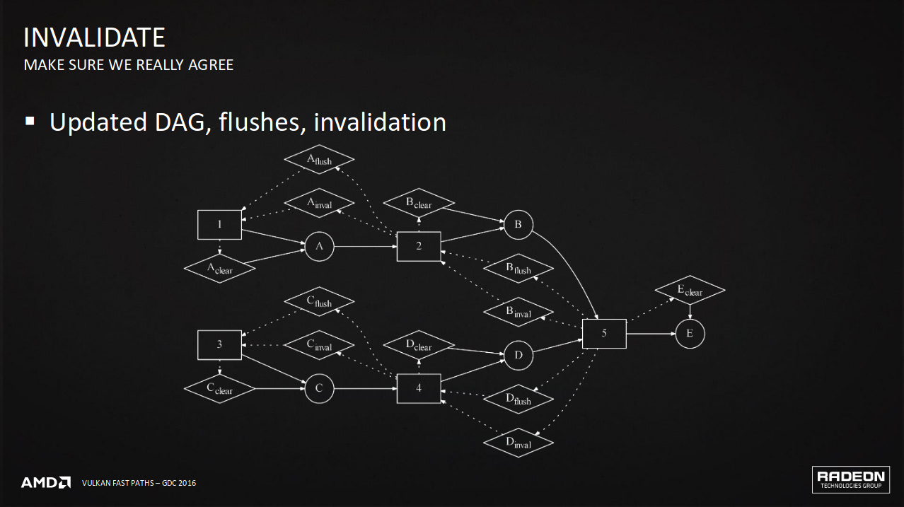

# Vulkan Fast Paths: Binding Model

# GCN Terms --- Background on the hardware

- SGPR - 32ビットのスカラー一般用途レジスタ(Scalar General Purpose Register)。
- VGPR - 32ビットのベクトル一般用途レジスタ(Scalar General Purpose Register)。
- K$ - スカラーデータキャッシュ(Scalar Data Cache)。
- CU - コンピュートユニット(Compute Unit)。
    - 各CUはクロックあたり64のFMA命令のスループットを持つ。
- Wave - 足並みを揃えて(in lock-step)実行する64のシェーダ呼び出し。
- 以下の命令はCUにおいて異なるwaveで同時に複数発行(multi-issue)を行うことができる。
    - SMEM - スカラーメモリ命令(K$へのアクセス、(dynamically uniform)アドレスを経由したバッファアクセス)。
    - SALU - スカラー算術命令(イメージやバッファのアクセス)。
    - VMEM - ベクトルメモリ命令。
    - VALU - ベクトル算術命令。

# Descriptor Types --- How they map to GCN hardware

- GCNの16バイトサンプラデスクリプタにマップする。
    - `VK_DESCRIPTOR_TYPE_COMBINED_IMAGE_SAMPLER`(サンプラの部分だけ)
    - `VK_DESCRIPTOR_TYPE_SAMPLER`
- GCNの16バイトバッファデスクリプタにマップする。
    - `VK_DESCRIPTOR_TYPE_STORAGE_BUFFER`
    - `VK_DESCRIPTOR_TYPE_STORAGE_BUFFER_DYNAMIC`
    - `VK_DESCRIPTOR_TYPE_STORAGE_TEXEL_BUFFER`
    - `VK_DESCRIPTOR_TYPE_UNIFORM_BUFFER`
    - `VK_DESCRIPTOR_TYPE_UNIFORM_BUFFER_DYNAMIC`
    - `VK_DESCRIPTOR_TYPE_UNIFORM_TEXEL_BUFFER`
- GCNの32バイトイメージデスクリプタにマップされる(後の世代のGDC[^GDC]はすべてのイメージデスクリプタで32バイトを使う)。
    - `VK_DESCRIPTOR_TYPE_COMBINED_IMAGE_SAMPLER`(イメージの部分だけ)
    - `VK_DESCRIPTOR_TYPE_IMAGE_ATTACHMENT`
    - `VK_DESCRIPTOR_TYPE_SAMPLED_IMAGE`
    - `VK_DESCRIPTOR_TYPE_STORAGE_IMAGE`

[^GDC]: GCNのtypo？

# USER-DATA SGPRs --- GDC[^GDC] hardware background for Vulkan descriptor model

- シェーダは2つのレジスタセットへのアクセス権限を持つ。
    - SGPRはひとつのwaveにおけるすべての呼び出しに対して動的に一定(uniform)である。
        - 定数やデスクリプタの例として使われる、
    - VGPRはひとつのwaveにおいてすべての呼び出しに対して唯一(unique)である。
- GCNはwaveの開始に先立って最大16個のSGPRを先読みする能力を持つ。
    - USER-DATA SGPRとして知られている。
    - GPUのコマンドバッファにUSER-DATAを設定するため、いくらかのオーバーヘッドがwaveの開始直前に発生する。
        - なので、必要以上に使わない。
    - 少量のUSER-DATA SGPRがドライバによって内部的に使われる。
        - シェーダステージや使っている機能により変化し、今後のドライバやハードウェアで変わり得る。
    - その残りがVulkanのバインディングモデルに使われる。
        - Push Constants
        - 32ビットのデスクリプタセットのポインタ(デスクリプタセットは下位32ビットアドレス空間に維持される)。
        - `UNIFORM_BUFFER_DYNAMIC`か`STORAGE_BUFFER_DYNAMIC`(それぞれが4つのUSER-DATA SGPRを使う)。

# USER-DATA SGPRs: and spilling --- GDC[^GDC] hardware background for Vulkan descriptor model

- USER-DATA SGPRが埋まりきると、ドライバはそのオーバーフロー分をドライバが管理するバッファに書き込む。
    - こぼれ(spilling)が起こると、コスト増加につながる(シェーダでの間接参照など)。
- USER-DATA SGPRが埋まる優先順位はドライバ依存(最適化やドライバのリビジョン次第で変わり得る)。
    - 現在の優先順位は一般的に、
        - 初めに、Push Constants。
        - 続いて、0からNまでのデスクリプタセット。
            - 先に、動的デスクリプタ。
            - 次いで、デスクリプタセットのポインタ。
- 起こり得るUSER-DATA SGPRの使用例。
    - 4つをドライバ内部で使用。
    - 2つを32ビットのPush Constantsに。
    - 4つを0番の動的デスクリプタに。
    - 1つを0番のデスクリプタセットポインタに。
    - 1つを1番のデスクリプタセットポインタに。
- 一般的なおみやげ(takeaway)
    - こぼさないためにPush Constants、バインドされたデスクリプタセット、動的デスクリプタの総数を十分に少なくしてみよう。

# Constant and Descriptor loads on GCN --- Hardware background

- 定数とデスクリプタはSMEM命令によりブロック読み込みされる。
    - これは(dynamically uniform)アドレスとして知られているいかなるバッファ読み込みにも適用することができる。
    - サポートされるアドレスモード: デスクリプタからのベース+レジスタか即値オフセットのいずれか。
        - S_BUFFER_LOAD_DWORD* dst, デスクリプタ, オフセットを提供するSGPR
        - S_BUFFER_LOAD_DWORD* dst, デスクリプタ, 20ビット即値オフセット
            - 20ビット=1MBであり、大きなバッファかデスクリプタセット用であり、初めに即値オフセットのアクセスデータを保持し、その後に動的アクセスデータを保持する。
- S_BUFFER_LOAD_DWORD* は1命令で1,2,4,8,16,32ビット値をブロック読み込みすることができる。
    - ドライバは複数の定数の読み込みを1つの大きなブロック読み込みに合体することができる。
    - 使用の局所性によりグループ化した定数とこれをサポートするためにアライメントされたブロックを保持するのが最善である。
    - ブロック読み込みはGCNで動的ベースアドレスを低コストにする。
        - // 8つの32ビット定数に対する動的ベースのために1つの追加のSALU命令を使う例。
        - S_ADD_U32 オフセット, ベース + 即値オフセット
        - S_BUFFER_LOAD_DWORDX8 dst, デスクリプタ, オフセット
- デスクリプタはS_LOAD_DWORD*経由で読み込まれる(ベースにはデスクリプタの代わりにポインタを使う)。
    - S_BUFFER_LOAD_DWORD*と同様に同じアドレスモードとブロック読み込みのサポート。

# One Set Design --- Fast path, "bindless" or rather "bind-everything" on Vulkan

- 1つの巨大なデスクリプタセットにすべてのデスクリプタを配置する。
    - `layout(set=0, binding=N) uniform texture2D textures[hugeNumber]`
- 1つの巨大なデスクリプタセットを常にバインドしたままにする。
    - Draw/Dispatchごとに`vkCmdBindDescriptorSets`を呼ばなくて良くなる。
    - 代わりにバインドする配列への各描画インデックスに対して`vkCmdPushConstants`経由でPush Constant(s)を使う。
- Push Constant経由の描画ごとの頻度を持つベースインデックス: textures[pushConstant + 1]
    - S_ADD_U32 配列ベース, デスクリプタセットベース, 32ビット即値オフセット
        - この命令は事実上タダで、配列バインディングからの第2のテクスチャに対して必要としない。
    - S_LOAD_DWORDX8 テクスチャデスクリプタ, 配列ベース, 20ビット即値オフセット
- フレームごとの頻度を持つテクスチャは即値で指すことができる: textures[2]
    - S_LOAD_DWORDX8 テクスチャデスクリプタ, デスクリプタセットベース, 20ビット即値オフセット
    - そのセットのベースに向かってフレームごとの頻度を持つテクスチャを保持するのが最善である。

# Dynamic Descriptors --- UNIFORM_BUFFER_DYNAMIC & STORAGE_BUFFER_DYNAMIC

- 動的ベースアドレスは`vkCmdBindDescriptorSets`の`dynamicOffsets`で提供する。
- ドライバはバインド呼び出しに対する動的オフセットに基づくユニークなGCNバッファデスクリプタを組み立てる。
    - この16バイトバッファデスクリプタはできるだけUSER-DATA SGPRに配置される。
- おみやげ
    - 描画ごとの頻度では、これは良いオーバーヘッド量を持つ(CPU処理、USER-DATAの追加スペース)。
        - かわりにPush Constantsを試す。
    - 動的デスクリプタはUSER-DATAに配置される。
        - シェーダで間接参照を取り除くためにこれを使うことができる。
        - 初めにデスクリプタを読み込む必要なしにすべての定数に達する。

# One Dynamic Buffer Descriptor Design -- Fast path, "bind-everything" applied to constant data

- 一例: per-frame、per-pass、per-drawの定数を渡す必要がある描画。
- これを最適化し得る。
    - 各描画で同じままにする1つのUNIFORM_BUFFER_DYNAMIC。
        - "One Set Design"の拡張。動的デスクリプタはセットがバインドされるときに作られる(per-drawの代わりにper-passで)。
        - 間接参照、USER-DATAの動的デスクリプタを取り除く。
    - per-drawを変化したりper-drawオフセットを供給する1つの32ビットPush Constant。
- 各パス(フレームごとの少数のパス)は別々のUNIFORM_BUFFER_DYNAMICデスクリプタを得る。
    - バッファコンテンツ: per-frame、per-pass、draw0、draw1、... drawN。
    - per-frameデータは各パスで重複し、即値オフセットでアクセスすることができる。
    - per-passデータは即値オフセットでアクセスすることができる。
    - per-drawはPush Constantで供給される動的ベースオフセットを使う。
        - 速い。GCNは定数をブロック読み込みする。

# Image Descriptors: Sampled vs Storage --- Optimal descriptor choice

- リードオンリーのSAMPLED_IMAGEはSTORAGE_IMAGEを読み込みだけに使うより早くなる可能性がある。
    - GCNハードウェアでこれらが同じデスクリプタタイプを共有するとしても。
    - 正しいVulkanデスクリプタタイプを使うために依然として重要である。
- `STORAGE_IMAGE`タイプは`GENERAL`レイアウトにする必要がある。
    - 圧縮されない。
- `SAMPLED_IMAGE`タイプは`SHADER_READ_ONLY_OPTIMAL`レイアウトにすることができる。
    - 圧縮をサポートできる。
    - GCN3(Tonga/Antigua/Fiji)でレンダターゲット用Delta Color Compression(DCC)が追加される。
- DCCは標準のリードオンリー、非ブロック圧縮、フォーマット化されたテクスチャ(RGBA8、RGBA16F、など)でも使うことができる。
    - テクスチャアップロード処理を調整することが鍵である。
    - `TRANSFER_DST_OPTIMAL`と一緒にグラフィックキューで`vkCmdCopyBufferToImage`を使う。
    - バッファからイメージへコピーするために内部的にピクセルシェーダを使い、出力時にDCC圧縮される。

# Immutable Samplers --- No-load samplers

- デスクリプタセットレイアウトに不変サンプラを指定する機能を持つ。
    - `vkDescriptorSetLayoutBinding::pImmutableSamplers`
- PSO生成時にサンプラデータを渡す。
    - サンプラをシェーダにコンパイルすることができる。
- 不変サンプラはSMEM読み込みの代わりにSALU命令により構築することができる。
    - シェーダでのレイテンシ量を減らす。
    - SALUパイプはほぼ十分に活用されていない。

# Descriptor Set Layout --- How descriptors are filled in descriptor pool GPU memory

- デスクリプタは64バイトのキャッシュラインを持つK$を通して読み出される。
    - キャッシュラインごとに2つのイメージデスクリプタか、4つのバッファデスクリプタか、その組み合わせを取れる。
    - 大きなデスクリプタセットでは、デスクリプタにまばらなランダムアクセスをしないのが最善である。代わりに、使用の局所性を維持するためのグループを使う。
    - "One Set Design"では、使用の局所性に沿ったキャッシュラインを維持するために副割り当てを行うのが最善である。
- デスクリプタは`VkDescriptorSetLayoutBinding`に現れる順にGPUメモリにパックされる。
    - GPUメモリマッピングへのレイアウト例。

|レイアウト|デスクリプタのバイト数|メモリオフセット|キャッシュライン|
|-|-|-|-|
|`layout(set=0, binding=0) uniform sampler s0;`|16|0|0|
|`layout(set=0, binding=1) uniform samplerBuffer sb0;`|16|16|0|
|`layout(set=0, binding=2) uniform texture2D t0;`|32|32|0|
|`layout(set=0, binding=3) uniform samplerBuffer sb[4];`|16*4=64|64|1|
|`layout(set=0, binding=4) uniform texture2D t1[2];`|32*2=64|96|2|

# Descriptor Pools --- Used to allocate descriptor sets

- `VkDescriptorPoolCreateInfo::flags`は`0`にする。
    - `FREE_DESCRIPTOR_SET_BIT`を使わない。
        - プールは`vkFreeDescriptorSets`をサポートするためにフラグメンテーションを引き起こし得るドライバ管理パスに落ちる。
        - ドライバ管理の動的メモリ割り当てを使う。
    - `vkResetDescriptorPool`をサポートするだけのパスを使うことを提案する。
        - デスクリプタプールは事前割当されたGPUとCPUメモリチャンクになる。
        - アロケーションはオフセットを増加させるようなもの。
    - 合理的な限界を設定することを忘れないこと。
        - `VkDescriptorPoolCreateInfo::maxSets`はCPUメモリ量に影響する。
    - Windowsでのデスクリプタプールはリソースの利用率に基づく可変マッピングを持つ。
        - 合理的な限界を維持することで最速パスを有効化する。
        - 最速パスは直接アクセス可能なGPUメモリの256MB最大ウィンドウを共有する。
            - GCNデスクリプタは典型的には多くて32バイト(MBのGPUメモリあたりballparkの32Kデスクリプタ)。
            - `vkUpdateDescriptorSets`はデスクリプタプールのGPUメモリに直接書き込む。
            - `vkCopyDescriptorSet*`を使うと、CPUでGPUメモリを読み込んだ後GPUメモリに書き込む(単純に書き込むくらいに速くない)。

# Updating Descriptor Sets --- Getting pipelined update, key for texture streaming with "One Set Design"

- `vkUpdateDescriptorSets`の効果は即時であることができる(GPUメモリが書き込んでいる途中で関数が戻ることにより)。
    - なので、使用中かもしれないデスクリプタに書き込むことはできない。
    - テクスチャストリーミングするやつの挑戦。
        - フレームの間でデスクリプタを更新したい。
- パイプラインの更新のワークアラウンド。最小レイテンシのVRでの例。
    - デスクリプタセットのコピー2つを維持する。
        - 各フレームごとに切り替える。
        - 使用中のときに更新するのをさけるために必要な同期を追加する。
    - アップデートは他方へ行われ、次のフレームが新しいデスクリプタを得る。
        - 次のフレームは他のコピーに次の更新を行い、次の次のフレームは新しいデスクリプタを得る。
    - 同じデスクリプタにエイリアスサれていない更新である限り、`vkUpdateDescriptorSets`を複数スレッドから呼び出すことができる。

# Summary --- "Bind-everything"

- Vulkanで簡単なパスでもある高速なパスを示した。
    - こぼれなしのUSER-DATAの高速パスを維持する。
    - 複雑なデスクリプタセット管理なし。シンプルなパイプラインの更新モデルによる重複したデスクリプタセット。
    - 1つのデスクリプタセットレイアウト。レイアウト互換性による複雑性をなくす。
    - 主なデスクリプタセットのバインド呼び出しの除去。
    - 各マテリアルで各フレームユニークなデスクリプタセットを再構築するオーバーヘッドの回避。
    - その他。

# Vulkan Fast Paths - Render Passes

# Renderpasses --- What on earth is that?

- レンダパスはGPU処理と背中合わせのチャンクである。
    - Vulkanオブジェクトにより表される。
    - 1つ以上のサブパスを含む。
    - すべてのレンダリングはレンダパスの内側で起こる。
        - 単一のサブパスしか持っていなくても。
    - サブパス間依存性はレンダパスの一部である。
        - ドライバは未来の知識に基づいて仕事をスケジュールすることができる。
        - ドライバは依存関係の知識からDAG(有向非巡回グラフ;Directed Acyclic Graph)を生成する。
- レンダパスはドライバ用タイムマシンである！

# Renderpass in Words --- A thousand words

- 以下を考える。
    - サブパス1はリソースAを生み出し、
    - サブパス2により消費され、リソースBを生む。
    - サブパス3はリソースCを生みだし、
    - サブパス4により消費され、リソースDを生む。
    - 最後に、サブパス5はリソースBとDを消費し、最終出力Eを生む。
- なんやかんや書いてあるけど
    - 要するにこれは、APIの呼び出し順のようなもの。

# Renderpass in Pictures --- Seems like a fair trade

# Creating Renderpasses --- Ok. How do I make one?

- シンプルなAPI --- `vkCreateRenderPass`
- レンダパスオブジェクトを生成する。
    - `device`で使用可能。
    - `pCreateInfo`の情報を使う。

# Renderpass Infomation --- So, what's in a renderpass?

- `VkRenderPassCreateInfo`構造に秘密がある。
- アタッチメント、サブパス、依存性情報の配列。

# Attachments --- Where am I drawing?

- `VkAttachmentDescription`の配列。
- レンダパスはいかなるアタッチメント数でも使う事ができる。
    - これらはサブパスで参照される。

# Attachments --- Where's the data?

- 各アタッチメントは以下を含む。
    - フォーマットとサンプル数。
    - ロード処理 --- どこからデータを取ってくるか(メモリ、クリア、don't care)。
    - ストア処理 --- どこへデータを送るか(メモリ、don't care)。
        - ステンシル用は分かれている。
    - レンダパスの初めと終わりに期待されるレイアウト。
        - ドライバはレイアウト変更を挿入するだろう。

# Subpasses --- Which bit am I drawing?

- `VkSubpassDescription`の配列。
- リファレンス色、深度ステンシル、入力(input)、解決(resolve)アタッチメント。

# Color Attachments --- This is where your data goes

- カラーアタッチメントの配列。
- これらは普通のカラーアタッチメントである。
    - レンダパスでのアタッチメントの総数は無制限。
    - サブパスごとに参照されるカラーアタッチメントの数は限度がある。
    -

# Input Attachments --- Read from previous subpasses

- 入力アタッチメントの配列。
- 入力アタッチメントは前のサブパスの出力である。
    - サブパス間のデータ依存性を表す。

# Other Attachments --- More stuff

- 解決、保護(preserve)、深度ステンシルのアタッチメント。
- 解決アタッチメント: 解決させるMSAAアタッチメントを置く。
- 深度ステンシルアタッチメント: 深度とステンシル。
- 保護アタッチメント: 保護されなければならないアタッチメントのリスト。

# Additional Dependencies --- Even more information

- 追加の依存性情報。
    - `VkRenderPassCreateInfo::pDependencies`
- 副次的効果のために使われる。
    - 例えば、後のサブパスで消費されるイメージかバッファに保存する場合とか。

# Graph Building --- Can you DAG it?

- ドライバはDAGを形成するためにレンダパス構造を使う。
    - サブパスはデータを生み出し、消費する。
    - リソースバリアはドライバが自動的に挿入する。
    - レンダパス生成時にスケジューリング情報が生成される。
- 1つのノードだけのDAGは役に立たない。
    - 便利にするには、複数のサブパスをレンダパスに含める必要がある。

# But Wait, There's More --- Order in the next 20 minutes

- 内部ドライバ処理。
    - アタッチメントは初期ステートと最終ステートを持つ。
        - 例えば、クリアはサブパス開始の一部である。
    - アタッチメントは出力から入力に進む。
        - カラーキャッシュをflushして、テクスチャキャッシュを無効化して、レイアウトを変更して、フェンスを挿入する。
    - いくつかのサーフェスはさらなる注意が必要である。
        - 例えば、圧縮された深度はシェーダでは直接読み出せない。
        - 内部ドライバ伸長が必要。

# Load Ops --- Let's make things clear

# Flush --- Make sure we all agree

# Invalidate --- Make sure we really agree

# Predicting the Future --- It's easy when you know how

- レンダパスはドライバが未来を予測することを可能にする。
    - 本当は予測ではない --- あなたが何をしようとしていたかを教えている。
    - クリア、内部blits、キャッシュ処理などをスケジュールする。
        - すべて静的に行われる。
        - レンダパスが生成された時に。
- 「俺ｽｰﾊﾟｰﾊｶｰwwwﾗｸｼｮｰwwww」
    - まあ、無理だよ。
    - いくつかの内部ドライバ処理はAPIに開示されていない。
    - あるものはとあるハードウェアのみを必要とする。

# Let's Get Crazy --- Doubling down on the nutty stuff

- PSOはレンダパスに関して作られる。
    - 各PSOはどのレンダパスとサブパスが一緒に使われるかを知っている。
    - レンダパスはサブパスの出力がどこに行くかを知っている。
    - レンダパスはすべてのアタッチメントのフォーマットを知っている。
- 出力が使われなければ、省かれる。
    - 出力における正確さを減らす。
    - 未使用のチャネルを削除する。
- 出力が直接消費される場合、
    - レンダパスの特殊化により、PSOが焼き切れる(fuse)。

# Sumary --- Recap

- レンダパスはデータと実行フローをカプセル化する。
    - ドライバは内部処理をスケジュールできる。
    - 描画時の驚きを取り除く。
    - 早期にデータの運命を決定する。
- GPUパフォーマンスに対する大いなるチャンス。
    - ストールやパイプラインバブル(pipeline bubbles)を排除する。
    - レンダリングに伴う内部処理をインターリーブする。
    - キャッシュの利用率を最適化する。
    - データフローに基づくフォーマットと割り当て戦略を選択する。

# Best Practice --- Do this

- いくつかのサブパスの小さなレンダパスでも良い。
    - 深度プリパス、Gバッファレンダリング、ライティング、ポストプロセス。
- 依存性は必ずしも必要ではない。
    - 複数の出力を生み出す複数のシャドウマップパス。
- やろうとしていることはレンダパスに混ぜ込む。
    - `vkCmdClearAttachment`よりLoadOpのクリアを推奨。
    - 明示的なバリアよりレンダパスのアタッチメントで最終レイアウトを指定することを推奨。
    - "don't care"を使うことを惜しまない。
    - 解決アタッチメントを使ってMSAAを解決する。

# Vulkan Fast Paths - Barriers & Sync

# Barriers --- Why do we need them

TODO

# References
